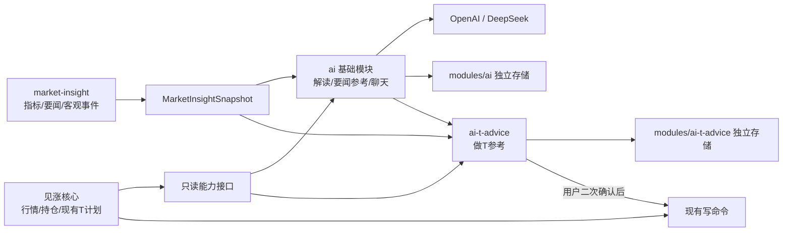
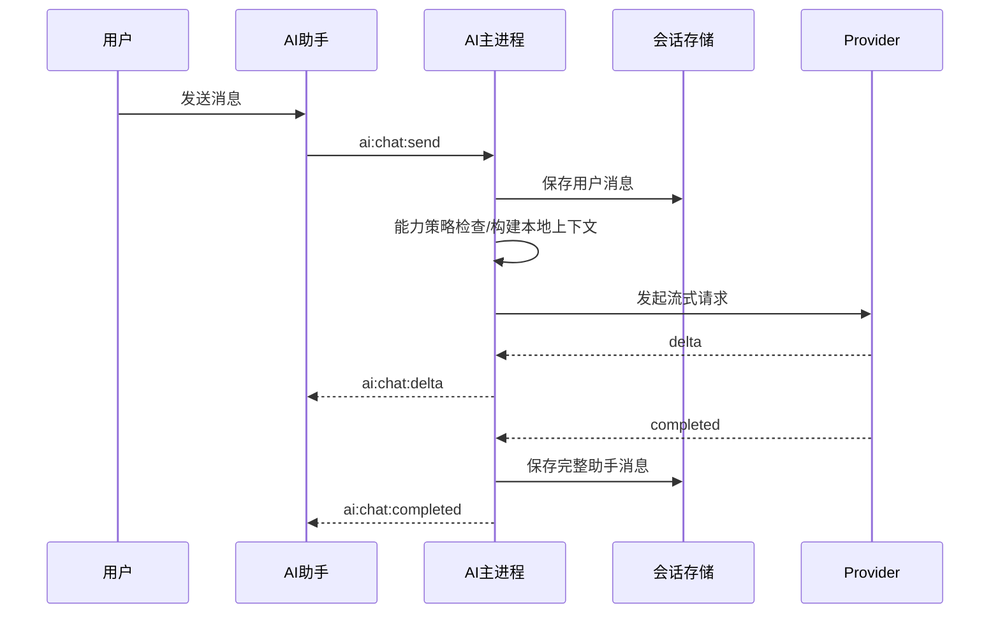
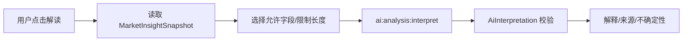
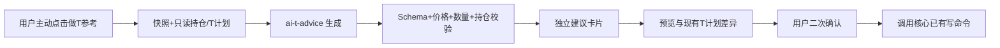

# AI 模块与可选做 T 参考实现计划

> 文档状态：基础 AI 已实施；独立做 T 参考已进入个人构建实现，默认分享构建仍不包含
>
> 编写日期：2026-07-21
>
> 当前应用版本：`4.1.0`
>
> 本文是 AI 接入的当前实施依据；如与早期 [AI 可移除模块设计](wiki/08-ai-extension-points.md) 冲突，以本文为准。2026-07-21 已完成阶段 0–4 的代码实现：基础模块可构建剔除、OpenAI/DeepSeek API Key 设置、本地聊天与手动快照解读；仍需在实际发行前完成构建剔除、Provider 联调和隐私验收。`ai-t-advice` 只保留独立构建/删除骨架，尚未进入发行范围。

## 1. 目标与结论

在不侵入见涨核心行情、持仓和现有做 T 功能的前提下，增加两层可选能力：

1. **AI 基础模块 `ai`**
   - 支持 OpenAI 与 DeepSeek。
   - 支持指标解读、要闻参考和自由对话。
   - 保存本地对话记录。
   - 可在运行时关闭、构建时剔除，也可以删除源码目录。
2. **做 T 参考模块 `ai-t-advice`**
   - 独立于 AI 基础模块，默认关闭。
   - 只负责可能涉及交易方向、价格区间、数量和失效条件的做 T 参考。
   - 合规评估不通过时，可以单独删除，指标解读、要闻参考和通用聊天继续可用。

现有 `market-insight` 模块继续负责确定性指标、新闻聚合和客观观察事件。AI 只消费其公开快照，不重新计算指标，也不反向控制它。

> 合规说明：本文按“指标解读与要闻参考”和“个性化做 T 参考”进行产品分层，但这只是工程和产品边界，不构成对任何功能必然不受监管的法律结论。正式发布范围仍应以专项合规评估为准。

## 2. 模块分层



依赖方向必须满足：

- 核心不导入 `ai` 或 `ai-t-advice` 的业务类型。
- `market-insight` 不依赖 AI，不接收 AI 输出。
- `ai` 可以依赖 `MarketInsightSnapshot` 和核心只读投影。
- `ai-t-advice` 依赖 `ai` 提供的模型能力，但 `ai` 不能依赖 `ai-t-advice`。
- `ai-t-advice` 被关闭或删除后，基础 AI 的聊天、指标解读和要闻参考不受影响。
- `ai` 被关闭或删除后，`ai-t-advice` 自动不可用，核心和 `market-insight` 继续运行。

## 3. 功能边界

### 3.1 AI 基础模块允许提供

- 对已经计算出的指标做自然语言解释。
- 总结要闻、归纳不同来源、标注来源和信息时间。
- 解释客观盯盘事件及其可能含义，明确不确定性。
- 围绕通用知识、应用功能或用户主动附加的股票上下文进行对话。
- 保存、搜索、重命名、删除和导出本地对话。

基础模块的股票分析结构只允许包含：

```ts
interface AiInterpretation {
  summary: string
  indicatorFacts: Array<{
    name: string
    interpretation: string
    evidence: string[]
  }>
  newsReferences: Array<{
    sourceId: string
    relevance: string
    summary: string
  }>
  uncertainties: string[]
  generatedAt: string
}
```

它不得包含：

- 买入、卖出、正 T、反 T 等操作方向。
- 建议成交价、价格区间、股票数量或仓位比例。
- 止盈、止损、失效价或“现在应操作”的时间点。
- 将 AI 输出直接写入现有 T 计划的能力。

### 3.2 通用聊天不能成为做 T 参考的旁路

单独拆出 `ai-t-advice` 后，还必须约束基础聊天，否则用户仍可在聊天框中直接索要个性化交易建议，模块边界会失去意义。

基础聊天需要执行统一的能力策略：

- 可以回答指标含义、新闻背景、计算方法和一般性知识。
- 可以引用当前股票快照，但不能基于用户持仓输出具体交易动作、价格或数量。
- 当用户询问个性化做 T 方案时：
  - `ai-t-advice` 未安装或未开启：明确说明该能力当前不可用，并继续提供客观数据解释。
  - `ai-t-advice` 已开启：提示用户进入独立的“做 T 参考”功能，不在普通聊天消息中直接生成建议。
- 该限制需要在请求路由、提示模板和输出校验三层生效，不能只靠界面文案。

### 3.3 做 T 参考模块独占能力

只有 `ai-t-advice` 可以定义和输出：

```ts
interface AiTAdvice {
  quoteId: string
  action: 'hold' | 'forward-t' | 'reverse-t'
  rationale: string[]
  priceZone?: {
    lower: number
    upper: number
  }
  quantity?: number
  invalidationPrice?: number
  risks: string[]
  confidence?: 'low' | 'medium' | 'high'
  sourceSnapshotId: string
  generatedAt: string
}
```

本模块还负责：

- 专用提示词与结构化输出 Schema。
- 价格、持仓、可用数量、交易时段和数量规则的本地校验。
- 做 T 建议历史和用户采纳/忽略记录。
- 与现有 T 计划的差异预览。
- 用户二次确认后调用核心已有的 T 计划写命令。

任何股票数量输入和最终应用数量都必须以 `100` 股为步长，并在本地校验为 `100` 的整数倍。

## 4. 功能入口设计

### 4.1 全局入口：AI 助手抽屉

在主界面顶部操作区的“刷新”和“设置”附近增加 **AI 助手** 按钮。点击后打开由 `ai` 模块完全拥有的宽抽屉，不把 AI 设置塞进现有 `SettingsMenu`。

抽屉分为两个页签：

1. **对话**
   - 左侧会话列表。
   - 右侧消息流、输入框和上下文附件。
2. **服务设置**
   - Provider、模型、认证方式、连接测试和基础调用选项。

第一版不在每只股票的行操作区增加 AI 图标，也不接入任务栏行情条和 T 提醒，以控制入口数量和核心耦合。

### 4.2 股票详情入口：AI 分析标签

在股票展开详情的“市场观察”之后增加 **AI 分析** 标签，提供：

- “解读当前快照”：手动触发指标与要闻解读。
- “问 AI”：以当前股票和最新 `MarketInsightSnapshot` 新建或继续上下文对话。
- 最近一次解读结果、来源引用、快照时间和重新生成按钮。

打开标签本身不自动调用模型。用户点击按钮后才发起请求，避免无意消耗额度和重复生成。

### 4.3 做 T 参考入口

当且仅当 `ai-t-advice` 已构建进应用且运行时开启时，在“AI 分析”中出现独立的 **做 T 参考** 子页签或卡片：

- 视觉上与“指标解读”“要闻参考”分区。
- 标注“可选功能”和数据时间。
- 先展示结构化参考，再通过“预览应用到 T 计划”进入确认弹窗。
- 不自动修改 T 计划，不自动下单，不触发核心提醒。

关闭模块后整个入口消失，不保留灰色按钮或占位提示。

## 5. 对话式聊天设计

### 5.1 页面布局

```text
┌──────────────────────────────────────────────────────────┐
│ AI 助手                                      [对话][设置] │
├───────────────┬──────────────────────────────────────────┤
│ + 新对话      │ 会话标题                                 │
│ 搜索会话      │ [上下文：贵州茅台 / 市场观察 14:35] [×]  │
│               │                                          │
│ 今天          │ 用户消息                                 │
│  指标怎么看   │ AI 流式回复                              │
│  一般性问题   │ 来源与上下文说明                         │
│ 更早          │                                          │
│  ...          │ [输入问题................] [停止/发送]   │
└───────────────┴──────────────────────────────────────────┘
```

### 5.2 会话操作

- 新建普通会话。
- 从股票详情新建带上下文的会话。
- 继续历史会话。
- 自动生成标题并允许手动重命名。
- 按标题和消息正文搜索。
- 删除单个会话、清空全部会话。
- 导出单个或全部会话为 JSON；后续可增加 Markdown 导出。
- 流式生成、停止生成、失败重试、重新生成上一条回复。

### 5.3 上下文策略

会话分为两类：

- `general`：普通聊天，不自动携带股票数据。
- `stock`：可以附加某只股票的快照引用。

股票上下文使用显式 Chip 展示，用户可以随时移除。保存消息时记录使用的 `snapshotId`，而不是把整份快照复制进每条消息。再次打开历史会话时应清楚区分：

- 当时回答使用的历史快照。
- 当前最新行情。

不能悄悄用最新行情改写历史回答的语义。

### 5.4 对话记录模型

```ts
interface AiConversation {
  id: string
  title: string
  scope: 'general' | 'stock'
  quoteId?: string
  createdAt: string
  updatedAt: string
  providerId: string
  model: string
  messageCount: number
}

interface AiMessage {
  id: string
  conversationId: string
  role: 'user' | 'assistant' | 'system'
  content: string
  status: 'pending' | 'streaming' | 'completed' | 'stopped' | 'error'
  createdAt: string
  providerId?: string
  model?: string
  providerResponseId?: string
  contextRef?: {
    quoteId: string
    snapshotId: string
  }
  sourceIds?: string[]
  errorMessage?: string
}
```

应用自己的本地记录是会话事实来源。即使 Provider 支持服务端会话状态，也要保留本地消息和 Provider response ID，确保切换 Provider 后仍能从本地历史构造上下文。OpenAI Responses API 支持用 conversation 或 previous response 延续多轮状态，流式输出也有独立官方指南：[Conversation state](https://developers.openai.com/api/docs/guides/conversation-state)、[Streaming API responses](https://developers.openai.com/api/docs/guides/streaming-responses)。

## 6. 本地存储与隐私

### 6.1 基础 AI 存储

所有数据放在独立目录，不写入核心 `%APPDATA%\见涨\settings.json`：

```text
%APPDATA%\见涨\modules\ai\
├─ settings.json
├─ credentials.bin
├─ conversations\
│  ├─ index.json
│  ├─ conversation-{id}.jsonl
│  └─ ...
├─ snapshots\
│  └─ snapshot-{id}.json
└─ cache\
```

写入规则：

- 用户消息在发送前立即落盘。
- 助手流式分片先保存在内存，完成后一次写入完整消息。
- 用户停止或调用失败时，保存 `stopped` / `error` 状态，避免出现无法解释的半条回复。
- 会话索引只保存列表所需元数据；消息按会话拆分，避免每次加载全部历史。
- 删除会话时同步删除消息文件；没有其他会话引用的快照可以一并清理。
- API Key、访问令牌、登录 Cookie 不得进入对话、日志、导出文件或提示词。

### 6.2 做 T 参考存储

```text
%APPDATA%\见涨\modules\ai-t-advice\
├─ settings.json
└─ advice-history.jsonl
```

删除 `ai-t-advice` 时，基础聊天记录不受影响。产品应提供单独的“删除做 T 参考数据”操作。

### 6.3 凭证存储

- API Key 使用 Electron `safeStorage` 加密后写入 `credentials.bin`。
- 渲染层只能获取“已配置/未配置”和脱敏尾号，不能读取明文。
- 调用由主进程完成，不将密钥发送给 renderer。
- OpenAI 网页/Codex 登录凭证由官方登录运行时管理，见涨不读取 `auth.json`，不复制 ChatGPT Cookie，也不自行实现或复用 Hermes 的 OAuth client ID。

## 7. Provider 与认证设计

### 7.1 统一接口

```ts
interface AiProvider {
  readonly id: string
  getCapabilities(): AiProviderCapabilities
  testConnection(): Promise<AiConnectionResult>
  streamChat(
    request: AiChatRequest,
    emit: (event: AiStreamEvent) => void,
    signal: AbortSignal
  ): Promise<AiProviderTurnResult>
}
```

指标解读和做 T 参考都通过统一消息接口调用；结构化任务额外提供 Schema 和输出校验，不在 Provider 中复制业务逻辑。

API Key Provider 直接使用 `fetch`；Codex 账号 Provider 仅在 AI 模块内部依赖官方 Codex 运行时，依赖与解包配置随模块一起删除。

### 7.2 OpenAI

提供两种认证适配器：

1. **OpenAI Platform API Key**
   - 按 OpenAI API 的 Bearer Key 方式调用。
   - 消耗 OpenAI Platform API 余额，与 ChatGPT/Codex 订阅分开。
   - 官方认证说明：[API authentication](https://developers.openai.com/api/reference/overview#authentication)。
2. **OpenAI Codex 登录**
   - 已接入官方 `codex app-server`，由官方组件打开登录并持有、刷新凭证。
   - 见涨只通过本地 JSON-RPC 进程协议提交请求和接收事件。
   - 不复刻 Hermes 的网页授权实现，不调用 OpenAI 内部接口，不直接读取 Codex 凭证文件。
   - 官方 Windows 运行时作为 AI 模块资源随启用 AI 的构建携带；无 AI 构建不复制该资源。登录状态与 API Key 模式相互独立。

两种认证在设置页中明确标注计费来源，不能只显示为同一个“OpenAI”。

### 7.3 DeepSeek

- 第一版使用 API Key。
- 通过 OpenAI 风格的 Chat Completions 适配层实现消息和流式事件转换。
- 官方接口支持 `stream` 参数，具体请求字段以 [DeepSeek Chat Completion 文档](https://api-docs.deepseek.com/api/create-chat-completion/) 为准。
- DeepSeek 适配器不得把特有字段泄漏到通用会话类型。

### 7.4 模型配置

- 默认模型放在模块设置中，不写死在组件。
- 支持刷新/手填模型 ID，但首版无需建设复杂模型市场。
- 每条助手消息记录实际 `providerId` 和 `model`。
- 切换 Provider 不删除历史；下一次请求从本地历史重建上下文，并提示用户模型已切换。

## 8. IPC 与进程边界

### 8.1 基础 AI：`window.aiApi`

建议 IPC：

```text
ai:status:get
ai:settings:get
ai:settings:update
ai:credential:set
ai:credential:clear
ai:connection:test

ai:conversation:list
ai:conversation:get
ai:conversation:create
ai:conversation:rename
ai:conversation:delete
ai:conversation:clear
ai:conversation:export

ai:chat:send
ai:chat:cancel
ai:chat:retry
ai:chat:delta          # main -> renderer event
ai:chat:completed      # main -> renderer event
ai:chat:error          # main -> renderer event

ai:analysis:interpret
```

`window.aiApi` 类型留在 `src/modules/ai/preload/types.ts`，不要扩展核心 `StockDesktopApi`。

### 8.2 做 T 参考：`window.aiTAdviceApi`

```text
ai-t:status:get
ai-t:settings:get
ai-t:settings:update
ai-t:advice:generate
ai-t:advice:cancel
ai-t:advice:history
ai-t:advice:dismiss
ai-t:advice:preview-apply
ai-t:advice:confirm-apply
```

生成和应用必须分成两个命令。`confirm-apply` 只接收已经通过本地校验的临时引用 ID，不直接信任 renderer 回传的价格和数量。

## 9. 建议目录结构

```text
src/modules/ai/
├─ README.md
├─ shared/
│  ├─ types.ts
│  ├─ schemas.ts
│  ├─ capabilities.ts
│  └─ ipc.ts
├─ main/
│  ├─ register.ts
│  ├─ service.ts
│  ├─ policy.ts
│  ├─ storage.ts
│  ├─ secrets.ts
│  ├─ conversations/
│  │  ├─ repository.ts
│  │  ├─ context-builder.ts
│  │  └─ title-generator.ts
│  └─ providers/
│     ├─ provider.ts
│     ├─ openai-api.ts
│     ├─ codex-app-server.ts
│     ├─ openai-codex.ts
│     └─ deepseek.ts
├─ prompts/
│  ├─ general-chat.ts
│  └─ market-interpretation.ts
├─ preload/
│  ├─ register.ts
│  └─ types.ts
└─ renderer/
   ├─ register.tsx
   ├─ AiAssistantDrawer.tsx
   ├─ AiAnalysisPanel.tsx
   ├─ AiSettingsPanel.tsx
   ├─ ConversationList.tsx
   ├─ ChatThread.tsx
   ├─ ChatComposer.tsx
   └─ hooks/

src/modules/ai-t-advice/
├─ README.md
├─ shared/
│  ├─ types.ts
│  ├─ schema.ts
│  └─ ipc.ts
├─ main/
│  ├─ register.ts
│  ├─ service.ts
│  ├─ validator.ts
│  └─ storage.ts
├─ prompts/
│  └─ t-advice.ts
├─ preload/
│  ├─ register.ts
│  └─ types.ts
└─ renderer/
   ├─ register.tsx
   ├─ TAdvicePanel.tsx
   └─ ApplyToTPlanDialog.tsx
```

每个模块的 `README.md` 必须列出安装点、外部依赖、存储路径、构建开关和完整删除步骤。

## 10. 安装点与可移除机制

### 10.1 构建开关

```text
JIANZHANG_AI_MODULE=0
JIANZHANG_AI_T_ADVICE_MODULE=0
```

规则：

- AI 基础模块默认是否开启由发行策略决定，但必须支持 `JIANZHANG_AI_MODULE=0` 完全剔除。
- 做 T 参考默认关闭，只有显式设置 `JIANZHANG_AI_T_ADVICE_MODULE=1` 才编译。
- 当 `JIANZHANG_AI_MODULE=0` 时，无论第二个变量为何值，做 T 参考都强制关闭。
- 构建常量分别注入 main、preload 和 renderer，三端保持一致。
- 条件入口使用动态导入，确保关闭后模块代码不会进入产物，而不只是隐藏 UI。

### 10.2 运行时开关

- `ai.enabled`
- `aiTAdvice.enabled`，默认 `false`

运行时关闭后：

- 不显示入口。
- 不注册定时任务。
- 不发起 Provider 请求。
- 不删除本地数据，用户可从数据管理中单独删除。

### 10.3 核心薄安装点

基础 AI 只允许保留以下薄安装点：

| 位置 | 安装内容 |
| --- | --- |
| `electron/main/index.ts` | 条件动态注册 `ai`，以及可选的 `ai-t-advice` |
| `electron/preload/index.ts` | 条件挂载 `window.aiApi` / `window.aiTAdviceApi` |
| `src/App.tsx` | 条件挂载全局 AI 助手按钮和抽屉 |
| `src/components/ExpandedStockDetails.tsx` | 条件挂载 AI 分析标签 |
| `electron.vite.config.ts` | 两个构建常量 |
| `src/vite-env.d.ts` | 仅声明构建常量；模块 API 类型由模块自己声明 |

不得把 AI 字段加入 `AppState`、`AppSettings`、核心配置导入导出、`refreshStocks` 或现有 T 提醒状态机。

### 10.4 删除场景

| 场景 | 操作 | 应保留能力 |
| --- | --- | --- |
| 只移除做 T 参考 | 删除 `src/modules/ai-t-advice` 和对应薄安装点，或构建变量设为 `0` | 指标解读、要闻参考、通用聊天、对话记录 |
| 移除全部 AI | 再删除 `src/modules/ai` 和对应薄安装点，或 AI 构建变量设为 `0` | 核心行情、持仓、现有手工做 T、`market-insight` |
| 只关闭运行 | 设置页关闭模块 | 源码和本地数据保留，不再显示入口或调用网络 |

## 11. 请求流程

### 11.1 普通聊天



### 11.2 指标与要闻解读



指标值、新闻标题、发布时间和来源链接由本地快照提供；模型生成解释但不能伪造新指标或新来源。UI 中事实和模型解释应采用不同视觉层级。

### 11.3 做 T 参考



模型输出不是写命令。校验失败时只显示错误，不进行“智能修正后自动应用”。

## 12. 分阶段实施

### 阶段 0：模块骨架与删除验证

- 建立 `ai`、`ai-t-advice` 两个目录和 README。
- 加入两个构建开关和三端条件动态注册。
- 先实现空面板，验证四种组合：全部关闭、仅基础 AI、两者同时开启、源码删除后构建。
- 固定 `MarketInsightSnapshot` 只读输入接口。

完成标准：关闭或删除任一模块后，核心没有编译依赖、空白标签、失效 IPC 或启动报错。

### 阶段 1：Provider、认证与设置

- 实现 Provider 统一接口。
- 实现 OpenAI API Key、DeepSeek API Key 和连接测试。
- 实现 `safeStorage` 凭证存储。
- 实现 OpenAI 官方 Codex App Server 登录运行时适配器。
- 完成 AI 服务设置页和计费来源提示。

完成标准：渲染层不可读取明文密钥；连接测试能区分认证失败、限流和网络失败。

### 阶段 2：本地会话与聊天界面

- 实现会话仓库、JSONL 消息存储和索引。
- 实现 AI 助手抽屉、会话列表、消息流和输入框。
- 实现新建、继续、重命名、搜索、删除、清空和导出。
- 先以非流式完整回复打通端到端链路。

完成标准：应用重启后对话仍存在；删除会话后对应文件确实删除。

### 阶段 3：流式交互与上下文

- 实现 delta 事件、停止、重试和错误状态。
- 实现股票上下文 Chip 和快照引用。
- 实现 Provider 切换后的本地历史重建。
- 实现基础聊天的能力策略和交易建议旁路拦截。

完成标准：停止生成不会留下伪完成消息；普通聊天不能返回价格、数量或具体做 T 动作。

### 阶段 4：指标解读与要闻参考

- 增加股票详情 AI 分析标签。
- 接入 `MarketInsightSnapshot`。
- 实现 `AiInterpretation` Schema、来源引用和不确定性展示。
- 增加缓存键：`snapshotId + provider + model + promptVersion`。

完成标准：打开标签不自动调用；解读内容可以追溯到本地快照和来源 ID。

### 阶段 5：独立做 T 参考模块

- 合规评估通过后才进入本阶段。
- 实现专用提示、`AiTAdvice` Schema、本地校验和独立历史。
- 做 T 参考默认关闭，不实现自动触发。
- 验证只删除 `ai-t-advice` 后基础 AI 完整可用。

完成标准：禁用产物中不存在做 T 建议提示词、类型、IPC、页面文案或建议逻辑。

### 阶段 6：应用到现有 T 计划

- 实现差异预览和二次确认。
- 复用核心已有 T 计划写命令，不新增 AI 专用字段到核心状态。
- 本地校验数量为 100 的整数倍、可用数量、价格有效性和计划冲突。
- 保存采纳/忽略结果，用于后续离线评估。

完成标准：未确认、校验失败或建议过期时均不能写入现有 T 计划。

### 阶段 7：评估、隐私与发行检查

- 建立固定快照回放，比较 Provider 和提示版本。
- 检查来源引用、幻觉、越界交易建议和错误恢复。
- 检查日志、导出和异常信息是否泄露凭证或完整敏感上下文。
- 对两种移除场景执行源码引用扫描和产物关键词扫描。
- 更新 Wiki、隐私说明和用户功能说明。

## 13. 验收清单

### 13.1 基础 AI

- [ ] OpenAI API Key 可以独立配置、测试和清除。
- [ ] DeepSeek API Key 可以独立配置、测试和清除。
- [ ] OpenAI Codex 登录由官方运行时处理，见涨不读取或复制凭证。
- [ ] 聊天支持多会话、流式输出、停止、重试、搜索、删除和导出。
- [ ] 对话在重启后保留，Provider 切换不丢失历史。
- [ ] 指标和要闻解释能引用 `MarketInsightSnapshot` 的来源和时间。
- [ ] 基础聊天与分析输出不包含具体交易动作、价格、数量或仓位建议。
- [ ] `JIANZHANG_AI_MODULE=0` 时产物没有 AI 入口、IPC 和网络调用。

### 13.2 做 T 参考

- [ ] 默认未启用，必须通过独立构建和运行时开关开启。
- [ ] 类型、提示词、Schema、IPC、存储和 UI 均位于 `ai-t-advice`。
- [ ] 禁用或删除后，基础聊天、指标解读和要闻参考继续工作。
- [ ] 生成结果经过本地 Schema、价格、持仓和数量校验。
- [ ] 所有股票数量输入 `step=100`，应用数量是 100 的整数倍。
- [ ] 必须先预览差异，再由用户二次确认写入现有 T 计划。
- [ ] 无自动下单、无自动应用计划、无后台静默生成建议。
- [ ] 禁用构建产物中扫描不到 `AiTAdvice`、建议提示词、价格/数量建议 IPC 和页面文案。

### 13.3 核心隔离

- [ ] 核心 `AppState`、`AppSettings` 和 `settings.json` 没有 AI 字段。
- [ ] 核心 `StockDesktopApi` 没有 AI IPC。
- [ ] `refreshStocks` 和现有 T 提醒逻辑没有导入 AI。
- [ ] 删除全部 AI 后，行情、持仓、现有手工做 T 和 `market-insight` 正常运行。
- [ ] 收益/收益率仍保持正红、负绿、零值中性。

## 14. 风险与待确认项

| 风险/决策 | 当前处理 |
| --- | --- |
| OpenAI 网页登录是否能作为应用稳定能力 | 只走官方 Codex 登录运行时；实施前验证发行和协议条件，不自行复刻 OAuth |
| 普通聊天绕过独立做 T 模块 | 请求路由、提示和输出校验三层限制；个性化做 T 请求只进入独立模块 |
| 模型把解释写成建议 | 使用受限 Schema，并在展示前做禁止字段和语义检查 |
| 新闻时效和来源可靠性 | 事实继续来自 `market-insight`，AI 只总结并保留 sourceId |
| 历史消息与当前行情混淆 | 消息固定 snapshotId，UI 同时标明“回答时快照”和“当前行情” |
| 流式中断产生损坏记录 | 用户消息先落盘，助手完成后落盘；中断记录明确状态 |
| 模块隐藏但仍进入安装包 | 构建常量配合动态导入，并扫描产物验证真正剔除 |
| 合规结论变化 | `ai-t-advice` 独立源码、存储、IPC、UI 和构建开关，可单独删除 |

## 15. 版本与发布约束

AI 基础模块和 `ai-t-advice` 都属于新功能模块。当前只输出计划，不修改版本号、不提交、不打包。

进入实际发布前需要按项目规则确认是否升级大版本；如果不升级大版本，至少应按新增功能提升中间版本并将尾数归零。每次打包前先提交代码，提交信息必须描述本次主要功能和修复内容。

## 16. 推荐的第一期交付范围

为尽快得到可用而可控的版本，第一期建议只交付：

1. `ai` 模块骨架和真正可剔除的构建开关。
2. OpenAI API Key、DeepSeek API Key、Provider 设置和连接测试。
3. 本地多会话聊天、历史记录、流式输出、停止与删除。
4. 手动触发的指标解读和要闻参考。
5. OpenAI Codex 账号登录、退出、状态检测、连接测试和只读对话适配器。

`ai-t-advice` 先完成接口和删除边界设计，不随第一期默认发行；待合规评估通过后从阶段 5 开始实现。这样即使做 T 参考最终不发布，前四项仍是完整、可独立使用的 AI 助手功能。
