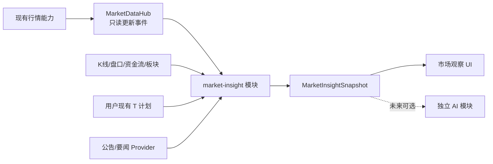
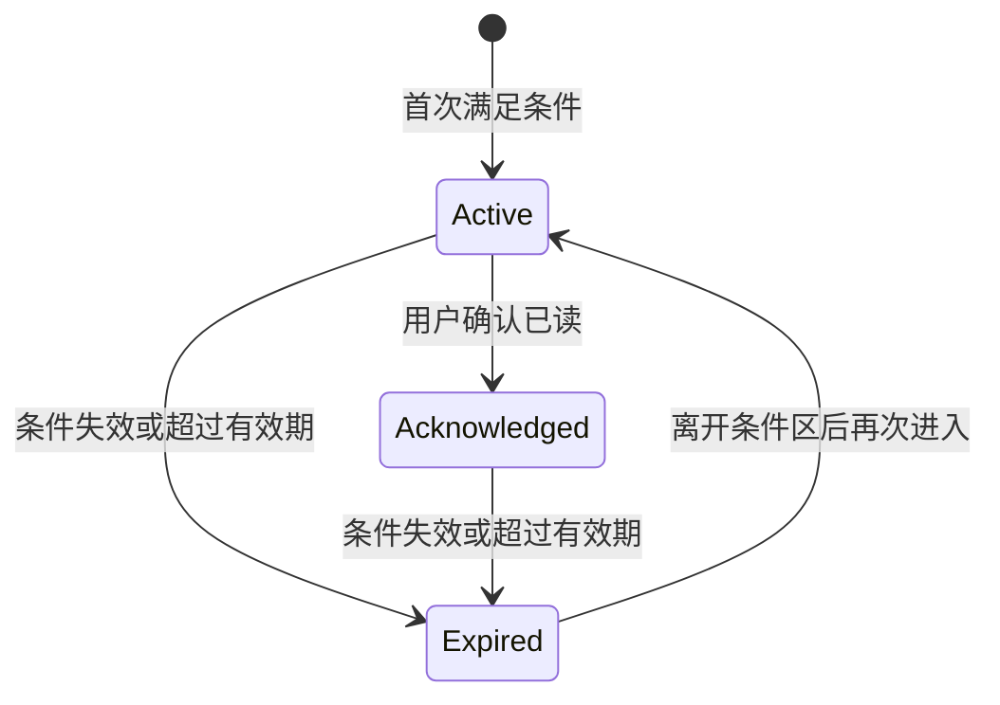

# 非 AI 市场洞察与智能盯盘实现计划

> 文档状态：方案已拆解，待实施
>
> 编写日期：2026-07-20
>
> 代码基线：`main` 分支，应用版本 `3.7.1`
>
> 关联文档：[AI 可移除模块设计](wiki/08-ai-extension-points.md)

## 1. 计划目标

先实现最初 AI 需求中的非 AI 基础能力：

- 使用现有行情、K 线、盘口、资金流和板块数据计算确定性技术指标。
- 收集、去重和展示公司公告、行业及市场要闻。
- 根据明确规则检测值得关注的行情事件。
- 在个股详情和图表中提供“市场观察/智能盯盘”界面。
- 展示当前价格与用户既有 T 计划档位的关系。
- 为后续 AI 模块提供稳定、可复用的 `MarketInsightSnapshot`。

本计划不调用任何大模型。同一份输入必须得到同一份指标和事件结果。

## 2. 明确排除的范围

本期不实现：

- OpenAI、DeepSeek 或其他模型 Provider。
- API Key、账号登录、OAuth 和秘密凭证存储。
- 提示词、模型上下文、模型调用、Token 预算和模型结果缓存。
- AI 摘要、AI 解读、AI 置信度或自然语言投资结论。
- 自动生成“买入、卖出、观望、做正 T、做反 T”等操作建议。
- 自动生成目标价格、失效价格或交易数量。
- 自动修改双五档计划、自动记录 T 交易或自动下单。
- 把规则型买卖时机建议伪装成“指标提醒”。

新闻层只展示来源明确的原始标题、时间、链接、类别和客观元数据，不生成模型摘要。

## 3. 产品与合规边界

非 AI 不等于天然不涉及证券投资咨询。技术实现必须区分两类能力：

| 能力                                       | 本期处理   |
| ------------------------------------------ | ---------- |
| 历史数据统计、指标数值、来源明确的新闻汇总 | 纳入本计划 |
| 客观条件触发，例如“价格上穿 VWAP”          | 纳入本计划 |
| 显示与用户自行设置的 T 档位距离            | 纳入本计划 |
| 针对具体股票生成买卖方向、时机、价格或数量 | 不纳入     |
| 根据多指标组合输出做 T 操作方案            | 不纳入     |

事件名称使用客观描述，例如：

- `价格上穿 VWAP`
- `5 分钟成交量达到近 20 个窗口的 2.3 倍`
- `距离用户 T2 买入档 0.4%`
- `出现新的公司公告`

不得改写成：

- `建议立即买入`
- `适合做正 T`
- `预计上涨概率 80%`
- `建议卖出 500 股`

如果以后希望增加纯规则生成的买卖时机建议，应作为新的合规敏感模块单独立项，不能直接塞进本模块。

## 4. 模块边界

非 AI 能力放入独立的 `market-insight` 模块，不散落到核心行情、持仓或做 T 文件中：



依赖规则：

- 核心代码不依赖指标类型、新闻类型或观察事件类型。
- `market-insight` 可以读取核心能力，但不能修改核心行情和交易计算。
- AI 模块以后只能读取 `MarketInsightSnapshot`，不能让本模块依赖 AI。
- 本模块拥有独立 IPC、设置、缓存、历史和 UI。
- 删除本模块后，行情、持仓、做 T、T 提醒、任务栏和配置导入导出仍可运行。

## 5. 建议目录

```text
src/modules/market-insight/
├─ README.md
├─ shared/
│  ├─ types.ts                 # 指标、新闻、事件和快照类型
│  ├─ constants.ts             # 模块版本与 insight:* IPC
│  └─ normalize.ts             # 模块数据兼容与归一化
├─ main/
│  ├─ register.ts              # 主进程唯一安装入口
│  ├─ service.ts               # 快照编排
│  ├─ scheduler.ts             # 分层刷新与冷却
│  ├─ storage.ts               # 独立设置、缓存和事件历史
│  ├─ indicators/
│  │  ├─ intraday.ts
│  │  ├─ trend.ts
│  │  ├─ momentum.ts
│  │  ├─ volatility.ts
│  │  ├─ order-book.ts
│  │  └─ relative-strength.ts
│  ├─ news/
│  │  ├─ types.ts
│  │  ├─ registry.ts
│  │  ├─ normalize.ts
│  │  └─ providers/
│  └─ events/
│     ├─ detect.ts
│     ├─ deduplicate.ts
│     └─ lifecycle.ts
├─ preload/
│  ├─ register.ts              # window.marketInsightApi
│  └─ types.ts
└─ renderer/
   ├─ register.tsx             # renderer 唯一安装入口
   ├─ MarketInsightPanel.tsx
   ├─ IndicatorGrid.tsx
   ├─ WatchEventList.tsx
   ├─ NewsTimeline.tsx
   ├─ TPlanDistanceCard.tsx
   └─ InsightChartOverlay.tsx
```

核心只保留三个薄安装点：

| 安装点                                    | 作用                                     |
| ----------------------------------------- | ---------------------------------------- |
| `electron/main/index.ts`                  | 注册模块主进程入口，并向模块发布行情更新 |
| `electron/preload/index.ts`               | 条件挂载 `window.marketInsightApi`       |
| `src/components/ExpandedStockDetails.tsx` | 条件挂载“市场观察”标签页                 |

为了避免模块直接插入 `refreshStocks` 内部，建议增加一个不含业务判断的通用 `MarketDataHub`。`refreshStocks` 合并报价后只发布只读快照，模块自行订阅和调度。

## 6. 核心数据结构

### 6.1 指标快照

```ts
interface IndicatorValue {
  id: string
  label: string
  value: number | null
  unit: 'price' | 'percent' | 'amount' | 'ratio' | 'none'
  state: 'up' | 'down' | 'flat' | 'unknown'
  calculatedAt: string
  sourcePeriod: string
}

interface IndicatorSnapshot {
  quoteId: string
  quoteTime: string
  calculatedAt: string
  intraday: IndicatorValue[]
  trend: IndicatorValue[]
  momentum: IndicatorValue[]
  volatility: IndicatorValue[]
  orderBook: IndicatorValue[]
  relativeStrength: IndicatorValue[]
}
```

`state` 只描述指标变化方向或相对位置。展示颜色沿用项目规则：上涨/正值红色、下跌/负值绿色、零值中性。

### 6.2 新闻

```ts
interface MarketNewsItem {
  id: string
  title: string
  source: string
  publishedAt: string
  url: string
  category: 'announcement' | 'policy' | 'finance' | 'industry' | 'market'
  scope: 'stock' | 'sector' | 'market'
  relatedQuoteIds: string[]
  fetchedAt: string
}
```

新闻条目必须有可追溯来源。没有原始链接和发布时间的内容不进入正式时间线。

### 6.3 观察事件

```ts
type WatchEventType =
  | 'vwap_cross'
  | 'opening_range_break'
  | 'volume_spike'
  | 'intraday_extreme'
  | 'order_book_imbalance_change'
  | 'funds_flow_direction_change'
  | 'relative_strength_change'
  | 'new_announcement'

interface WatchEvent {
  id: string
  quoteId: string
  type: WatchEventType
  severity: 'info' | 'attention'
  title: string
  facts: string[]
  occurredAt: string
  expiresAt: string
  fingerprint: string
  status: 'active' | 'acknowledged' | 'expired'
  sourceIds: string[]
}
```

`facts` 由固定模板和确定性数值组成，不由模型生成。

### 6.4 汇总快照

```ts
interface MarketInsightSnapshot {
  version: 1
  quoteId: string
  generatedAt: string
  dataCutoffAt: string
  indicators: IndicatorSnapshot
  news: MarketNewsItem[]
  events: WatchEvent[]
  existingTPlanDistances: TPlanDistance[]
}
```

未来 AI 模块只消费该快照，不直接抓取本模块内部缓存。

## 7. 技术指标范围

### 7.1 第一批：分时指标

- 当日成交均价与 VWAP。
- 最新价相对 VWAP 的偏离率。
- 1、3、5、15 分钟收益率。
- 当日高低点位置。
- 开盘 15/30 分钟区间及是否突破。
- 最近窗口成交量相对历史窗口的倍数。
- 量价同向/背离的客观状态。

输入主要来自现有 `fetchKline(quoteId, 'intraday')`。

### 7.2 第二批：日线背景

- MA5、MA10、MA20、MA60。
- EMA12、EMA26、MACD。
- RSI6、RSI14。
- KDJ。
- 布林带及带宽。
- ATR14 和近期实现波动率。
- 成交量、换手率在最近窗口中的分位。

输入来自现有日 K 接口。计算函数必须是无网络、无状态的纯函数。

### 7.3 第三批：盘口与相对强弱

- 买卖五档委托量不平衡。
- 委托不平衡的短窗口变化。
- 主力资金净流入方向和斜率。
- 个股相对所属行业板块的日内强弱。
- 个股相对用户所选大盘指数的日内强弱。
- 当前价距离 T 仓均价和既有 T1～T5 档位的百分比。

盘口只能作为观察信号，不表示真实成交意愿或必然走势，UI 需要固定展示这一局限。

## 8. 指标计算约束

- 统一使用已闭合 K 线计算窗口指标；当前未闭合分时柱单独标记。
- 明确处理午间休市、集合竞价和缺失分时点。
- 不用 `0` 代替缺失值，缺失统一为 `null`。
- 所有指标输出包含输入周期和计算时间。
- 浮点误差在计算层保留，展示层再格式化。
- 历史长度不足时返回 `null`，不外推。
- 同一输入数组不得被原地修改。
- 指标函数不读取全局状态、当前时间或网络。

第一版不引入第三方技术指标库，优先使用小型纯函数实现，减少依赖、打包体积和计算口径不透明问题。

## 9. 新闻与公告层

### 9.1 Provider 接口

```ts
interface MarketNewsProvider {
  id: string
  fetchStockNews(input: NewsQuery): Promise<MarketNewsItem[]>
  fetchSectorNews(input: NewsQuery): Promise<MarketNewsItem[]>
  fetchMarketNews(input: NewsQuery): Promise<MarketNewsItem[]>
}
```

### 9.2 数据源顺序

1. 交易所和上市公司公告等一手来源。
2. 监管、政策发布机构。
3. 已确认授权方式和稳定性的财经资讯源。
4. 开放网页检索仅作为以后可选补充，不在第一版默认开启。

正式编码前需要确认每个来源的：

- 接口或页面使用条件。
- 抓取频率限制。
- 标题、摘要和正文的展示授权范围。
- 链接是否长期稳定。
- 股票代码、公告编号和发布时间字段。

没有确认使用条件的来源不进入默认发行版。

### 9.3 去重和关联

去重优先级：

1. 公告编号或来源内容 ID。
2. 规范化 URL。
3. `来源 + 规范化标题 + 发布时间窗口` 哈希。

股票关联优先使用来源提供的证券代码；标题关键词只能作为补充，且需要保留较低可信等级，不应据此触发高优先级事件。

## 10. 智能盯盘事件

事件检测基于“前一快照 → 当前快照”的状态变化，避免每次刷新重复提醒。

示例：

```text
VWAP 上穿：
previous.latest <= previous.vwap
current.latest > current.vwap

成交量突增：
current.windowVolume / median(previous20.windowVolume) >= threshold

接近现有 T 档：
abs(latest - existingLevelPrice) / existingLevelPrice <= threshold
```

事件生命周期：



配套规则：

- 每类事件生成稳定 `fingerprint`。
- 同一股票、同一事件在冷却期内不重复创建。
- 只有状态变化时持久化和通知 renderer。
- 默认仅在“市场观察”面板展示，不接入任务栏闪烁。
- 新闻事件和行情事件使用不同有效期。
- 用户可以逐条确认，也可以清除已过期记录。

## 11. 分层刷新与缓存

不能按主行情的 5 秒频率重新抓取所有数据：

| 数据                 | 建议刷新策略                           |
| -------------------- | -------------------------------------- |
| 最新报价             | 复用现有主进程刷新结果                 |
| 当前价与已有档位距离 | 每次报价更新计算                       |
| 分时 K 线            | 每 60 秒或用户手动刷新                 |
| 日 K 指标            | 每 15 分钟、交易日切换或手动刷新       |
| 盘口                 | 仅对开启盯盘/展开详情的股票，15～30 秒 |
| 资金流、板块         | 1～5 分钟                              |
| 公告和要闻           | 5～15 分钟，按来源限制调整             |

缓存键至少包括：

```text
quoteId + dataType + period + sourceVersion
```

每份缓存保存抓取时间、数据截止时间和过期时间。过期数据可继续显示，但必须标记“数据可能已过期”，不能伪装为实时。

## 12. UI 设计

在 `ExpandedStockDetails` 中增加“市场观察”标签页：

```text
市场观察
├─ 数据截止时间与刷新状态
├─ 分时观察
│  ├─ VWAP 偏离
│  ├─ 短周期涨跌
│  └─ 成交量变化
├─ 趋势/动量/波动指标
├─ 当前观察事件
├─ 与现有 T 计划的距离
└─ 要闻与公告时间线
```

交互：

- “立即刷新”
- “开启/关闭该股票盯盘”
- “确认已读”
- “查看原始来源”
- “在图表显示/隐藏指标”

图表第一批只叠加：

- VWAP。
- 开盘区间高低线。
- 观察事件标记。
- 用户既有 T 计划价格线。

不显示自动生成的买卖区域、建议箭头或胜率。

## 13. 与现有做 T 功能的边界

本模块只读取：

- 当前活动 T 批次。
- 当前 T 仓平均价。
- 用户已经设置的买入/卖出五档。
- `getAvailablePositionQuantity` 的结果。

本模块输出：

- 当前价距离各档的百分比。
- 最近档位名称。
- 既有档位是否已经进入触发区。

本模块不调用：

- `updateTPlanLevel`
- 交易新增/删除接口
- 批次结算接口
- 持仓保存接口

现有 `applyTAlertTriggersToAccounts` 继续负责用户 T 计划的价格提醒；市场洞察模块不替代、不重写它的状态机。

## 14. IPC 与本地存储

使用独立的 `window.marketInsightApi`，不扩充 `StockDesktopApi`：

```ts
interface MarketInsightApi {
  getStatus(): Promise<MarketInsightStatus>
  getSettings(): Promise<MarketInsightSettings>
  saveSettings(settings: MarketInsightSettings): Promise<void>
  getSnapshot(quoteId: string): Promise<MarketInsightSnapshot | null>
  refresh(quoteId: string): Promise<MarketInsightSnapshot>
  listEvents(quoteId: string): Promise<WatchEvent[]>
  acknowledgeEvent(eventId: string): Promise<void>
  onUpdated(listener: (quoteId: string) => void): () => void
}
```

IPC 统一使用 `insight:*` 命名空间。

模块数据保存到：

```text
%APPDATA%\见涨\modules\market-insight\
├─ settings.json
├─ cache\
├─ events.json
└─ news-index.json
```

不写入核心 `AppState` 和配置导出文件。第一版没有密钥，不需要 `safeStorage`。

## 15. 浏览器演示模式

当前项目支持 `dev:web`，因此需要提供无网络的模块演示适配器：

- 使用固定 K 线和指标 fixture。
- 使用固定新闻条目，URL 标记为演示。
- 事件检测仍运行真实纯函数。
- 不在浏览器模式直接访问第三方新闻源。

演示适配器放在模块目录内，删除模块时一起移除。

## 16. 分阶段实施

### 阶段 0：空模块与可移除性

交付：

- 建立 `src/modules/market-insight/`。
- 增加三个薄安装点。
- 增加 `JIANZHANG_MARKET_INSIGHT_MODULE` 构建开关。
- 增加模块独立设置目录。
- 增加空的“市场观察”标签。

验收：

- 开关关闭时没有模块 IPC、定时器和网络请求。
- 删除模块和三个安装点后核心仍可构建。
- 无模块版本的行情、持仓和做 T 行为不变。

### 阶段 1：指标纯函数

交付：

- 分时、趋势、动量和波动率计算。
- 指标类型、空值规则和格式化映射。
- 固定样本与边界用例。

验收：

- 相同输入产生完全相同输出。
- 输入历史不足时返回 `null`。
- 午间休市、缺失 K 线和未闭合 K 线口径明确。
- 计算函数不修改输入。

### 阶段 2：主进程聚合与缓存

交付：

- `MarketDataHub`。
- `MarketInsightService`。
- 分层 scheduler 和缓存。
- `insight:snapshot:get`、`insight:refresh` IPC。

验收：

- 不重复抓取主进程已有报价。
- K 线、盘口、资金流按各自频率刷新。
- 单个数据源失败不影响核心行情刷新。
- UI 能区分实时、缓存和过期状态。

### 阶段 3：市场观察 UI

交付：

- 指标网格。
- 数据时间和加载状态。
- 图表 VWAP/开盘区间覆盖层。
- 浏览器演示 fixture。

验收：

- 标签关闭后不继续请求仅供详情展示的数据。
- 正值红、负值绿、零值中性。
- 小窗口宽度下不挤压现有详情标签。
- 图表切换周期后覆盖层不残留。

### 阶段 4：要闻和公告

交付：

- `MarketNewsProvider` 注册表。
- 首个已确认使用条件的数据源。
- 去重、关联、缓存和时间线。
- 原始来源跳转。

验收：

- 每条内容都有来源、发布时间和 URL。
- 重复公告不会跨刷新反复出现。
- 无可靠证券代码关联时不触发高优先级个股事件。
- 来源失败时展示状态，不伪造空白“无新闻”结论。

### 阶段 5：观察事件与盯盘

交付：

- 事件检测纯函数。
- 指纹、冷却、确认和过期状态机。
- 每只股票盯盘开关。
- renderer 增量更新。

验收：

- 条件持续满足时不重复提醒。
- 离开条件区后重新进入可以再次触发。
- 事件事实可由输入数据复算。
- 所有文案是客观事实，不出现操作建议。

### 阶段 6：既有 T 计划关联

交付：

- T 仓均价和双五档距离计算。
- 最近档位标记和双五档距离展示。
- 图表现有档位价格线。

验收：

- 只读取用户已有计划，不生成或修改档位。
- 数量字段若参与展示，仍以 100 股为单位。
- 与现有 T 提醒状态一致，不产生第二套交易提醒状态机。

### 阶段 7：历史回放与稳定性

交付：

- 指标和事件历史回放 fixture。
- 性能统计和单股票资源预算。
- 缓存清理与交易日切换。
- 模块删除/禁用回归清单。

验收：

- 使用固定历史数据可以复现事件。
- 长时间运行不会无限增长缓存或事件文件。
- 休市、跨日和应用睡眠恢复后时间状态正确。
- 禁用模块后没有残留定时器和请求。

## 17. 测试与验证计划

### 单元测试

- MA、EMA、MACD、RSI、KDJ、布林带、ATR。
- VWAP、收益窗口、成交量倍数。
- 盘口不平衡。
- 相对强弱。
- 新闻去重。
- 事件状态机、指纹和冷却。
- T 档位距离。

### 集成检查

- 主进程行情更新到模块快照。
- IPC 请求与 `insight:updated` 事件。
- 模块设置和缓存重启恢复。
- 数据源超时、限流和部分失败。
- 主窗口隐藏时的盯盘生命周期。
- 浏览器演示模式。

### 产物检查

非 AI 版本中不得出现：

- OpenAI、DeepSeek SDK。
- `api.openai.com`、`api.deepseek.com` 和其他 AI 服务地址。
- API Key 或 OAuth 字段。
- Prompt、模型 ID、Token 预算。
- `AiTAdvice`、`confidence` 或模型建议缓存。

## 18. 可移除性验收

运行时关闭：

- 不计算新指标。
- 不抓取新闻。
- 不生成事件。
- 不注册模块通知。

构建时剔除：

```text
JIANZHANG_MARKET_INSIGHT_MODULE=0
```

- 不打包模块 renderer chunk。
- 不包含 `insight:*` IPC 实现。
- 不包含新闻 Provider 地址。

源码级删除：

1. 删除 `src/modules/market-insight/`。
2. 删除主进程、preload、详情页三个安装点。
3. 删除构建变量和模块专用依赖。
4. 经用户确认后删除模块数据目录。
5. 复查核心行情、持仓和做 T。

## 19. 实施前需要锁定的事项

开始阶段 4 前必须确定：

- 第一版公告/新闻来源及使用条件。
- 是否只支持 A 股公司公告，还是同时展示行业和市场新闻。
- 新闻缓存保留时间。

开始阶段 5 前必须确定：

- 默认开启哪些观察事件。
- 各事件默认阈值和冷却时间。
- 盯盘范围是全部自选，还是用户逐只开启。

本计划建议：

- 默认仅监控用户逐只开启的股票。
- 第一版事件只在详情面板展示。
- 阈值允许设置，但提供保守默认值。
- 不接入 Windows 任务栏闪烁，避免与现有 T 价格提醒混淆。

## 20. 完成定义

同时满足以下条件才算非 AI 模块完成：

1. 指标计算确定、可复算、有数据截止时间。
2. 新闻具有真实来源、链接、发布时间和去重规则。
3. 观察事件只陈述事实，不输出交易动作。
4. 不修改用户 T 计划、交易、持仓或结算数据。
5. 不包含任何模型、Provider、认证或提示词代码。
6. 模块可运行时关闭、构建剔除和源码删除。
7. 模块删除后核心应用功能完整。
8. 数量展示遵守 100 股单位，收益和收益率遵守正红负绿零中性。

该功能属于新的独立功能模块。准备打包时，应按项目规则先询问是否将当前 3.x 升级到 `4.0.0`，并在打包前提交代码。
