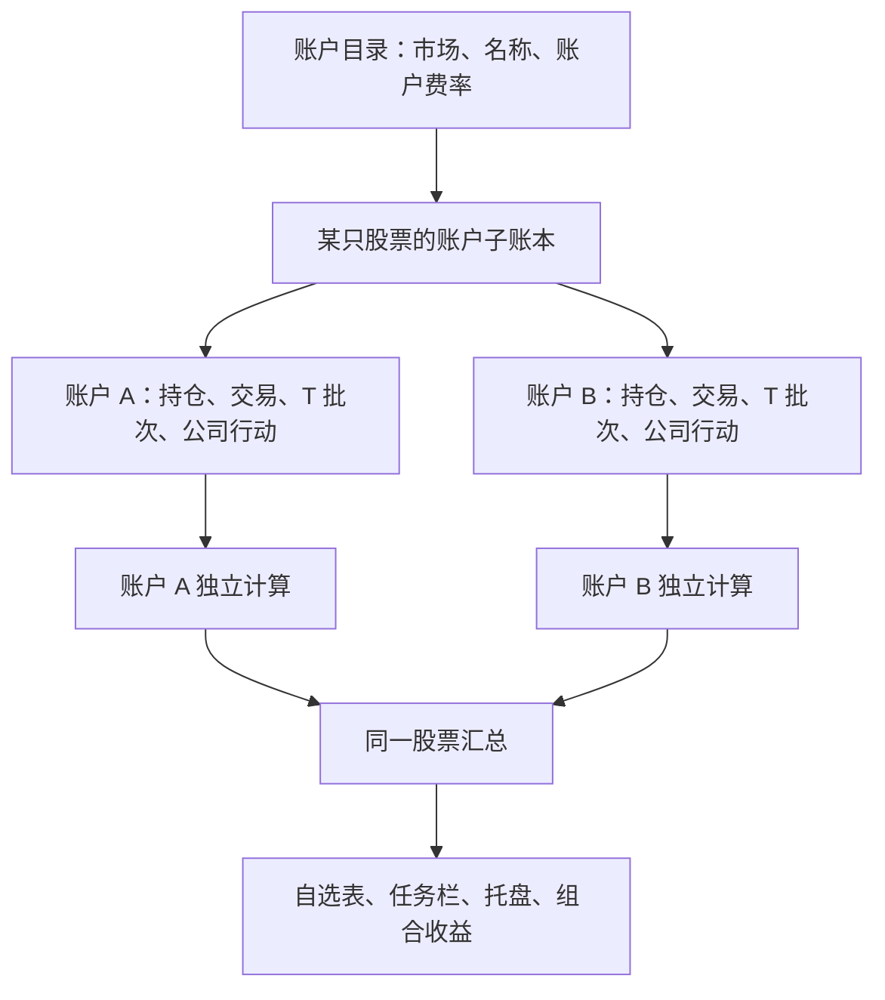

# 股票账户功能详细实现方案

日期：2026-10-05

状态：已在 `codex/stock-accounts` 分支实施；校验结果见文末实施记录

适用项目：见涨桌面应用；以当前仓库代码为基线

## 1. 目标与已确认的业务规则

本次增加真实的股票账户层。同一市场可以创建多个账户，每个账户拥有自己的费率、持仓、流水和做 T 批次；股票总览再汇总各账户的计算结果。

用户已确认：

| 项目     | 确认后的规则                                                       |
| -------- | ------------------------------------------------------------------ |
| 持仓管理 | 各账户独立维护同一股票的数量、成本和可卖数量                       |
| 做 T     | 不允许跨账户配对；每个账户分别维护批次、计划、提醒和结算           |
| 记账入口 | 买卖、初始持仓、持仓校准、分红缴税、公司行动和券商导入全部纳入账户 |
| 多账户   | 同一市场允许多个账户，各账户费率可以不同                           |
| 市场过滤 | 录入某只股票时，仅提供该股票所属市场的账户                         |
| 默认选择 | 优先使用该市场上一次成功录入交易的账户                             |
| 系统账户 | A 股、港股、美股各提供一个默认账户，名称和费率可以修改             |
| 历史绑定 | 现有数据按股票市场归入相应的默认账户                               |
| 流水展示 | 所有交易记录都显示账户名                                           |
| 股票收益 | 汇总全部账户中同一股票的计算结果                                   |

关键例子：A 账户没有某股票，B 账户有 100 股时，不能使用 B 的持仓允许 A 卖出 100 股。A 账户的正 T 买入也不能由 B 账户的卖出关闭。

本方案不增加券商登录、实盘下单、账户现金余额、出入金、账户间转股或跨市场统一资金账户。一个账户对应一个市场；同一家券商的不同市场账户分别建立。

## 2. 当前实现及改造原因

### 2.1 当前的“账户”是股票账本

当前 `AppState.tTradingAccounts` 使用 `quoteId` 作为键，一只股票只有一个 `TTradingAccount`。它包含活动 T 批次、历史批次、统一账本和交易镜像，并不表示某个券商账户。

当前账本条目已经有 `accountId` 字段，但交易重建、持仓校准、现金录入及券商导入等路径实际将它填写为 `quoteId`。因此不能只增加一个账户名称字段，也不能仅修改某个录入弹窗。

### 2.2 当前费率是市场级设置

`AppSettings.tTradingFees` 保存 A 股费率，`AppSettings.marketTradeFees` 保存港股和美股费率。交易管理、港美股交易录入及五档收益预测读取这些全局设置。

新模型需要让这些计算读取所选账户的费率，同时继续复用现有市场费用算法、历史费率模板和手工实际费用能力。

### 2.3 当前持仓及收益缺少账户维度

`WatchStock.position` 当前表示该股票的持仓。持仓编辑、T 结算和公司行动会更新这个字段。

`portfolio-performance.ts` 已经提供股票、市场、账户、币种和组合等汇总结构，但账户维度目前固定为“默认账户”。持仓周期、收益调整也主要按股票处理。

### 2.4 当前已经使用分片状态存储

`StateStore` 使用 manifest、偏好分片、组合元数据分片及按股票保存的交易账本分片。实施时应沿用这一架构，不能按早期单文件 `settings.json` 的方式设计新状态保存。

## 3. 总体结构

采用“全局账户目录 + 每只股票的账户子账本 + 股票汇总”的结构。



股票仍然在自选表中只占一行。账户维度在持仓明细、交易管理和收益明细中展开，不为每个账户复制一条自选股票。

需要严格区分三个身份：

| 身份                  | 含义               | 用途                             |
| --------------------- | ------------------ | -------------------------------- |
| `quoteId`             | 某只证券           | 行情、研究数据、自选、股票汇总   |
| `accountId`           | 某个股票账户       | 费率、持仓归属、流水归属         |
| `quoteId + accountId` | 某账户中的某只证券 | 账本、T 批次、持仓周期、账户收益 |

账户名称只用于展示。所有关联使用稳定 ID，改名不改变历史关联。

## 4. 数据模型

以下命名为建议落地命名，重点是保持账户目录和股票子账本的职责明确。

### 4.1 全局账户目录

```ts
type AccountFeeSettings =
  | { market: 'CN'; settings: TTradingFeeSettings }
  | { market: 'HK'; settings: HongKongTradeFeeSettings }
  | { market: 'US'; settings: UnitedStatesTradeFeeSettings }

interface SecuritiesAccount {
  id: string
  name: string
  market: StockMarket
  enabled: boolean
  isSystemDefault: boolean
  feeSettings: AccountFeeSettings
}

type SecuritiesAccounts = Record<string, SecuritiesAccount>
```

`market` 与 `feeSettings.market` 必须一致。继续使用现有三套费率类型，不为每个账户复制费用计算算法。

系统默认账户使用固定 ID，例如 `default:CN`、`default:HK`、`default:US`。普通新账户使用 UUID。首次迁移或初始化时，每个市场恰好创建一个系统默认账户。

系统默认账户可以修改名称和费率；市场和系统默认身份不变。普通账户创建后也不修改市场，避免历史证券、币种和费率结构失配。

### 4.2 股票账户子账本

```ts
interface StockAccountBook {
  accountId: string
  quoteId: string
  code: string
  name: string
  market: StockMarket
  currency: StockCurrency
  position?: StockPosition
  positionSnapshots?: StockPositionSnapshot[]
  boardLotSize?: number
  activeBatch?: TTradingBatch
  history: TTradingBatch[]
  ledger: PortfolioLedger
  tradeRecords: TTradeRecord[]
  performanceAdjustmentCny?: number
}

interface StockTradingBook {
  quoteId: string
  accounts: Record<string, StockAccountBook>
}

type StockTradingBooks = Record<string, StockTradingBook>
```

这是对现有单股票账本的账户化改造，保留既有 T 交易、拆分成交、结算及统一账本能力。

账户目录中的股票账户不必预先创建所有证券子账本。首次录入该账户的持仓或流水时，再创建对应子账本。

账本继续作为流水和收益计算的事实来源；`tradeRecords` 继续从账本成交条目派生。`position` 保存该账户当前已确认的持仓快照，正常成交由账本重算，手工校准则必须同时写入校准条目。两者通过统一写入流程保持一致。

### 4.3 AppState 和设置

新状态增加：

```ts
interface AccountPortfolioState {
  portfolioSchemaVersion: 2
  securitiesAccounts: SecuritiesAccounts
  stockTradingBooks: StockTradingBooks
  corporateActionApplications: CorporateActionApplications
}

// 并入 AppSettings
interface AccountSelectionSettings {
  lastUsedAccountIdByMarket: Partial<Record<StockMarket, string>>
}
```

新运行态用 `stockTradingBooks` 取代现有 `tTradingAccounts`。旧字段只在本次升级转换入口中读取，转换完成后的新保存不再维护两套账本。

`WatchStock.position` 保留为股票全部账户的汇总投影，供现有表格、系统分组和持仓筛选读取；它不再是持仓编辑入口。账户写入后统一刷新这个投影。

股票层面的雷达开关、自选分组、关注状态和股票追踪仍属于股票。持仓快照及人工收益调整归入具体账户子账本。

### 4.4 交易、账本和批次的账户字段

新增交易的 `TTrade.accountId` 为必填。所有 `PortfolioLedgerEntryBase.accountId` 改为真实股票账户 ID，`TTradingBatch` 也明确携带 `accountId`。

必须满足：

```text
子账本.accountId
  = 条目.accountId
  = 成交 record.accountId
  = 所属 T 批次.accountId
```

`tradeLedgerEntry`、`withLedgerTradeRecords`、账本规范化等函数必须使用子账本的真实 `accountId`，不能再次把它替换为 `quoteId`。

拆分成交的两条记录必须属于同一账户。`splitSource` 保持现有用途，不允许利用成交拆分向其他账户分配数量。

新初始持仓记录的 ID 包含账户和股票身份，避免沿用 `opening-balance:<quoteId>` 后发生多账户冲突。历史记录保留原 ID，读取及编辑按账户子账本定位。

### 4.5 公司行动按账户记录执行状态

公司公告和事件资料仍按股票获取一次；实际入账状态按账户维护。

```ts
interface CorporateActionApplication {
  id: string
  candidateId: string
  accountId: string
  quoteId: string
  status: CorporateActionRecord['status']
  candidate: CorporateActionCandidate
  appliedEntryIds?: string[]
  reviewedAt?: string
}

type CorporateActionApplications = Record<string, CorporateActionApplication>
```

执行记录以事件 ID 和账户 ID 联合定位。A 账户已入账不能让 B 账户的同一事件自动变成已入账；忽略、撤销、重新确认也只影响所选账户。

公告抓取缓存、证据和 AI 公告总结继续复用股票事件，不重复抓取。界面中的“已入账”状态由账户执行记录计算，不直接使用共享候选事件上的全局状态。

## 5. 账户管理和默认选择

### 5.1 设置入口

在设置中增加“股票账户”入口，按 A 股、港股、美股分组展示。每个账户显示名称、市场、启用状态及费率摘要，可新增、修改、停用或删除符合条件的账户。

费率编辑整体迁入账户设置；原有市场全局费率入口不再作为第二套可写配置保留。现有默认常量继续用于初始化新账户。

新增账户时可以复制同市场系统默认账户的费率，再单独修改。默认账户首次升级时继承用户现有费率，避免升级后恢复成程序内置值。

### 5.2 生命周期

建议首版使用以下规则：

| 操作         | 规则                                                                 |
| ------------ | -------------------------------------------------------------------- |
| 名称         | 非空；同市场启用账户的名称不重复，避免选择时混淆                     |
| 修改费率     | 可修改；影响之后的估算，不改写历史已保存费用                         |
| 停用         | 普通账户无持仓、无未结算 T 批次时允许；历史流水保留                  |
| 恢复启用     | 可恢复；继续使用原 ID 和历史数据                                     |
| 删除         | 仅允许删除没有账本、快照、收益调整、公司行动执行等业务引用的普通账户 |
| 系统默认账户 | 保持启用，不删除；可修改名称和费率                                   |

停用账户仍可查看历史、编辑历史金额和执行必要的历史撤销；不允许为停用账户新增记账。因历史更正重新出现持仓前，需要恢复启用。

### 5.3 选择优先级

统一账户选择组件和选择函数，按以下顺序解析：

1. 明确带账户身份的操作上下文，例如账户明细、提醒通知、批次入口。
2. 编辑已有记录时，该记录的原账户。
3. 该市场上一次成功新增买卖记录的账户。
4. 该市场的系统默认账户。

第 3 项只在对应账户存在、启用且市场一致时使用。账户停用或删除后，清理失效的最近使用引用，并回退到系统默认账户。

最近使用偏好按市场保存，跨股票共享：在 A 股股票甲使用账户 B 后，打开 A 股股票乙也默认选择 B；不影响港股和美股。

只有成功保存新买卖记录才更新最近使用偏好。仅打开弹窗、切换选项、取消录入或编辑历史，不更新偏好；分红、公司行动处理也不覆盖交易账户偏好。

### 5.4 选择列表

新录入列表仅包含所属市场的启用账户，不因某账户还没有这只股票的持仓而隐藏它。

“全部账户”只用于查看汇总，不是可写账户。新增持仓、交易、校准或现金记录时必须明确选择一个账户。

若存在多个账户的编辑草稿，切换账户不能将 A 的数量、费用、批次或未保存修改带到 B。采用按账户保存的本地草稿；只提交当前明确确认的账户变更，关闭时沿用现有未保存修改处理方式。

## 6. 所有记账入口的行为

### 6.1 普通买卖和初始持仓

持仓编辑和交易管理加入账户选择，购买与卖出均记录真实 `accountId`，自动费用使用当前账户配置。

初始持仓只初始化所选账户；同一股票在其他账户已有持仓，不影响新账户创建初始持仓。初始持仓仍明确标记为 `opening-balance`，不把它冒充成经过券商确认的实际成交。

填写券商成本时保留现有零费用初始持仓语义，不对输入成本再叠加估算佣金。

卖出数量、A 股可卖数量、正 T 减仓和反 T 开仓校验都使用该账户的持仓与交易。新增回溯交易或修改历史时，以该记录发生日期的子账本顺序验证，不能拿今天或其他账户的可用数量代替。

### 6.2 账户费用计算

继续复用：

- A 股 `calculateTradeFees`，并保留证券交易所差异。
- 港美股 `calculateMarketTradeFeeItems`、费用模板版本和日期选择。
- `totalRecordedTradeFees`，用于读取已保存的真实费用。
- 现有手工覆盖费用和券商实际费用入口。

账户切换时更新自动费用预览。明确填写的实际费用不应被静默替换；界面继续区分自动估算和实际填写。

新增自动估算成交保存账户费率快照，用于追溯当时采用的账户参数；费用金额本身仍是收益计算输入。手工实际费用可以没有估算快照。

修改账户费率不会重新计算历史收益。编辑历史记录时默认保留其已保存费用；需要重算费用时由用户明确选择，且使用该记录所属账户的配置和成交日期模板。

同笔成交拆成 T 流水与底仓流水时，按当前账户对原整笔成交计算一次费用，然后按数量分摊，保持每项费用及总费用守恒。不能对拆出的每条流水分别收取最低佣金。

### 6.3 做 T

每个 `quoteId + accountId` 独立拥有一个活动批次和自己的历史批次。同一股票可以在两个账户同时进行 T 交易。

所有批次操作使用明确的账户上下文：

- 开启正 T、反 T；计算剩余 T 仓和待回补数量。
- 超买、超卖拆分及新反向批次创建。
- 五档计划、预测费用、目标收益和浮动盈亏提醒。
- 批次结算、历史收益修订、成本校准和批次删除。

批次开仓快照、券商结算数量和结算成本只取当前账户。B 账户的成交不能关闭 A 的批次，也不能更新 A 的提醒状态。

T 结算对持仓的修改统一写入当前账户校准记录。当前代码 A 股结算和港美股结算的持仓写入存在不同分支，实施时需要集中为一个账户级持仓提交入口，避免 A 股只改快照而账本仍保留旧成本。

历史结算数值在迁移时原样保留。统一新写入流程不能成为重新计算全部历史结算的理由。

### 6.4 持仓校准和持仓快照

“编辑持仓”先显示各账户明细与股票合计。只有账户明细中的数量、成本、建仓日可编辑；合计只读。

校准条目只更新当前账户，原有“重置收益基准 / 保留历史累计收益”选择也只作用于该账户。A 的收益重置不重置 B 的历史。

按现有规则删除校准记录及其后续记录时，级联范围限制在当前账户子账本。提示同时列出账户名和受影响记录数。

持仓版本快照按账户保存和比较，历史股票快照迁入市场默认账户，避免不同账户快照之间直接比较数量与成本。

### 6.5 分红和缴税

手工分红、缴税选择账户；登记股数默认取该账户数量，而不是股票合计数量。未知登记股数时继续保留现有可不填写行为。

费用、现金金额、币种和汇率按原有逻辑保存。分红和缴税仍不改变数量和持仓成本，但会计入该账户及股票汇总收益。

历史清仓后发生的补税或分红仍可以归入原账户。查看与收益计算不能因为该账户当前无持仓而丢弃这些现金流水。

现有现金流水首次入账所需的初始持仓补建逻辑改为账户级，删除现金流水仍保留初始持仓。

### 6.6 公司行动

公司行动面板显示当前账户，按账户计算登记日股数和影响预览。登记日历史持仓、拆合股前后数量、供股认购和代扣税均使用该账户账本。

同一事件在多个账户分别确认与入账，每个账户保留自己的实际股数、金额、费用和汇率。首版使用逐账户确认，不默认对全部账户执行。

撤销只反转当前账户该事件的条目。公司行动 ID 可以在不同账户账本中重复引用，但幂等判断必须包含账户 ID。

证券转换按账户处理，不能沿用当前“整体改写股票及所有历史 quoteId”的方式：

1. 在当前账户记录源证券转换，并保留原历史证券身份。
2. 在目标证券的同一市场、同一账户子账本记录转换结果；目标已有持仓时合并校验，不覆盖其他账户。
3. 两只证券的账户持仓及股票合计一次保存。
4. 其他账户仍持有源证券时，源证券继续存在；研究、追踪和自选资料不因某个账户转换而整体搬走。
5. 跨市场转换需要显式匹配目标市场账户，不自动选择另一个市场默认账户；首版维持单市场账户边界，跨市场转换不作为自动入账能力新增。

### 6.7 券商流水导入

导入审核表加入账户列，支持按来源文件及市场批量指定账户，再逐行调整。一个跨市场文件分别选择各市场账户，不能用一个账户接收全部市场流水。

AI 可以从文件提取券商和账户线索，但提交前由审核界面明确账户 ID；不能只凭相似账户名把数据写入某个账户。

预览影响分别显示“股票 + 账户”的前后数量、成本，并附股票合计。回放失败时指出具体账户，不用其他账户的持仓补足。

重复判断的范围从股票扩展为账户与股票，并覆盖以下路径：

- 已入账外部成交编号。
- 同一文件内容哈希与来源位置。
- 同一批导入草稿中的外部编号、来源位置及内容指纹。
- 文件重新导入后的账本重复检查。

不同账户的相同成交编号不能互相阻止。同一账户的重复导入保持现有拦截与提示语义。来源文件绑定信息在预览和提交之间保持一致，避免换账户后误用旧校验结果。

导入实际费用继续使用文件中的实际金额，不用账户自动费率覆盖。缺少费用时沿用当前导入策略，不能为了账户化而静默补算并改变导入含义。

## 7. 历史记录编辑与删除

交易记录详情、近期流水、完整流水、底仓流水、活动批次、历史批次、现金流水和公司行动记录均显示账户名。默认按当前账户查看，提供“全部账户”合并查看，并用发生时间排序。

普通独立买卖或手工现金流水允许更正所属账户，但只能移入同市场启用账户。变更必须同时更新源与目标账本的条目、成交镜像和持仓汇总，并对两边完整回放；任一边校验失败，整个更正不保存。

与 T 批次或同笔拆分绑定的记录不允许逐条改到账户外，以免破坏批次或成交来源。首版不增加历史 T 批次批量转移工具；错误归属按现有撤销流程处理后，在正确账户重新录入。公司行动和导入记录继续从对应业务入口更正或撤销，不绕过来源管理。

更正账户归属默认保留原手续费，并明确提供是否重算的选择。编辑旧记录不更新最近使用账户偏好。

删除记录、删除历史 T 批次及删除校准后的级联都按账户限制范围。股票级删除若保留原有清理行为，需要清楚列出将影响的全部账户，不能只删除最近选中账户，也不能因移除自选而删除账户目录。

## 8. 持仓、收益和股票汇总

### 8.1 先计算账户，再汇总股票

不能把多个账户的买卖混成一个账本做移动平均或 T 配对。正确顺序是：

```text
账户 A 的该股票账本 → A 的数量、成本、收益
账户 B 的该股票账本 → B 的数量、成本、收益
账户结果求和          → 该股票的汇总结果
```

底仓成本、T 成本和已实现收益在各子账本内部使用现有算法。账户化不额外更换移动平均、费用扣减、历史汇率及收益重置的既有含义。

### 8.2 汇总数量与成本

对持有该股票的账户：

```text
股票总数量 = Σ 账户数量
股票库存总成本 = Σ（账户数量 × 账户库存成本价）
股票库存平均成本 = 股票库存总成本 / 股票总数量
股票可卖数量 = Σ 账户可卖数量
股票市值 = Σ 账户市值
```

账户执行卖出时只能使用自己的可卖数量，股票合计数量仅用于展示。

汇总成本按成本金额加权，不能直接平均账户成本价。汇总建仓日期用于展示时取当前仍有持仓账户的最早建仓日；各账户的收益周期仍独立处理。

库存成本与软件用于收益率计算的收益成本基数是不同指标。继续分别计算，不能为了汇总只保留一个“成本”字段。

### 8.3 收益汇总与周期

以下指标先按账户计算，再汇总：今日收益、当前周期收益、累计收益、已实现收益、未实现收益、分红、缴税、交易费用、公司行动收入与费用。

账户的最新持仓周期和历史累计周期独立确定。A 清仓或重新开仓不结束 B 的周期，A 的收益重置不排除 B 的历史。

“汇总全部账户”不取消现有的当前周期、累计收益和收益重置区别：

- 当前周期栏汇总各账户自己的当前或最近周期结果，保留现有周期规则。
- 累计收益栏汇总各账户依既有重置规则纳入的全部历史周期。
- 历史周期详情增加账户身份；不能为股票虚构一个跨账户共用周期。

有历史记录但当前数量为零的账户仍参与对应收益统计，不能用 `position !== undefined` 过滤账本。某账户已清仓但股票在其他账户仍持有时，也不能漏掉前者应计入的已实现或现金收益。

例如忽略费用：A 以 10 元买入 100 股，B 以 20 元买入 100 股；A 后来以 30 元卖出全部，当前价格为 30 元。应得到 A 已实现收益 2,000 元，B 库存浮盈 1,000 元，累计收益合计 3,000 元。不能通过跨账户混算把已实现与未实现分别算成 1,500 元。

T 历史结算收益是 T 功能视角，股票账本收益是整体交易视角。同一笔 T 成交已在账本计算中体现，汇总时不能再把结算 `finalProfit` 加一次，造成重复收益。

### 8.4 收益率

金额先求和，再按该指标原有分母计算：

```text
股票今日收益率 = Σ账户今日收益 / Σ账户今日成本基数
股票持仓收益率 = Σ账户对应收益 / Σ账户对应收益成本基数
```

不能相加或简单平均账户收益率。分母为零、非正或缺失时，沿用当前显示空值的处理，不创造收益率。

### 8.5 币种、汇率和人工调整

同一证券在不同账户的历史买入汇率可能不同。人民币成本与收益先在账户账本中用各条记录保存的汇率计算，再汇总。

现金流水保留现有逐币种切片。市场及组合总览以人民币汇总，不能把港币、美元和人民币直接相加。

一个账户缺少历史汇率时，对应人民币汇总继续标记不完整，不能使用另一账户汇率或将未知收益当作零。原币可计算的结果仍显示，问题定位到具体账户。

原有按股票保存的人工人民币收益调整迁入对应默认账户；以后在账户明细中调整，股票合计只读。避免为每个账户复制同一笔调整，或在股票和账户层同时重复计入。

### 8.6 汇总接口

建议集中新增 `src/lib/stock-accounts.ts`，提供：

```text
listAccountsForMarket
resolveAccountSelection
getStockAccountBook
listStockAccountBooks
calculateStockAccountsPosition
calculateStockAccountsMetrics
calculateStockAccountsPerformance
getMergedStockLedgerEntries
```

共享结果给自选表、组合卡片、收益弹窗、任务栏浮窗、托盘摘要、持仓分组及 AI 上下文，避免每个界面自行汇总。

`getMergedStockLedgerEntries` 返回携带账户身份的展示记录；它不生成一个可用于重放成本的跨账户账本。

## 9. 界面、提醒和 AI 上下文

### 9.1 自选和持仓

主表继续显示每只股票的合计数量、市值、收益和可卖数量。打开持仓明细后展示账户分布，可选择某账户编辑。

全账户交易记录增加账户名。所有收益及收益率正数红色、负数绿色、零中性；所有界面文字不低于 12px；所有股票数量输入框保持 `step=100`。

### 9.2 交易管理

标题区明确当前账户，账户选择位于交易录入基础信息中。当前持仓、可卖数量、活动批次、五档、结算和历史批次都随账户切换。

另提供“全部账户概览”查看各账户持仓及 T 状态；概览不提供需要具体批次身份的交易或结算按钮。

### 9.3 多账户提醒

主进程遍历全部股票子账本，分别更新提醒状态。通知携带 `quoteId`、`accountId`、`batchId`，通知文字显示账户名；点击后打开对应账户与批次。

主表可以合并展示同一股票的提醒，但明细必须列出账户。某个账户处理一档提醒不能清除其他账户的同方向提醒。

浮窗与托盘的普通持仓摘要使用股票汇总；T 状态按账户列出或明确显示多个账户。不能随便选第一个账户作为整只股票的 T 状态。

行情优先级仍按股票决定：任一账户有持仓或活动 T 批次，该股票进入相应刷新范围；同一股票行情只订阅一次。

### 9.4 AI 数据接口

股票研究、行情和财报数据继续按股票共享。涉及持仓和交易的数据接口必须提供账户维度：

- 股票总览返回汇总结果及账户明细，不伪装成一个账户。
- 账户交易建议明确选择 `accountId`，只使用该账户的持仓、可卖数量、T 批次和费用。
- AI 做 T 请求、快照标识、历史存储及建议缓存加入账户身份，防止复用另一账户建议。
- 股票级自动事件检查需要遍历所有相关子账本，生成的事件带账户身份。

旧 AI 快照作为历史证据保留，不全量改写。缺少账户字段的旧单账户交易上下文按其市场默认账户解释；新请求和新快照必须记录真实账户。

## 10. 历史迁移、状态保存与导入导出

### 10.1 迁移覆盖范围

这次升级只转换当前实际采用的单股票统一账本结构，不恢复早已清理的 `baseTrades`、批次内 `trades` 等过期迁移路径。

迁移必须覆盖：

| 旧数据                      | 新归属                                       |
| --------------------------- | -------------------------------------------- |
| A 股全局费率                | A 股系统默认账户                             |
| 港股 / 美股全局费率         | 对应市场系统默认账户                         |
| `tTradingAccounts[quoteId]` | 对应股票中该市场默认账户的子账本             |
| `WatchStock.position`       | 该默认账户的当前持仓；股票层保留汇总投影     |
| 股票持仓快照                | 默认账户的持仓快照                           |
| 所有账本条目                | 将旧股票型 `accountId` 绑定为默认账户 ID     |
| 成交镜像                    | 从新账本派生，成交内容及账户归属保持一致     |
| 活动与历史 T 批次           | 绑定默认账户，保留计划、提醒、开仓快照及结算 |
| 公司行动记录                | 事件资料保留，执行状态归入默认账户           |
| 股票人工收益调整            | 对应默认账户的人民币收益调整                 |
| 最近使用账户                | 各市场初始化为其系统默认账户                 |

不能只迁移有当前持仓的股票。已清仓但仍有交易、T 历史或公司行动的账本也要迁移；子账本清单以持久化交易账本和持仓数据的并集为准。

### 10.2 迁移步骤

1. 从已提交状态读取数据，建立迁移前的数量、持仓成本、交易费用、收益与 T 结算基线。
2. 保留一个明确的升级前恢复点，包含 manifest 及其引用的原分片。
3. 创建三个默认账户，复制原市场费率。
4. 把旧股票账本整体放入对应市场默认账户，补齐条目、交易与批次账户字段。
5. 迁移持仓快照、公司行动执行状态及人工收益调整。
6. 重新派生成交镜像与股票汇总投影，核对单默认账户下与升级前语义一致。
7. 写出完整新分片，验证后提交新 manifest；使用既有恢复机制管理 last-good 和状态历史。
8. 后续启动只读取新结构；重新启动或再次导入已升级数据不重复创建账户或初始持仓。

迁移只改变账户归属及组织结构，不重新估算费用、不改变成交时间与金额、不拆历史成交、不重新结算 T、不自动重置收益基准。

原来有持仓但没有股票账本的情况，将持仓原样放到默认账户，保留既有“缺少账本”语义；需要首次记账时再沿用当前初始持仓补建机制，不在升级时编造历史实际交易。

如果旧 `position` 与账本重放不一致，迁移先保留原持仓和原账本并记录差异，不能用全量重算静默覆盖。当前 A 股旧结算分支可能存在此类差异；实施时对实际数据做只读核对，存在差异时保留旧结果，通过账户持仓校准入口明确处理。

### 10.3 分片存储与版本

建议保留按股票的物理分片粒度：一个股票分片包含该股票所有账户子账本。这样行情和详情读取仍以股票为入口，不因账户增加而引入大量小文件。

组合元数据分片保存账户目录、业务结构版本和公司行动执行信息；偏好分片保存最近使用账户；各股票分片保存账户持仓、账本、批次和收益调整。

新 manifest 使用格式版本 2，股票分片使用明确的 `stock-trading-book` 文档类型；新业务结构标记为 `portfolioSchemaVersion: 2`。通用分片封装、哈希和原子提交机制继续复用。

当前 manifest 版本 1 只作为升级入口支持。不能让账户化数据继续被旧程序当作原单账户结构正常解析。升级后需要回退旧程序时，使用升级前的完整恢复点。

加载当前、加载 last-good、导入、恢复备份及构造默认状态都调用同一业务转换与规范化入口，避免某条路径丢失账户字段。last-good 如果仍引用旧结构，先按受控升级入口转换，再作为新运行态使用。

账户目录、源与目标子账本、股票汇总投影、最近使用账户偏好等关联变更在一个 revision 中提交。失败时不留下只有账户字段或只有汇总数量更新的半份数据。

### 10.4 配置与同步

导出配置从 `jianzhang-config` 版本 3 升为版本 4。版本 4 包含账户目录、子账本及全部账户偏好；旧版本 3 仅通过当前结构转换器一次导入升级。

原有备份和 Gist 上传下载继续使用已提交状态，经过同一导入恢复链路。导入的账户与流水作为一个完整集合替换，不把账户名称合并到本机同名账户，也不重新生成已导入账户 ID。

重建旧导入的最近使用账户时使用默认账户；新导入保留有效偏好。升级后的再次导出、导入应保持账户、费用、收益和批次关联一致。

## 11. 实施文件与职责

以下为当前核对到的主要文件；实施时还需检索所有 `tTradingAccounts`、`accountId: quoteId` 和按股票写持仓的调用点。

| 文件或范围                                                                              | 改造职责                                                          |
| --------------------------------------------------------------------------------------- | ----------------------------------------------------------------- |
| `src/shared/types.ts`                                                                   | 账户目录、子账本、交易及批次归属、AppState、共享 API 类型与规范化 |
| `src/shared/config.ts`                                                                  | 配置版本 4、版本 3 升级及导入保真                                 |
| 新增 `src/shared/stock-accounts.ts`                                                     | 账户初始化、当前单账本升级、身份与市场一致性规范化                |
| 新增 `src/lib/stock-accounts.ts`                                                        | 账户选择、子账本读取、股票持仓和收益聚合                          |
| `src/lib/trade-records.ts`                                                              | 账户内流水、批次关联和全账户展示投影                              |
| `src/lib/position-ledger.ts`                                                            | 账户初始持仓、校准、快照和账户内级联删除                          |
| `src/lib/portfolio-ledger.ts`                                                           | 单账户重放、公司行动及账户内反转校验                              |
| `src/lib/t-trading.ts`、`src/lib/market-trades.ts`                                      | 复用费用和成本算法，输入切换为账户数据                            |
| `src/lib/portfolio.ts`                                                                  | 账户可卖数量、今日收益与股票汇总指标                              |
| `src/lib/portfolio-performance.ts`                                                      | 真实账户分组、账户持仓周期、人工调整与股票汇总                    |
| `src/lib/t-alerts.ts`                                                                   | 遍历子账本、提醒带账户身份、计划估算用账户费率                    |
| `src/components/SettingsMenu.tsx`                                                       | 账户入口，替换市场全局费率编辑                                    |
| 新增账户管理与账户选择组件                                                              | 复用账户列表、市场过滤、费率表单和选择行为                        |
| `src/components/PositionEditor.tsx`                                                     | 账户持仓编辑、初始持仓、校准、流水账户展示                        |
| `src/components/TTradingDrawer.tsx`                                                     | 账户级录入、批次、拆分、现金和结算                                |
| `src/components/CorporateActionPanel.tsx`、`CorporateActionCenterDialog.tsx`            | 账户预览、执行状态和撤销                                          |
| `src/components/PortfolioPerformanceDialog.tsx`、`PortfolioPerformanceCyclesDialog.tsx` | 股票、账户和周期收益明细                                          |
| `src/App.tsx`、`WatchlistTable.tsx`                                                     | 统一账户写入，刷新股票汇总及账户导航                              |
| `TaskbarStockTooltip.tsx`、`TrayHoverSummary.tsx`、相关提醒徽标                         | 股票合计与多账户 T 状态                                           |
| `electron/main/state-store.ts`                                                          | manifest 升级、分片读写、统一转换、恢复点                         |
| `electron/main/ipc-handlers.ts`、`quote-runtime.ts`、`index.ts`                         | 主进程账户校验、提醒、默认状态及行情优先级                        |
| `electron/main/corporate-action-service.ts`、`electron/preload/index.ts`                | 账户化请求与公司行动执行接口                                      |
| `src/modules/ai/renderer/TradeImportPanel.tsx`                                          | 导入账户列、批量归属选择与账户影响预览                            |
| `src/modules/ai/main/trade-import/commit.ts`、相关 shared 类型                          | 导入按账户验证、去重和原子入账                                    |
| `src/modules/ai/main/stock-data/tool.ts`、上下文构建器                                  | 股票汇总与具体账户数据范围                                        |
| `src/modules/ai-t-advice/`                                                              | 做 T 请求、快照、缓存与历史加入账户维度                           |
| `docs/wiki/04-position-and-t-trading.md`、`05-state-storage-and-ipc.md` 等              | 实施完成后更新模型、入口、状态版本和开发说明                      |

账户化是组合模型改造，不应借机重写行情、研究、新闻或 AI 记忆模块。当前工作区已有 AI 相关未提交修改，实际实施时需尊重这些修改并单独处理本功能变更。

## 12. 实施顺序

### 阶段一：账户模型、升级与保存

完成账户目录、子账本模型、默认账户初始化、单账本转换、StateStore 新结构和配置导入导出。

阶段出口：旧数据能完整映射到三个市场默认账户；账户目录与流水可完整保存、恢复、再次导入。

### 阶段二：账户持仓及收益内核

完成账户内持仓回放、可卖数量、周期与收益调整，以及股票汇总函数。统一持仓提交入口，排查清仓账户被遗漏及费用重复计入的路径。

阶段出口：不同账户的成本、数量、周期互不干扰，单默认账户的旧指标保持一致。

### 阶段三：账户管理与全部录入入口

完成账户设置、统一选择组件、持仓编辑、交易管理、做 T、现金流水、历史展示及更正路径。

阶段出口：每个可写入口都有明确账户上下文，不能从汇总持仓直接提交到账户。

### 阶段四：公司行动、导入、提醒及 AI

完成公司行动分账户执行与撤销、导入账户选择及去重、后台提醒、托盘浮窗和账户化 AI 上下文。

阶段出口：两账户可以独立处理同一事件和 T 批次，来源及提醒不会混用。

### 阶段五：静态检查、文档与提交

由 Luna 只读进行静态检查与校验，主代理负责修复及最终提交。更新 Wiki，提交 message 按实际变更内容填写。

以上是开发划分，不能把只完成账户选择或只完成普通交易录入当作整个功能完成。模型、所有入口、后台和恢复链路应一起达到可交付状态。

本次尚未实施功能，不涉及版本变更或打包。未来不主动运行 `build:unpacked`、生产构建、界面验证或安装包命令；正式打包及版本号处理按项目规则和届时用户指示执行。

## 13. 验收场景与检查边界

以下是实现应覆盖的设计验收场景，不表示本次已经执行测试或界面验证。

| 场景                          | 预期                                           |
| ----------------------------- | ---------------------------------------------- |
| 首次初始化                    | CN、HK、US 各一个默认账户，无重复              |
| 升级已有配置                  | 默认账户继承用户原费率；历史流水归属正确       |
| 多次启动及再次导入            | 不重复创建默认账户、初始持仓或公司行动条目     |
| 同股票两个账户买入            | 两份数量、成本独立，股票合计金额加权正确       |
| A 无仓、B 有仓，A 卖出        | 拒绝；不能借用 B 持仓                          |
| A 股 A 今天买入、B 有原持仓   | 两账户可卖数量分别计算；合计仅展示             |
| A、B 费率不同                 | 相同交易预览费用不同，保存金额分别正确         |
| 修改账户费率                  | 新估算和预测更新，历史已保存费用与收益不变     |
| 同笔交易拆分                  | 两条记录同账户，原整笔最低佣金仅计算一次       |
| 账户切换和取消                | 草稿不串账，最近使用偏好不提前改变             |
| 最近使用账户                  | 同市场跨股票复用；跨市场不复用；无效时回退     |
| A 正 T、B 独立交易            | B 不关闭 A 批次，也不重排 A 五档               |
| 同股票两账户活动 T            | 批次、计划、提醒及结算独立存在                 |
| 修改账户持仓并重置收益        | 只重置该账户，其他账户历史保留                 |
| 删除历史校准                  | 级联只在所选账户，不删其他账户流水             |
| 更正独立交易所属账户          | 两侧一起回放与提交，失败时全部保留原状         |
| 账户已清仓但有历史收益 / 补税 | 对应收益统计仍纳入，不因缺少当前 position 丢失 |
| 同事件分红两账户入账          | 按各自登记数量计算，状态互不覆盖               |
| 撤销 A 公司行动               | B 已入账记录保持有效                           |
| 一账户证券转换                | 原证券其他账户不搬移；目标账户已有仓位不被覆盖 |
| 两账户相同券商成交编号        | 独立去重；同账户重复仍拦截                     |
| 跨市场导入                    | 每行账户市场匹配，不能通过单一批量账户错写     |
| 实际费用导入                  | 保留实际金额，不被账户估算覆盖                 |
| 一个账户缺少历史汇率          | 人民币汇总标记不完整，原币已知结果可显示       |
| 人工收益调整                  | 只属于一个子账本，股票总览不重复加算           |
| 股票收益与 T 历史收益         | T 成交只计入一次，不叠加结算收益               |
| 通知点击                      | 打开对应股票、账户、批次                       |
| 新状态导出、恢复和 Gist 同步  | 账户 ID、偏好、持仓、费用与归属保持一致        |
| 保存失败或 revision 冲突      | 不出现部分账户已改、合计未改的中间状态         |

代码实施完成后的默认检查限于项目约定的静态校验：

```text
npx tsc --noEmit --pretty false
npm run lint
变更文件的 prettier --check
git diff --check
Luna 对账户隔离、迁移、聚合及调用链进行只读静态审阅
```

不把静态通过描述为运行时、界面、构建或打包验证通过。上述场景可作为后续获准执行自动化测试或用户实际验证的用例依据。

## 14. 交付判断

这次功能的核心是把现有股票账本拆为账户内独立账本，并让股票级显示统一聚合。只给记录加账户名、只替换佣金参数或保留跨账户 T 批次，都不满足已经确认的需求。

完成标准是：每笔业务有明确账户，每个账户只使用自己的数量、成本、费率和批次；全部账户的股票收益能完整汇总；历史数据平稳归入默认账户；保存、恢复、同步及后台消费路径均保留这一模型。

## 13. 实施记录

- 从提交 `4e0753f` 创建分支 `codex/stock-accounts`。
- 实际沿用 `TTradingAccount` 类型作为账户子账本，父容器采用 `StockTradingBook`；旧单账本类型只作为本次升级输入兼容。
- 公司行动执行记录沿用原事件结构，增加 `accountId`，持久化键为 `accountId::candidateId`，公告资料按股票复用。
- 账户管理入口接替原市场费率编辑入口；录入、T 计划与 AI 做 T 上下文读取当前账户配置。
- 持仓、交易与公司行动面板保留每个已访问账户的独立草稿；账户更正同时回放源、目标账本，默认保留原费用，可明确选择重算。
- manifest 升至版本 2、配置文档升至版本 4、用户数据备份升至版本 2，继续读取上一版本。首次升级保留 `state/manifest.before-stock-accounts.json` 及其引用分片，不受常规历史轮换清理影响。
- 新写入统一更新账户持仓和股票汇总；历史迁移保留已确认数量、成本、费用、结算及快照，不重算历史。
- 校验由 Luna 执行类型、lint、格式、差异空白检查及只读调用链审阅。按项目约束不执行运行测试、界面验证、构建或打包。

## 14. 账户弹窗后续调整（2026-10-05）

初始账户调整为普通股票账户，可编辑、停用和删除，删除后不会在规范化、恢复或导入时重新创建。本文之前涉及系统默认账户不可删除、始终启用的描述已由该行为替代；旧数据首次迁移仍绑定初始化账户。无同市场账户时显示创建提示，全部停用时保留历史查看入口并阻止新增交易。

账户弹窗标题采用标准 18px，说明和删除按钮采用 14px。市场及交易账户选择使用 AppSelect，新增按钮图标与文字居中，账户列表行保持固定高度。所属市场显示禁用样式；费用输入保留可清空文本，保存时校验有效非负数字。保存账户后保留弹窗并显示保存结果。
