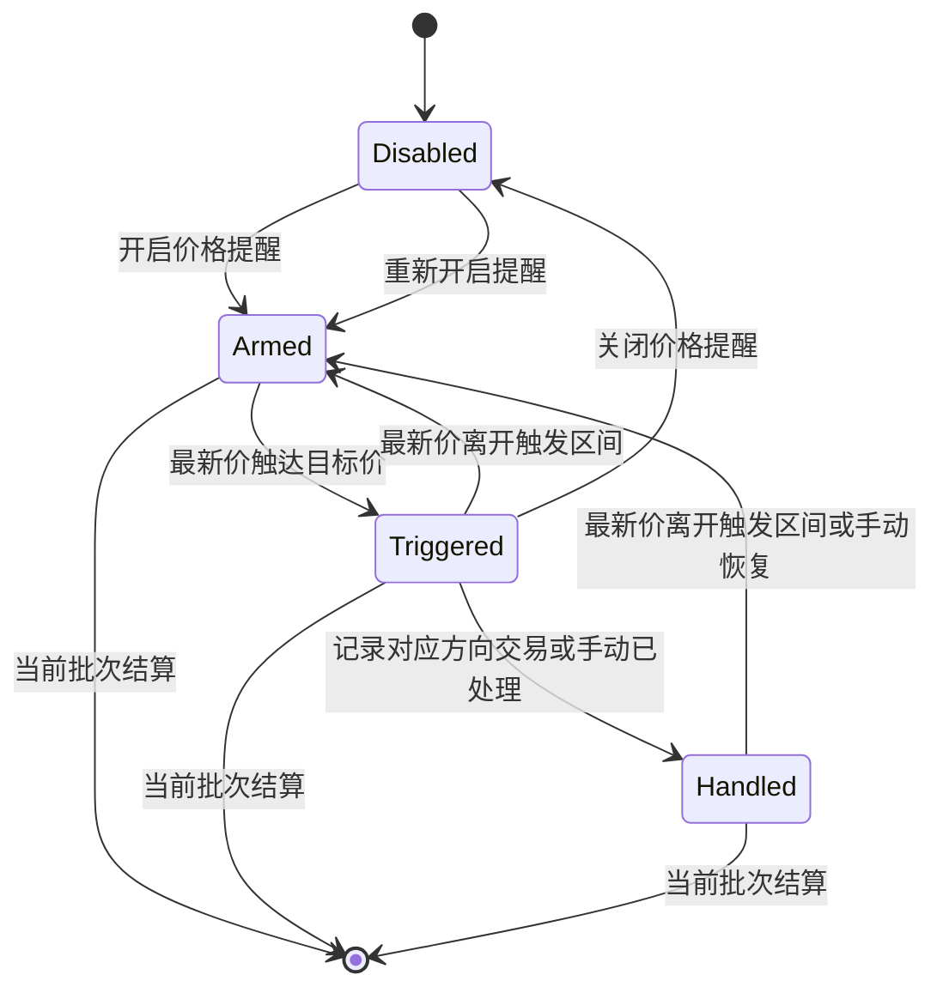

# 当前 T 仓双五档买卖提醒实施计划

> 文档状态：需求已确认，待实施  
> 编写日期：2026-07-20  
> 适用版本：基于当前 `3.1.1` 工作区继续开发

## 1. 需求目标

为当前活动 T 批次增加买入和卖出价格提醒：

- 当前 T 仓同时维护买入五档和卖出五档，共十个档位。
- 买入五档默认使用当前 T 仓平均价格下方 `1%～5%` 的目标价。
- 卖出五档默认使用当前 T 仓平均价格上方 `1%～5%` 的目标价。
- 两套五档始终在现有五档计划区域内并排显示。
- 增大 T 仓 Drawer 宽度，并压缩五档表格的行高、列宽、间距和字号。
- 提供一个当前批次级别的总开关，同时控制买入和卖出提醒。
- 提醒触发后，在主表格和 Windows 任务栏行情浮窗显示对应颜色的 `T1～T5` 标识。
- 提醒标识持续闪烁，直到提醒被处理、关闭或当前批次结算。

## 2. 已确认的业务口径

### 2.1 五档价格来源

本功能不使用盘口买一～买五、卖一～卖五作为提醒价，也不依赖五档盘口接口。

提醒目标价直接由当前 T 仓平均价格和五档目标百分比计算：

```text
买入目标价 = 当前 T 仓平均价格 × (1 - 目标跌幅 / 100)
卖出目标价 = 当前 T 仓平均价格 × (1 + 目标涨幅 / 100)
```

默认档位：

| 档位 | 买入目标 | 卖出目标 |
| --- | --- | --- |
| T1 | -1% | +1% |
| T2 | -2% | +2% |
| T3 | -3% | +3% |
| T4 | -4% | +4% |
| T5 | -5% | +5% |

目标百分比仍允许在五档计划中手动修改。当前 T 仓平均价格发生变化时，目标价格和提醒价格同步重新计算，不单独保存一份容易失效的提醒价格。

### 2.2 买卖两侧同时存在

无论当前批次是正 T 还是反 T，Drawer 中都同时显示买入五档和卖出五档：

- 正 T 批次突出卖出计划，但不隐藏买入计划。
- 反 T 批次突出买入计划，但不隐藏卖出计划。
- 买入计划使用绿色主题。
- 卖出计划使用红色主题。

### 2.3 提醒开关

在双五档计划卡片标题右侧增加一个总开关：

```text
价格提醒  [关闭 ○──]
价格提醒  [开启 ──●]
```

开关规则：

- 开关属于当前活动 T 批次。
- 新批次默认关闭，避免未经用户确认便开始闪烁。
- 开启后同时监控买入和卖出十个档位。
- 关闭后停止价格判断，并立即隐藏主表格和任务栏中的提醒标识。
- 重新开启时使用最新行情重新判断各档状态。
- 当前批次结算后，开关和全部提醒状态自动失效。
- 新批次重新使用默认关闭状态。

本期不增加每档独立开关，避免双五档区域继续膨胀。

## 3. 目标界面

### 3.1 Drawer 总体布局

当前 Drawer 宽度为：

```css
width: min(940px, calc(100vw - 48px));
```

计划调整为：

```css
width: min(1320px, calc(100vw - 24px));
```

双五档区域布局：

```text
┌────────────────── 当前 T 仓五档计划 ────────────────── [价格提醒 开/关] ┐
│                                                                        │
│  ┌────────────── 买入五档（绿色） ──────────────┐  ┌────────────── 卖出五档（红色） ──────────────┐
│  │ 档位 跌幅 目标价 数量 本档 累计 全仓         │  │ 档位 涨幅 目标价 数量 本档 累计 全仓         │
│  │ T1   -1%  价格   数量 收益 收益 收益         │  │ T1   +1%  价格   数量 收益 收益 收益         │
│  │ T2   -2%  ……                              │  │ T2   +2%  ……                              │
│  │ T3   -3%  ……                              │  │ T3   +3%  ……                              │
│  │ T4   -4%  ……                              │  │ T4   +4%  ……                              │
│  │ T5   -5%  ……                              │  │ T5   +5%  ……                              │
│  └────────────────────────────────────────────┘  └────────────────────────────────────────────┘
└────────────────────────────────────────────────────────────────────────┘
```

双栏容器建议使用：

```css
grid-template-columns: repeat(2, minmax(0, 1fr));
gap: 12px;
```

应用最小窗口宽度为 `1080px`。在较窄窗口中仍优先保持并排展示；如果可用空间不足，由双五档卡片内部提供横向滚动，不改成上下排列。

### 3.2 五档表格紧凑规格

保留现有七列信息，但缩短表头：

| 原表头 | 紧凑表头 |
| --- | --- |
| 档位 | 档位 |
| 目标涨幅/目标跌幅 | 涨幅/跌幅 |
| 目标价格 | 目标价 |
| 买入数量/卖出数量 | 数量 |
| 本档净收益 | 本档 |
| 累计收益 | 累计 |
| 全仓卖出收益/全部回补收益 | 全仓 |

完整含义通过表头 `title` 和无障碍标签保留。

样式目标：

| 项目 | 当前 | 目标 |
| --- | --- | --- |
| 数据行最小高度 | 44px | 36px |
| 表头高度 | 32px | 28px |
| 输入框高度 | 32px | 28px |
| 列间距 | 7px | 3px |
| 行内水平边距 | 9px | 4px |
| 数据字号 | 12px | 11px |
| 表头字号 | 12px | 10px |

建议列宽：

```css
grid-template-columns:
  30px
  62px
  68px
  78px
  minmax(70px, 1fr)
  minmax(70px, 1fr)
  minmax(76px, 1fr);
```

数量输入框继续遵守项目规则，必须使用：

```html
step="100"
```

### 3.3 当前方向强调

两张表始终显示，但通过卡片边框和标题状态区分当前批次重点：

- 正 T：卖出五档使用较强红色边框；买入五档保持浅绿色。
- 反 T：买入五档使用较强绿色边框；卖出五档保持浅红色。
- 不通过降低透明度弱化另一侧，保证两侧数据都清晰可读。

## 4. 数据结构设计

### 4.1 五档计划类型

将现有仅面向卖出语义的 `TSellPlanLevel` 扩展为通用计划类型：

```ts
export type TAlertStatus = 'armed' | 'triggered' | 'handled'

export interface TPlanLevel {
  targetPercent: number
  quantity: number
  alertStatus?: TAlertStatus
  triggeredAt?: string
}
```

### 4.2 当前批次结构

```ts
export interface TTradingBatch {
  id: string
  sequence: number
  openedAt: string
  direction?: TTradingDirection
  openingPosition?: TPositionSnapshot
  trades: TTrade[]
  buyLevels: TPlanLevel[]
  sellLevels: TPlanLevel[]
  alertEnabled?: boolean
  settlement?: TBatchSettlement
}
```

状态说明：

- `armed`：等待价格触达。
- `triggered`：已经触达，主表格和任务栏持续闪烁。
- `handled`：用户已经处理，本档不再重复提醒。
- 旧数据缺少状态时按 `armed` 处理。
- `alertEnabled` 缺省时按 `false` 处理。

### 4.3 默认五档生成

将当前 `createDefaultSellLevels` 改造成通用方法：

```ts
createDefaultPlanLevels(quantity: number): TPlanLevel[]
```

买入和卖出计划都默认生成五档：

- 百分比为 `1、2、3、4、5`。
- 数量按现有逻辑以 100 股为单位尽量平均分配。
- 股票数量输入和默认值都保持 100 股整数倍。

## 5. 目标价格和收益计算

### 5.1 买入计划

```text
目标价 = T 仓平均价格 × (1 - 目标跌幅)
本档价差 = (T 仓平均价格 - 目标价) × 数量 - 预计买入费用
```

### 5.2 卖出计划

```text
目标价 = T 仓平均价格 × (1 + 目标涨幅)
本档价差 = (目标价 - T 仓平均价格) × 数量 - 预计卖出费用
```

### 5.3 展示口径

- 买入侧的收益值表示相对当前 T 仓平均价格的买入价差价值。
- 卖出侧的收益值表示相对当前 T 仓平均价格的卖出价差价值。
- 累计值按照 T1 到当前档依次累计。
- 全仓值使用当前剩余 T 仓数量进行测算。
- 所有收益数字继续遵守项目配色：正数红色、负数绿色、零值中性色。
- 买入或卖出卡片的主题色不改变收益数字的正负配色规则。

## 6. 提醒触发规则

| 方向 | 触发条件 | 标识颜色 |
| --- | --- | --- |
| 买入 | 最新价小于等于买入目标价 | 绿色 |
| 卖出 | 最新价大于等于卖出目标价 | 红色 |

其他规则：

- 提醒开关关闭时不执行判断。
- 最新价为空时不触发。
- 价格跳空跨越多个档位时，同时触发全部满足条件的档位。
- 应用启动后第一次取得行情时，直接按当前价格判断，避免漏掉应用关闭期间已经达到的价格。
- 已经处于 `triggered` 或 `handled` 的档位不重复写入触发时间。
- 买入档位在最新价重新高于目标价时取消显示并恢复为 `armed`。
- 卖出档位在最新价重新低于目标价时取消显示并恢复为 `armed`。
- 修改某档百分比后，该档恢复为 `armed`，使用新目标价重新判断。
- 点击“重新均分”只重置数量；是否同时重置百分比沿用当前产品行为。

## 7. 提醒生命周期



处理规则：

- 保存买入方向的 T 交易后，将当前已触发的买入档位标记为 `handled`。
- 保存卖出方向的 T 交易后，将当前已触发的卖出档位标记为 `handled`。
- Drawer 中提供按档位“已处理”和按方向“处理全部已触发”操作。
- 已处理档位在价格仍处于触发区间时保持静默，离开触发区间后自动恢复待命。
- 关闭总开关后立即停止闪烁；重新开启时，未处理档位重新进入判断。
- 当前 T 批次结算后，主表格和任务栏中的全部提醒标识立即移除。

## 8. 行情判断架构

提醒判断放在 Electron 主进程，而不是只放在 React Drawer 中：


这样即使主窗口最小化或隐藏到通知区，任务栏提醒仍能持续工作。

为避免频繁写入配置：

- 每次行情刷新都允许执行纯计算。
- 只有档位从 `armed` 变成 `triggered` 等状态发生变化时才写入 `settings.json`。
- 没有状态变化时只广播最新行情，不写磁盘。

## 9. 主表格展示

在自选股主表格增加“T提醒”列：

- 无提醒时显示 `--`。
- 买入提醒使用绿色闪烁 `T1～T5`。
- 卖出提醒使用红色闪烁 `T1～T5`。
- 同时触发时，先显示绿色买入组，再显示红色卖出组。
- 标识悬停提示完整信息，例如：
  - `买入 T2，目标价 18.36`
  - `卖出 T3，目标价 20.48`
- 点击标识打开对应股票的 T 仓 Drawer。

新增表格列时：

- 更新 `WatchlistColumnId`。
- 将 `WATCHLIST_COLUMN_ORDER_VERSION` 升级。
- 迁移时把“T提醒”插入到“异动提示”附近。
- 保留用户已有的自定义列顺序，不整体恢复默认顺序。

## 10. 任务栏展示

任务栏使用现有透明、鼠标穿透的行情浮窗：

- 在股票名称和最新价旁追加闪烁 `T1～T5`。
- 买入标识绿色，卖出标识红色。
- 已触发提醒的股票临时加入任务栏浮窗，即使该股票平时没有勾选“任务栏展示”。
- 提醒全部处理或关闭后，如果股票原本未勾选任务栏展示，则自动从浮窗移除。
- 任务栏浮窗仍保持鼠标穿透，提醒处理操作统一在主表格或 Drawer 中完成。
- Electron 主进程计算任务栏窗口宽度和显示条件时，使用“普通任务栏股票与提醒股票的并集”。

价格提醒属于用户主动开启的高优先级功能。触发期间允许临时唤起任务栏浮窗；普通行情的任务栏展示设置不被永久修改。

## 11. 持续闪烁样式

新增统一的提醒标识组件和样式：

```text
买入：绿色 T1～T5
卖出：红色 T1～T5
```

动画要求：

- 仅标识自身闪烁，不闪烁整行或整张表。
- 使用透明度、背景色和外圈阴影组合动画。
- 动画无限循环，直到提醒状态不再是 `triggered`。
- 主表格和任务栏共用相同的颜色、节奏和状态类名。

当前全局 `prefers-reduced-motion` 会把无限动画压缩为单次动画。为满足“标识需要一直闪烁”的明确要求，需要对 T 提醒标识增加范围有限的覆盖，不能影响其他动画。

## 12. React 组件拆分

为避免在 `TTradingDrawer` 中复制两套大型 JSX，计划新增：

```text
TPlanTable
├── direction: buy | sell
├── levels
├── metrics
├── alertEnabled
├── onLevelChange
└── onHandleAlert
```

同时新增小型复用组件：

```text
TAlertBadges
├── buyTriggeredLevels
├── sellTriggeredLevels
└── displayMode: table | taskbar
```

计算逻辑放在共享纯函数中，组件只负责渲染和触发操作，避免在两个表格和两个展示区域中重复计算。

## 13. 预计文件改动

| 文件 | 计划改动 |
| --- | --- |
| `src/shared/types.ts` | 增加通用五档类型、提醒状态、双五档数据和列顺序版本 |
| `src/shared/config.ts` | 兼容配置导入并迁移旧 T 批次 |
| `src/shared/t-alerts.ts` | 新增目标价、提醒判断和展示数据纯函数 |
| `src/lib/t-trading.ts` | 扩展默认计划、双侧收益和批次处理逻辑 |
| `src/components/TTradingDrawer.tsx` | 增加总开关、双五档并排区域及提醒处理操作 |
| `src/components/TPlanTable.tsx` | 新增紧凑五档表格组件 |
| `src/components/TAlertBadges.tsx` | 新增主表格和任务栏共用的闪烁标识组件 |
| `src/components/WatchlistTable.tsx` | 增加“T提醒”列并打开对应 Drawer |
| `src/components/TaskbarTicker.tsx` | 展示提醒股票和闪烁档位 |
| `electron/main/index.ts` | 在行情刷新后执行提醒判断并同步两个窗口 |
| `src/lib/api.ts` | 补齐浏览器演示环境的双五档和提醒状态 |
| `src/styles.css` | 扩大 Drawer、双栏布局、压缩表格和增加闪烁样式 |
| `README.md` | 补充 T 仓双五档与价格提醒使用说明 |

## 14. 旧数据迁移

现有批次只有 `sellLevels`，但反 T 批次中该字段实际表示回补计划。迁移规则：

1. 正 T 活动批次：
   - 旧 `sellLevels` 迁移为新的 `sellLevels`。
   - 自动生成默认 `buyLevels`。
2. 反 T 活动批次：
   - 旧 `sellLevels` 迁移为新的 `buyLevels`。
   - 自动生成默认 `sellLevels`。
3. 缺少五档或数量不完整时，按照当前剩余 T 仓数量生成默认五档。
4. 旧批次的 `alertEnabled` 默认为 `false`。
5. 历史批次保持原交易和结算数据，不参与实时提醒。
6. 配置导入、应用启动和状态保存统一走同一个迁移方法，避免产生不同结果。

## 15. 实施顺序

1. 扩展共享类型和旧数据迁移。
2. 将现有五档计算改造成买入、卖出通用计算。
3. 提取 `TPlanTable` 并完成双表数据编辑。
4. 扩大 Drawer 并完成双栏紧凑样式。
5. 增加提醒总开关和档位状态。
6. 在 Electron 行情刷新链路中接入提醒判断。
7. 增加主表格提醒列。
8. 增加任务栏提醒展示及窗口尺寸计算。
9. 完成交易保存、手动处理、关闭提醒和批次结算的状态清理。
10. 更新配置导入导出和 README。
11. 按验收清单检查边界场景。
12. 如需要打包，先提交代码，再升级版本并执行打包。

## 16. 验收清单

### 16.1 Drawer

- [ ] Drawer 宽度明显增大，双五档完整并排显示。
- [ ] 买入五档显示 `-1%～-5%`，卖出五档显示 `+1%～+5%`。
- [ ] 两张表均允许修改百分比和数量。
- [ ] 所有数量输入框 `step="100"`。
- [ ] 双表在 1080px 应用最小宽度下仍可使用。
- [ ] 表格紧凑但数值、输入框和收益颜色可清晰辨认。
- [ ] 正 T 和反 T 只改变重点样式，不隐藏任何一侧。

### 16.2 提醒开关

- [ ] 新批次提醒默认关闭。
- [ ] 开启后同时监控买入和卖出十档。
- [ ] 关闭后主表格和任务栏标识立即消失。
- [ ] 修改目标百分比后使用新目标价判断。
- [ ] 当前批次结算后提醒自动结束。

### 16.3 触发逻辑

- [ ] 最新价跌到买入 T1 时显示绿色闪烁 `T1`。
- [ ] 最新价涨到卖出 T1 时显示红色闪烁 `T1`。
- [ ] 最新价重新高于买入目标价时，对应绿色档位立即取消显示。
- [ ] 最新价重新低于卖出目标价时，对应红色档位立即取消显示。
- [ ] 跳空跨过多档时同时触发多个标识。
- [ ] 买卖两侧已触发标识可以同时存在。
- [ ] 行情为空或刷新失败时不产生新误触发。
- [ ] 没有状态变化时不重复写入配置文件。

### 16.4 处理逻辑

- [ ] 保存买入交易后处理已触发的买入档，不影响卖出档。
- [ ] 保存卖出交易后处理已触发的卖出档，不影响买入档。
- [ ] 支持手动将单档或同方向全部提醒标记为已处理。
- [ ] 已处理档位在价格仍处于触发区间时不会立即再次触发。
- [ ] 已处理档位离开触发区间后自动恢复为待提醒状态。
- [ ] 手动恢复档位后可以重新触发。

### 16.5 主表格和任务栏

- [ ] 主表格同时正确显示绿色和红色 `T1～T5`。
- [ ] 任务栏浮窗与主表格显示相同的触发状态。
- [ ] 主窗口隐藏后任务栏标识仍持续闪烁。
- [ ] 未勾选普通任务栏展示的股票，在提醒触发时仍临时出现。
- [ ] 提醒处理后，临时出现的股票自动从任务栏移除。

### 16.6 数据兼容

- [ ] 旧正 T 活动批次迁移后原卖出计划不丢失。
- [ ] 旧反 T 活动批次迁移后原回补计划不丢失。
- [ ] 导出再导入配置后双五档、开关和提醒状态保持一致。
- [ ] 历史 T 批次收益和交易流水不受影响。

## 17. 版本和交付

该需求属于现有 T 仓功能的小功能扩展，按项目版本规则建议：

```text
3.1.1 → 3.2.0
```

如果后续继续扩展为独立提醒中心，包括声音、系统通知、提醒历史和跨股票统一管理，再评估是否升级大版本。

打包前必须：

1. 保留并检查当前工作区已有的未提交五档盘口改动和已暂存 T 仓改动。
2. 使用包含主要功能内容的提交信息完成代码提交。
3. 将版本升级到 `3.2.0`。
4. 再执行 Windows 安装包构建。

按照当前协作习惯，常规实现完成后不主动执行编译、测试或打包；只有在用户明确要求验证或打包时再执行相应命令。
