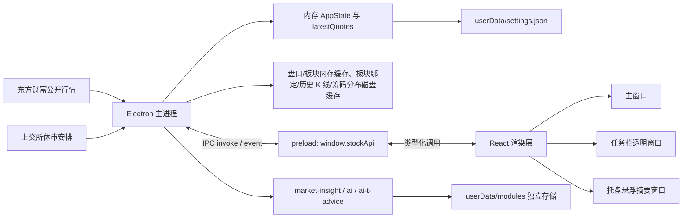
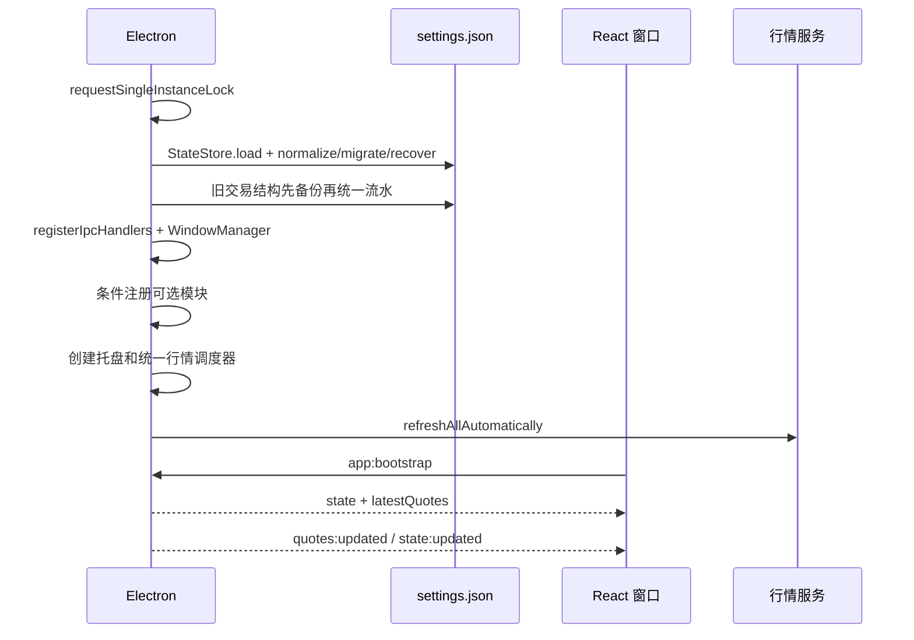
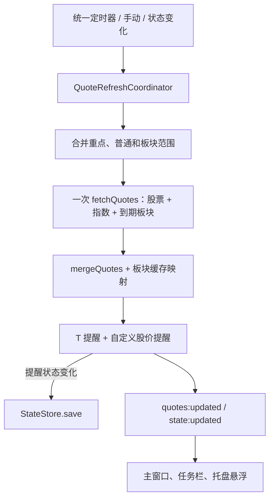

# 系统架构

[Wiki 首页](README.md) · [功能地图](02-feature-map.md) · [状态与 IPC](05-state-storage-and-ipc.md)

## 分层结构



### Electron 主进程

`electron/main/index.ts` 只负责 Electron 生命周期、核心模块组装和可选模块注册。具体职责分配如下：

| 模块 | 职责 |
| --- | --- |
| `StateStore` | 加载/规范化状态、历史迁移、原子保存、最近可用备份和损坏恢复 |
| `WindowManager` | 主窗口、任务栏窗口、托盘菜单与托盘悬浮窗口的创建、定位和销毁 |
| `registerIpcHandlers` | 注册和清理核心 `StockDesktopApi` IPC handler |
| `QuoteRuntime` | 统一报价调度、板块绑定、股价/T 提醒判断、盘口大单轮询和窗口广播 |
| `TradingCalendarRuntime` | 交易日历启动刷新和定时刷新 |
| `KlineHub` / `FundsFlowHub` / `OrderBookHub` | 对应行情的缓存、同参数请求合并和串行错峰 |

入口仍负责单实例、模块依赖注入、开机启动和退出清理；窗口细节、状态文件读写、IPC 实现和行情刷新过程不再堆叠在入口文件中。

外部数据访问集中在：

- `electron/main/market.ts`
- `electron/main/market-constants.ts`
- `electron/main/quote-refresh-coordinator.ts`
- `electron/main/sector-market-cache.ts`
- `electron/main/market-request-logger.ts`
- `electron/main/trading-calendar.ts`

### preload

`electron/preload/index.ts` 使用 `contextBridge` 暴露 `window.stockApi`。

渲染层不能直接访问 Node API，也不直接调用 Electron `ipcRenderer`。核心能力由 `StockDesktopApi` 类型约束；可选模块分别暴露 `window.marketInsightApi`、`window.aiApi` 和 `window.aiTAdviceApi`，避免把模块专有类型并入核心 API。

当前窗口均启用：

- `contextIsolation: true`
- `sandbox: true`
- `nodeIntegration: false`

### React 渲染层

`src/main.tsx` 根据 URL 查询参数选择根组件：

| URL 模式 | 根组件 | 用途 |
| --- | --- | --- |
| 无 `mode` | `App` | 主窗口 |
| `?mode=taskbar` | `TaskbarTicker` | Windows 任务栏行情条 |
| `?mode=tray` | `TrayHoverSummary` | 鼠标悬停托盘后的收益和 T 仓摘要 |

`src/App.tsx` 是主窗口的状态编排层；复杂业务计算尽量放在 `src/lib`，具体界面放在 `src/components`。

## 启动流程



注意：

- 非交易刷新时段启动时，`latestQuotes` 可能暂时为空，直到用户手动刷新或进入自动刷新窗口。
- 只有配置文件不存在时才创建内置默认状态。配置损坏时先保留原文件并尝试从 `settings.last-good.json` 恢复；没有可用备份时显示错误并停止启动，不会静默覆盖用户配置。
- 浏览器开发预览不走这条 Electron 启动链路，而使用 `src/lib/api.ts` 中的演示实现。

## 行情刷新流程

`electron/main/quote-refresh-coordinator.ts` 维护一个定时器和一个全局请求队列：

- 重点关注：默认 5 秒。
- 其余股票和大盘指数：默认 10 秒。

设置允许 3–300 秒。只有北京时间以下窗口自动刷新：

```text
09:15:00–11:30:30
12:59:30–15:30:30
```

重点和普通同时到期时合并为一轮；请求执行期间再次到期时只保留一份待刷新范围，不补跑错过的每个时间点。手动刷新和配置变化也进入同一队列，主行情最大并发数为 1。

调用链：



只有 T 提醒状态发生变化时，行情刷新链路才会额外写入 `settings.json`。普通最新报价只保存在 `latestQuotes` 内存变量中。

## 状态所有权

| 状态 | 权威位置 | 是否持久化 |
| --- | --- | --- |
| 自选、分组、持仓、列顺序、设置、统一交易流水与做 T 批次 | Electron 主进程的 `state` | 是，`settings.json` |
| 最新实时报价 | Electron 主进程的 `latestQuotes` | 否 |
| 盘口最近成功结果 | 主进程 `OrderBookHub` | 否，进程内短时缓存 |
| 股票所属板块绑定 | 主进程 `SectorMarketCache` | 是，`market-cache/sector-bindings.json` |
| 板块最近报价 | 主进程 `SectorMarketCache` | 否，进程内缓存 60 秒 |
| 分时/五日 K | 主进程 `KlineHub` | 否，100 条 LRU 短时缓存 |
| 日/周/月 K | 主进程 `KlineHub` + `HistoricalKlineCache` | 是，内存 150 条 LRU，磁盘 `market-cache/klines/*.json` |
| 最近一次全市场收盘扫描 | 主进程 `DailyMarketScanService` | 是，`daily-market-scan/latest.json` |
| 筹码分布最近一次结果 | 主进程 `ChipDistributionCache` | 是，`market-cache/chip-distributions.json` |
| 分红融资回报分析 | `DividendFinancingService` 读取 schema v2 用户快照并生成快照差异；缺失时首次自动获取，过期只提示 | 是，`dividend-financing/ranking.json`、`previous-ranking.json`、`change-report.json` |
| 基本面财务数据 | `FundamentalDataService` 读取 schema v1/v2/v3/v4/v5 用户快照；v5增加快照日收盘价，用于按总市值反推总股本并计算每股 DCF，缺失时首次自动获取，过期或完整财年落后只提示 | 是，`fundamentals/snapshot.json`、`diagnostics.json` |
| 市场观察、AI 设置/会话/结果、做 T 参考历史 | 各可选模块 | 是，`userData/modules/<module>/` |
| renderer K 线最近结果 | `ExpandedStockDetails` 的 100 条 LRU | 否；桌面版同时复用主进程缓存 |
| 行情请求记录 | 主进程 `MarketRequestLogger` | 是，`logs/market-requests-YYYY-MM-DD.jsonl`，保留 7 天 |
| 主窗口当前展开股票、弹窗开关、加载状态 | React 组件 state | 否 |
| 浏览器演示状态 | `localStorage` | 仅浏览器预览 |

渲染层保存状态时会先本地更新，再调用 `state:save`。主进程会执行 normalize/migrate，持久化后通过 `state:updated` 向所有窗口广播规范化结果。

## 窗口与托盘

### 主窗口

- 默认 1380×860，最小 1080×700。
- `ready-to-show` 后最大化。
- 使用隐藏标题栏和 Windows Mica 背景。
- 开启“关闭后驻留”时，关闭动作改为隐藏。

### 任务栏窗口

- 透明、无边框、不可聚焦、鼠标穿透。
- 根据主屏任务栏高度和用户横向位置动态定位。
- 展示用户选中的股票，以及存在已触发 T 提醒的临时股票。
- 活动 T 提醒或活动 T 仓的五档大单提示可临时加入股票并让窗口显示。
- 已选中的股票若触发自定义股价提醒，会按“达到或高于/低于”显示方向主题；股价提醒本身不会把未选择的股票临时加入任务栏。

### 托盘悬浮窗口

- 鼠标进入托盘 1 秒后显示。
- 根据托盘位置和工作区边界决定窗口位置。
- 展示任务栏可见股票的今日收益、持仓市值、持仓收益和当前 T 仓摘要，并汇总今日收益。

## 共享代码边界

### `src/shared`

主进程和渲染层都能使用，不能依赖 DOM 或 Electron：

- `types.ts`：领域模型、默认值、normalize/migrate。
- `config.ts`：导入导出文档格式。
- `market-hours.ts`：北京时间自动刷新窗口。
- `trading-calendar.ts`：内置休市范围和交易日计数。

### `src/lib`

- `portfolio.ts`：持仓、今日收益、组合汇总。
- `t-trading.ts`：费用、正反 T 账本、批次和成本计算。
- `t-alerts.ts`：双五档目标价、收益预测、价格和浮动盈亏提醒状态机。
- `trade-records.ts`：统一交易流水排序、批次筛选、写入和解除批次关联。
- `stock-alerts.ts`：股价、涨幅和持仓收益率提醒状态机。
- `order-book-alerts.ts`：五档买卖盘大单识别。
- `chip-distribution.ts`：基于日 K 与换手率的筹码分布计算。
- `api.ts`：桌面 API 选择与浏览器演示实现。
- `format.ts`：金额、价格、数量、百分比格式化。

## 修改架构时的同步点

增加一项跨进程能力通常要同时修改：

1. `src/shared/types.ts` 中的输入、输出和 `StockDesktopApi`。
2. `electron/main/ipc-handlers.ts` 中的 IPC handler 依赖和注册。
3. `electron/preload/index.ts` 中的桥接方法。
4. `src/lib/api.ts` 中的浏览器演示实现；固定演示行情数据放在 `src/lib/demo-data.ts`。
5. React 调用方。

可选模块新增 IPC 时，应保持在模块自己的 `shared/main/preload/renderer` 目录中，只在核心入口保留条件注册代码。

增加持久化字段还要同步：

1. `AppState` 或 `AppSettings`。
2. 默认值。
3. normalize/migrate。
4. 配置导入兼容。
5. 设置界面或业务入口。

交易数据结构迁移还要确认：旧结构备份、按交易 ID 去重、批次关联保留，以及重复启动后的幂等性。
