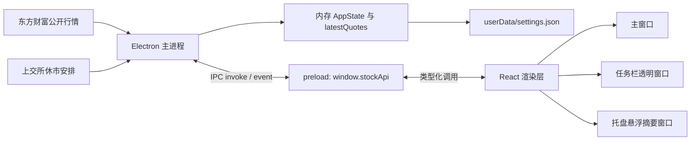
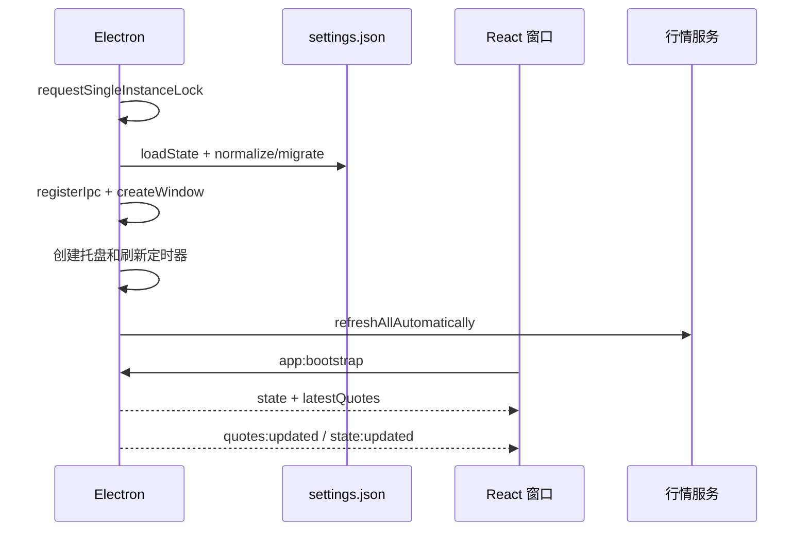
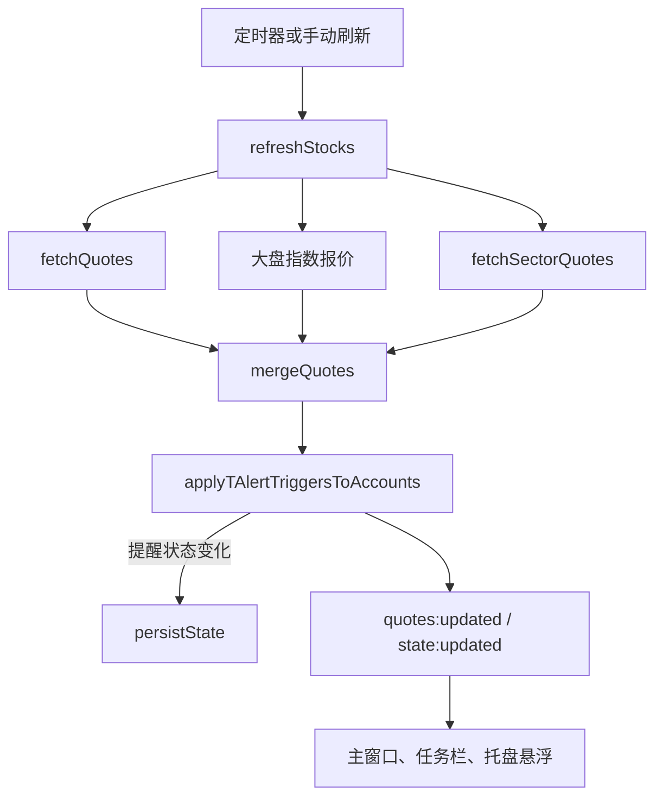

# 系统架构

[Wiki 首页](README.md) · [功能地图](02-feature-map.md) · [状态与 IPC](05-state-storage-and-ipc.md)

## 分层结构



### Electron 主进程

核心文件是 `electron/main/index.ts`。

职责：

- 保证单实例运行。
- 创建主窗口、任务栏透明窗口和托盘悬浮窗口。
- 加载并持久化 `AppState`。
- 注册 IPC。
- 分别按重点股票和普通股票刷新。
- 合并实时报价、板块数据和异动信号。
- 在每次行情合并后执行 T 价格提醒判断。
- 同步所有窗口并更新托盘菜单。
- 管理开机启动、关闭后驻留和交易日历刷新。

外部数据访问集中在：

- `electron/main/market.ts`
- `electron/main/trading-calendar.ts`

### preload

`electron/preload/index.ts` 使用 `contextBridge` 暴露 `window.stockApi`。

渲染层不能直接访问 Node API，也不直接调用 Electron `ipcRenderer`。所有可调用方法和订阅事件都由 `StockDesktopApi` 类型约束，类型定义位于 `src/shared/types.ts`。

当前窗口均启用：

- `contextIsolation: true`
- `sandbox: true`
- `nodeIntegration: false`

### React 渲染层

`src/main.tsx` 根据 URL 查询参数选择根组件：

| URL 模式 | 根组件 | 用途 |
| --- | --- | --- |
| 无 `mode` | `App` | 主窗口 |
| `?mode=taskbar` | `TaskbarTicker` | Windows 任务栏行情条 |
| `?mode=tray` | `TrayHoverSummary` | 鼠标悬停托盘后的收益和 T 仓摘要 |

`src/App.tsx` 是主窗口的状态编排层；复杂业务计算尽量放在 `src/lib`，具体界面放在 `src/components`。

## 启动流程



注意：

- 非交易刷新时段启动时，`latestQuotes` 可能暂时为空，直到用户手动刷新或进入自动刷新窗口。
- 当前状态读取失败会回退到内置默认自选列表。
- 浏览器开发预览不走这条 Electron 启动链路，而使用 `src/lib/api.ts` 中的演示实现。

## 行情刷新流程

`electron/main/index.ts` 中有两组定时器：

- 重点关注：默认 5 秒。
- 其余股票和大盘指数：默认 10 秒。

设置允许 3–300 秒。只有北京时间以下窗口自动刷新：

```text
09:15:00–11:30:30
12:59:30–15:30:30
```

调用链：



只有 T 提醒状态发生变化时，行情刷新链路才会额外写入 `settings.json`。普通最新报价只保存在 `latestQuotes` 内存变量中。

## 状态所有权

| 状态 | 权威位置 | 是否持久化 |
| --- | --- | --- |
| 自选、持仓、列顺序、设置、做 T 账本 | Electron 主进程的 `state` | 是，`settings.json` |
| 最新实时报价 | Electron 主进程的 `latestQuotes` | 否 |
| 行情面板缓存 | 各 React 模块级 `Map` | 否 |
| 主窗口当前展开股票、弹窗开关、加载状态 | React 组件 state | 否 |
| 浏览器演示状态 | `localStorage` | 仅浏览器预览 |

渲染层保存状态时会先本地更新，再调用 `state:save`。主进程会执行 normalize/migrate，持久化后通过 `state:updated` 向所有窗口广播规范化结果。

## 窗口与托盘

### 主窗口

- 默认 1380×860，最小 1080×700。
- `ready-to-show` 后最大化。
- 使用隐藏标题栏和 Windows Mica 背景。
- 开启“关闭后驻留”时，关闭动作改为隐藏。

### 任务栏窗口

- 透明、无边框、不可聚焦、鼠标穿透。
- 根据主屏任务栏高度和用户横向位置动态定位。
- 展示用户选中的股票，以及存在已触发 T 提醒的临时股票。
- 即使用户关闭普通任务栏行情，活动 T 提醒仍可让窗口显示。

### 托盘悬浮窗口

- 鼠标进入托盘 1 秒后显示。
- 根据托盘位置和工作区边界决定窗口位置。
- 展示任务栏股票的今日收益和当前 T 仓摘要。

## 共享代码边界

### `src/shared`

主进程和渲染层都能使用，不能依赖 DOM 或 Electron：

- `types.ts`：领域模型、默认值、normalize/migrate。
- `config.ts`：导入导出文档格式。
- `market-hours.ts`：北京时间自动刷新窗口。
- `trading-calendar.ts`：内置休市范围和交易日计数。

### `src/lib`

- `portfolio.ts`：持仓、今日收益、组合汇总。
- `t-trading.ts`：费用、正反 T 账本、批次和成本计算。
- `t-alerts.ts`：双五档目标价、收益预测、提醒状态机。
- `api.ts`：桌面 API 选择与浏览器演示实现。
- `format.ts`：金额、价格、数量、百分比格式化。

## 修改架构时的同步点

增加一项跨进程能力通常要同时修改：

1. `src/shared/types.ts` 中的输入、输出和 `StockDesktopApi`。
2. `electron/main/index.ts` 中的 IPC handler。
3. `electron/preload/index.ts` 中的桥接方法。
4. `src/lib/api.ts` 中的浏览器演示实现。
5. React 调用方。

增加持久化字段还要同步：

1. `AppState` 或 `AppSettings`。
2. 默认值。
3. normalize/migrate。
4. 配置导入兼容。
5. 设置界面或业务入口。

