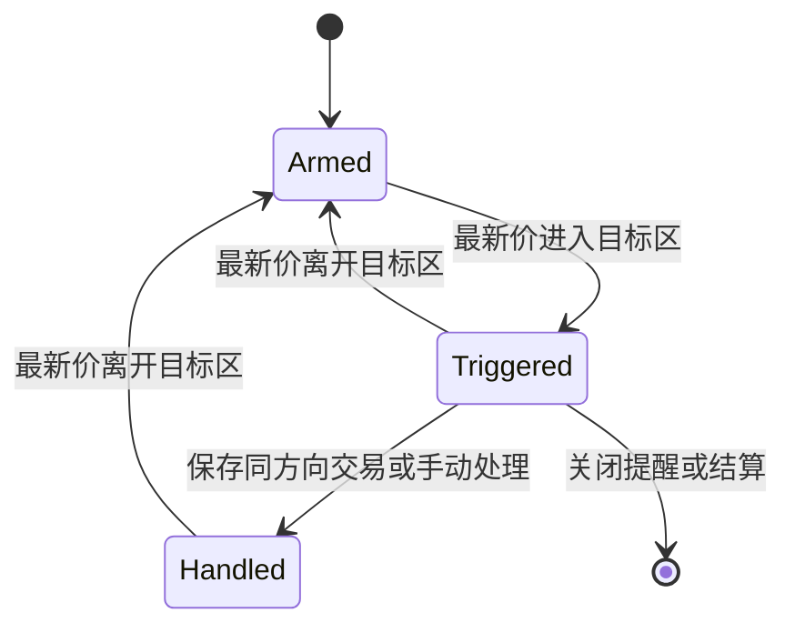

# 持仓与做 T

[Wiki 首页](README.md) · [功能地图](02-feature-map.md) · [状态与 IPC](05-state-storage-and-ipc.md)

## 代码分工

| 文件 | 职责 |
| --- | --- |
| `src/shared/types.ts` | 持仓、交易、批次、结算、费用和五档的数据结构 |
| `src/lib/portfolio.ts` | 持仓指标、今日收益、可用数量、持仓天数、组合汇总 |
| `src/lib/t-trading.ts` | 费用、正/反 T 账本、成本、批次和持仓重算 |
| `src/lib/t-alerts.ts` | 五档目标价、预测数据、提醒状态机 |
| `src/lib/trade-records.ts` | 统一交易流水排序、批次筛选、写入和批次关联处理 |
| `src/components/PositionEditor.tsx` | 持仓录入、版本快照、全部交易记录的查看与行内编辑 |
| `src/components/TTradingDrawer.tsx` | 做 T 交易、计划、结算和历史交互 |
| `src/components/TPlanTable.tsx` | 买入/卖出五档表格 |
| `src/components/TAlertBadges.tsx` | 双五档价格提醒标识 |
| `src/components/TFloatingProfitAlertBadge.tsx` | T仓浮盈/浮亏金额提醒标识 |
| `electron/main/index.ts` | 行情刷新后执行提醒并广播状态 |

## 普通持仓

`StockPosition`：

```ts
{
  quantity: number
  cost: number
  openedToday: boolean
  openedOn?: string
}
```

当前判断“本日建仓”实际以 `openedOn === currentDateKey()` 为准。`openedToday` 保留在数据结构中，但收益和可用数量的主要判断使用 `openedOn`。

### 持仓收益

有最新价时：

```text
持仓市值 = 最新价 × 当前数量
持仓收益 = (最新价 - 成本价) × 当前数量
持仓收益率 = (最新价 / 成本价 - 1) × 100%
```

### 今日收益

`calculatePositionMetrics` 通过 `getAccountTrades` 读取该股票账户唯一的 `tradeRecords`，只保留交易日期为今天的记录，然后反推开盘数量：

```text
开盘数量 = 当前数量 - 今日买入数量 + 今日卖出数量
```

普通持仓按昨收计算开盘价值；本日建仓持仓按当前成本、今日买卖和费用反推。最后：

```text
今日成本基数 = 开盘价值 + 今日买入成本（含费）
今日收益 = 当前市值 + 今日卖出净收入 - 今日成本基数
今日收益率 = 今日收益 / 今日成本基数
```

这样今日收益不会因为盘中增减仓而只做简单的“当前价减昨收”。

### 可用数量

```text
可用数量 = 当前持仓 - 今日所有买入数量
```

如果整个持仓今天首次建立，则可用数量直接为 0。这里体现 A 股股票 T+1 的可卖限制，但应用不会连接券商核验真实可用数。

### 持仓天数

`getPositionHoldingDays` 使用：

- `src/shared/trading-calendar.ts` 的 2021–2026 内置休市范围。
- 设置中在线刷新得到的额外休市日期。
- 周末过滤。

起止日都包含在计数范围内。

### 持仓快照

`PositionEditor` 可保存多个 `StockPositionSnapshot`。快照只记录名称、创建时间、数量和成本，用当前最新价计算版本市值和收益差，不影响真实持仓和做 T 账本。

同一弹窗还展示最近 5 条统一交易记录；“查看更多”按每页 15 条查看全部记录。交易类型、时间、数量、价格、费用和备注都可行内编辑，也可直接删除。保存持仓设置前这些修改只存在于弹窗草稿中。

## 做 T 账户模型

每只股票对应一个 `TTradingAccount`：

```text
TTradingAccount
├─ activeBatch?   当前活动批次
├─ history[]      已结算批次，新的在前
└─ tradeRecords[] 唯一交易数据源，包含全部 T 流水和底仓增减
```

`TTradeRecord` 在普通 `TTrade` 基础上增加可选的：

```text
batchId / batchSequence / batchDirection
```

缺少批次字段表示独立底仓交易；带 `batchId` 的记录由 `getBatchTrades` 按需投影给活动批次或历史批次。批次对象本身不再持有 `trades` 数组。

`normalizeTTradingAccounts` 兼容 4.15.0 之前的 `baseTrades`、`activeBatch.trades` 和 `history[].trades`：按交易 ID 合并去重，补齐批次关联，然后从运行结构中移除旧字段。主进程首次检测到旧结构时会先备份完整旧配置：

```text
userData/settings.pre-unified-trades.json
```

迁移后的 `settings.json` 不再含旧字段，因此后续启动只做普通规范化；迁移函数本身重复执行也会得到稳定结果。

活动批次 `TTradingBatch`：

```text
TTradingBatch
├─ direction      forward 正 T / reverse 反 T
├─ openingPosition
├─ buyLevels[5]
├─ sellLevels[5]
├─ alertEnabled
├─ floatingProfitAlert?  双向浮动盈亏金额提醒
└─ settlement?
```

## 正 T 与反 T

| 方向 | 建立 T 仓 | 关闭 T 仓 | 剩余数量含义 |
| --- | --- | --- | --- |
| 正 T `forward` | 买入 | 卖出 | 尚未卖出的 T 仓 |
| 反 T `reverse` | 卖出 | 买回 | 尚未回补的数量 |

没有活动批次时：

- 第一笔用途为 T 的买入创建正 T 批次。
- 第一笔用途为 T 的卖出创建反 T 批次。
- 用途为底仓的交易直接写入 `tradeRecords`，但不带批次关联，也不会创建批次。
- 每笔 T 交易写入同一个 `tradeRecords`，并携带当前批次 ID、序号和方向。
- 在“编辑持仓”中从无持仓首次保存为有效持仓时，会以填写的数量、成本价和建仓日期生成一笔零费用“底仓买入”记录；后续编辑持仓不会重复生成。

## 账本计算

### 正 T

买入建立剩余数量和成本：

```text
剩余成本 += 买入金额 + 买入费用
平均成本 = 剩余成本 / 剩余数量
```

卖出时按移动平均成本分摊：

```text
已实现收益 += 卖出金额 - 卖出费用 - 分摊成本
浮动收益 = (最新价 - 平均成本) × 剩余数量
```

### 反 T

卖出建立待回补数量，剩余成本基数表示卖出净收入：

```text
剩余成本 += 卖出金额 - 卖出费用
基准价 = 剩余成本 / 待回补数量
```

买回时：

```text
已实现收益 += 分摊卖出净收入 - 回补金额 - 买入费用
浮动收益 = (基准价 - 最新价) × 待回补数量
```

正 T 与反 T 的浮动收益率使用同一口径：

```text
浮动收益率 = 浮动收益 / 当前 T 仓剩余成本基数 × 100%
```

界面中的当前批次摘要和托盘悬浮窗口都复用 `calculateTBatchMetrics` 的计算结果。

### 交易校验

`validateTBatchTrades` 按时间顺序重放交易：

- 批次内卖出不能让总持仓变成负数。
- 正 T 卖出不能超过已建立的 T 仓。
- 反 T 回补不能超过已卖出的待回补数量。

保存、编辑、删除交易后都重新校验和重算持仓。

- 修改当前活动批次的记录时，会重排双五档并重新判断批次是否仍存在有效 T 交易；若不存在，批次会被移除，剩余记录解除批次关联。
- 修改已结算批次记录时，会刷新该批次的账本收益和结算元数据。
- 删除历史批次会同时删除所有关联该 `batchId` 的统一交易记录。

## 交易费用

默认配置位于 `DEFAULT_T_TRADING_FEE_SETTINGS`：

| 项目 | 默认值（万分比） |
| --- | ---: |
| 净佣金 | 5.313 |
| 经手费 | 0.341 |
| 证管费 | 0.2 |
| 过户费 | 0.1 |
| 卖出印花税 | 5 |

最低费用组合默认为 5 元：

- 深 A：佣金、经手费、证管费和过户费共同补足最低组合。
- 沪 A：佣金、经手费和证管费补足最低组合，过户费另计。
- 过户费单笔最低 0.01 元。
- 印花税只在卖出时收取。

界面允许逐笔启用手工费用并覆盖五项金额。

## 双五档计划

每个活动批次都有买入和卖出各五档。默认百分比为 1%–5%，数量默认来自设置。

目标价：

```text
买入目标价 = 当前 T 仓平均价 × (1 - 目标百分比 / 100)
卖出目标价 = 当前 T 仓平均价 × (1 + 目标百分比 / 100)
```

计划分为开仓侧和闭仓侧：

| T 方向 | 开仓侧 | 闭仓侧 |
| --- | --- | --- |
| 正 T | 买入五档 | 卖出五档 |
| 反 T | 卖出五档 | 买入五档 |

开仓侧展示执行后的预计数量和预计均价；闭仓侧展示本档、累计和全仓预计收益。预计收益会扣除按目标价格计算的费用。

交易变化后 `rebalanceTBatchPlans` 会保留现有百分比和提醒状态，但把每档数量重新套用当前设置默认值；“重置双五档”会同时恢复百分比和数量默认值。

所有数量输入框的 `step` 必须为 100。

## T 价格提醒

### 状态

每个 `TPlanLevel` 的 `alertStatus`：

```text
armed      等待触发
triggered  已触价，显示提醒
handled    已处理，在价格离开触发区前保持静默
```

状态机：



### 触发条件

```text
买入档：最新价 <= 买入目标价
卖出档：最新价 >= 卖出目标价
```

提醒总开关属于当前批次，新批次默认关闭。开启时会立即按当前最新价判断。

### 后台执行

每次主进程合并报价后：

```text
latestQuotes
  → applyTAlertTriggersToAccounts
  → 仅状态变化时 persistState
  → state:updated
  → 主表、任务栏、托盘同步
```

所以主窗口隐藏到托盘后提醒仍继续运行。

### 展示细节

- 档位状态本身可同时触发多档。
- `getTriggeredTAlertBadges` 在主表和任务栏中，每个方向只显示当前最深的一档，例如卖出侧 T1–T3 都触发时显示卖出 `T3`。
- 买入提醒为绿色主题，卖出提醒为红色主题。
- 主表提醒与五档大单徽标一起显示在股票名称旁，点击仍打开对应做 T Drawer。
- 提醒股票即使未勾选任务栏展示，也会临时进入任务栏窗口。
- 记录同方向 T 交易会把该方向当前触发档标记为 `handled`。
- 价格离开触发区域后，`triggered` 和 `handled` 都恢复为 `armed`。

## T仓浮动盈亏提醒

在“设置 → 做T”中配置“浮动盈亏提醒默认值”，默认金额为 100 元。新建批次会复制该值；活动批次在“交易管理”窗口中可以单独修改阈值和开关。

提醒是双向金额阈值：

- 浮动收益达到或超过 `+阈值` 时提醒浮盈。
- 浮动收益达到或低于 `-阈值` 时提醒浮亏。

状态只在跨越阈值时变化，持续停留在阈值外不会重复通知；回到 `-阈值～+阈值` 区间后恢复待命。批次没有剩余 T 仓、关闭提醒或完成结算后，标识会移除。

后台沿用 `applyTAlertTriggersToAccounts`，在每次统一行情刷新后计算。触发时由主进程发出 Windows 系统通知，并通过 `state:updated` 同步主表、任务栏和托盘悬停摘要。浮盈标识为红色“盈”，浮亏标识为绿色“亏”，两者持续闪烁。

## 批次结算

活动 T 仓剩余数量为 0 后才允许结算。

结算保存：

- 账本已实现收益。
- 券商最新持仓数量和成本。
- 按持仓成本推算的校准收益。
- 最终采用的收益来源。
- 结算时间和备注。

如果填写了券商最新成本：

```text
参考成本基数
  = 批次开仓时底仓成本
  + 批次内底仓交易影响

成本校准收益
  = 参考成本基数 - 券商最新数量 × 券商最新成本
```

最终收益优先采用成本校准值，否则采用账本已实现收益。结算后活动批次移入 `history`，并用券商数量和成本更新普通持仓。

历史批次支持：

- 通过统一交易表按 `batchId` 查看完整流水和费用。
- 修改成本校准收益。
- 删除批次，删除前确认。
- 每页 10 条。

## 跨市场收益分析

主标题栏的“收益分析”基于统一组合账本生成持仓收益报告，支持按股票、市场、默认账户、币种和全部组合查看。

报告分别展示：

- 已实现收益和未实现收益。
- 税前分红、预扣税、交易费用和公司行动费用。
- 资本返还、碎股现金、权利出售、退市结算等公司行动现金收益。
- 原币收益和人民币收益。
- 人民币证券收益中的价格贡献和汇率贡献。

历史成交和现金事件只使用各自记录的历史汇率。缺少历史汇率、当前汇率、当前行情或账本数据时，不使用当前汇率回填；对应股票会从人民币组合小计中排除，并显示排除原因和数量。

当前系统尚未记录完整入金、出金和现金余额，因此该页面只表示“持仓收益”，不计算账户收益、TWR 或 XIRR。

## 修改做 T 时的检查清单

1. 数据结构是否需要兼容旧批次。
2. 正 T 和反 T 是否都按时间重放验证。
3. 普通持仓是否与交易重算结果一致。
4. 五档默认值、计划重排和重置是否同步。
5. 提醒状态是否只在发生变化时持久化。
6. 主表、任务栏和托盘是否使用相同账户状态。
7. 数量输入是否 `step="100"`。
8. 所有收益和收益率是否正红、负绿、零中性。
9. 是否只从 `tradeRecords` 读写成交，未重新向批次或账户增加第二份流水。
10. 旧交易迁移是否保留批次关联、按 ID 去重并且重复启动稳定。
