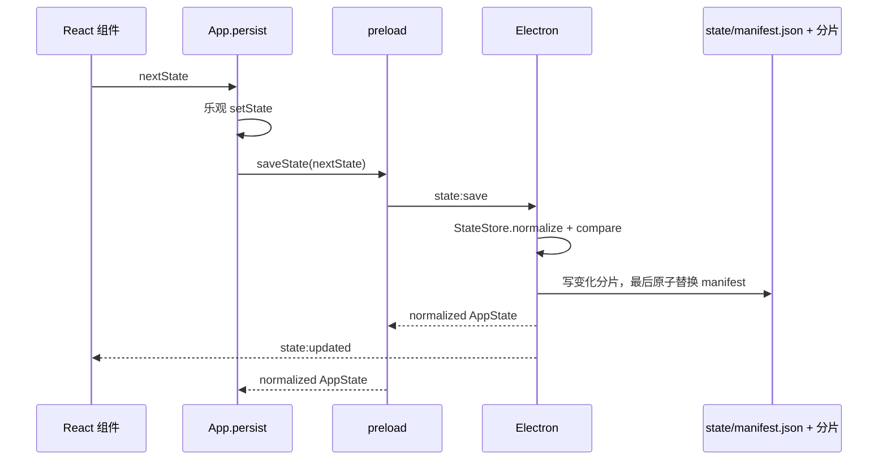

# 状态、存储与 IPC

[Wiki 首页](README.md) · [系统架构](01-architecture.md) · [持仓与做 T](04-position-and-t-trading.md)

## `AppState`

当前持久化根结构定义在 `src/shared/types.ts`：

```ts
interface AppState {
  revision?: number
  watchlist: WatchStock[]
  watchlistGroups: WatchlistGroup[]
  stockTrackingProfiles: StockTrackingProfiles
  settings: AppSettings
  columnOrder: WatchlistColumnId[]
  columnOrderVersion?: number
  tTradingAccounts: TTradingAccounts
  corporateActionRecords: CorporateActionRecords
  portfolioPerformanceAdjustments?: PortfolioPerformanceAdjustments
}
```

包含：

- 自选顺序、任务栏选择、重点关注。
- 自选分组及股票的多分组归属；包含不可改名或删除的系统“异动观察”和“追踪”分组。
- 选股追踪档案、来源历史、标签、选股逻辑、时间线、停止状态、复盘结论和按交易日保存的通用指标快照。
- 持仓和持仓快照。
- 自定义股价提醒规则与触发状态。
- 刷新、指数、筹码分布开关、界面主题、做 T、浮动盈亏提醒默认值、系统、交易日历设置。
- 表格列顺序及迁移版本。
- 全部做 T 活动批次、历史元数据和唯一交易流水。

不包含：

- 最新行情。
- 行情、周期 K 线和盘口缓存。
- 筹码分布磁盘缓存和三个可选模块的设置、缓存及历史。
- 当前展开股票。
- 弹窗、加载和错误提示状态。

## 本地存储

状态文件由 `electron/main/state-store.ts` 的 `StateStore` 统一管理。已安装应用通常使用 `%APPDATA%\jianzhang-stock-desktop`，核心状态目录为：

```text
<Electron userData>/
├─ state/
│  ├─ manifest.json
│  ├─ manifest.last-good.json
│  ├─ documents/
│  │  ├─ preferences-r<revision>-<hash>.json
│  │  ├─ watchlist-r<revision>-<hash>.json
│  │  └─ portfolio-meta-r<revision>-<hash>.json
│  ├─ tracking/<quoteId>-r<revision>-<hash>.json
│  └─ portfolios/<quoteId>-r<revision>-<hash>.json
├─ state-history/manifest-<时间>-r<revision>.json
├─ settings.legacy-v1.json
└─ settings.last-good.legacy-v1.json
```

`manifest.json` 是一次核心状态提交的唯一生效点。各 JSON 分片不可变并记录字节数和 SHA-256；未变化的分片在下一 revision 中复用旧引用。历史最多保留 20 个 manifest，且至少间隔 15 分钟，清理只删除未被当前、last-good 或保留历史引用的分片。

### 加载

`StateStore.load()` 读取 manifest 明确引用的全部分片，校验大小、SHA-256、文档类型和业务 ID，组装完整 `AppState` 后依次执行共享 normalize：

1. `normalizeWatchlist`
2. `normalizeWatchlistGroups`
3. `normalizeStockTrackingProfiles`
4. `synchronizeWatchlistGroupMemberships`
5. `normalizeAppSettings`
6. `normalizeWatchlistColumnOrder`
7. `normalizeTTradingAccounts`
8. `normalizeCorporateActionRecords`
9. `normalizePortfolioPerformanceAdjustments`

列版本或交易账户规范化结果变化时，会立即把规范化后的状态写回。

当前 manifest 或任一引用分片损坏时会整体回退，不会用空对象伪装成用户删除数据：

1. 把当前 manifest 保留为 `state/manifest.invalid-<时间>.json`。
2. 依次尝试 `manifest.last-good.json` 和按时间倒序的历史 manifest。
3. 恢复候选必须能完整读取并通过所有分片校验；成功后通过正常保存流程提交新 revision，并在主界面显示一次启动警告。
4. 没有完整候选时停止启动，不用默认状态覆盖用户数据。

首次升级时，如果新 manifest 尚不存在，`StateStore` 会读取并 normalize 旧 `settings.json`，写入首套分片，重新组装并校验迁移前后语义，再把旧文件归档为 `settings.legacy-v1.json`。旧当前文件损坏时可从旧 `settings.last-good.json` 迁移。新 manifest 一旦存在，就不再读取或合并旧文件。

迁移分支带有 `TODO(state-manifest-migration)`。只有当所有受支持安装版本都已跨过 manifest 格式后，才能连同旧文件常量和迁移测试一起移除；当前不做长期双写。

### 保存

主进程 `persistState` 调用 `StateStore.save()` 保存完整 `state`。常规保存入口仍是 IPC `state:save`：

每次成功保存都会递增 `revision`。渲染层提交的版本落后于主进程时会拒绝整份覆盖，并重新读取最新状态，避免后台提醒、追踪指标或交易日历更新被旧界面状态覆盖。

1. 接收渲染层的完整 `AppState`。
2. 再次 normalize。
3. 比较新旧状态中会触发主进程副作用的字段。
4. 只为变化领域写入新的不可变分片。
5. 保存旧当前 manifest 为 last-good，最后原子替换 `manifest.json`。
6. manifest 成功提交后更新内存 revision，并广播 `state:updated`。
7. 更新托盘菜单和任务栏窗口。
8. 通知追踪指标运行时检查是否有新开始追踪的股票需要立即采集。

可能触发的额外动作：

| 变化               | 副作用                                           |
| ------------------ | ------------------------------------------------ |
| 刷新秒数           | 重排统一行情调度器的重点/普通到期时间            |
| 大盘指数选择       | 向统一调度器提交全量报价刷新                     |
| 开机启动           | `app.setLoginItemSettings`                       |
| 自选集合或重点状态 | 交易时段内提交合并刷新；新增股票后台补取板块绑定 |
| 任务栏相关设置     | 重新计算窗口显示和位置                           |

## 状态规范化

`src/shared/types.ts` 中的 normalize 是当前状态约束核心：

| 函数                                   | 作用                                                                       |
| -------------------------------------- | -------------------------------------------------------------------------- |
| `normalizeWatchlist`                   | 持仓股票强制重点关注、补异动开关、过滤无效快照                             |
| `normalizeWatchlistGroups`             | 去除无 ID、无名称或重复 ID 的自选分组，并补齐系统“异动观察”和“追踪”分组    |
| `normalizeStockTrackingProfiles`       | 规范化追踪来源、标签、时间线和通用每日指标快照；快照中的数字指标按名称扩展 |
| `synchronizeWatchlistGroupMemberships` | 根据持仓、追踪中/已停止状态同步系统分组成员关系                            |
| `normalizeMarketIndexIds`              | 过滤并按内置顺序返回指数                                                   |
| `normalizeActiveTTradingBatch`         | 根据当前成交数量规范化双五档计划、提醒状态和反 T 语义                      |
| `normalizeTTradingAccounts`            | 以统一账本为准同步 `tradeRecords` 镜像并规范化活动批次                     |
| `normalizeWatchlistColumnOrder`        | 去重、补缺失列、保证操作列在末尾                                           |
| `normalizeAppSettings`                 | 限制刷新秒数和任务栏位置，规范化费用、浮动盈亏提醒默认值和日历             |
| `normalizeTradingCalendarSettings`     | 校验日期、去重、排序并保证内置覆盖年份                                     |

新增持久化字段时，不能只改 interface；至少要补默认值和 normalize。

## 用户数据备份与恢复

用户数据备份文档定义在 `src/shared/user-data-backup.ts`：

```text
JianzhangUserDataBackupDocument
├─ format = "jianzhang-user-data-backup"
├─ formatVersion = 1
├─ applicationVersion
├─ exportedAt
├─ state
├─ files[]
└─ aiApiKeys
```

`state` 保存完整 `AppState`。`files` 只保存无法通过网络直接恢复的用户数据：市场观察设置与事件、AI 设置/对话/上下文快照/分析结果、AI 做 T 设置与建议历史、完成通知队列，以及用户主动生成的财报 AI 总结。行情、K 线、股东、估值、基本面、分红融资、财报目录和全市场扫描等可重新获取的数据不进入备份。

`aiApiKeys` 保存 OpenAI 和 DeepSeek API Key。导出时主进程通过 `safeStorage` 解密，导入到另一台电脑时再使用目标电脑的 `safeStorage` 加密。当前备份文件没有密码或二次加密，因此 API Key 在 JSON 中是明文，设置页和导出结果会明确提示用户妥善保管。

### 导出

1. React 发起 `config:export`，主进程显示保存对话框。
2. `StateStore.exportCommittedState()` 从当前 manifest 重新组装已提交状态，不采用 renderer 的乐观状态或孤立分片。
3. `UserDataBackupService` 收集允许备份的文件和 AI API Key。
4. 写入单个 `见涨-用户数据-<时间>.json`；外部格式不包含本地 manifest、分片或历史文件。

### 导入

1. 主进程显示打开对话框。
2. 校验备份格式、允许的相对路径、AI API Key 和 `AppState`，再运行共享 normalize。
3. 只把状态、文件数量和 API Key 数量返回给 React；Key 本身不会进入 renderer。
4. React 显示覆盖和自动重启确认提示。
5. 用户确认后先在临时目录完整写入并校验备份内容，再保存当前 manifest 及全部引用分片、模块文件和凭证到 `restore-backups/`。
6. 替换受管用户文件、重新加密 API Key，再通过 `StateStore.saveImported()` 提交新本地 revision；任一步骤失败都会按物理恢复点回滚 manifest、分片、模块文件和凭证。
7. 成功恢复后保留最近 5 份恢复前快照，并自动重启，让各模块重新加载恢复后的设置和历史。

独立 `jianzhang-config` 导入仅接受当前格式 3，只恢复其中的核心配置，不触发模块数据替换和应用重启。

### GitHub Gist 加密同步

GitHub 同步复用同一份用户数据备份，不维护第二套业务数据格式。用户在“设置 → 数据”点击“连接 GitHub”，应用通过 GitHub OAuth Device Flow 打开官方网页授权，并自动查找账号下描述为“见涨用户数据同步”、文件名为 `jianzhang-user-data.json` 的 Secret Gist。未找到时不要求用户填写链接，首次上传自动创建；存在多个匹配项时选择最近更新的一个。

- OAuth App 必须启用 Device Flow。仓库内置见涨 OAuth App 的公开 Client ID，也可在构建时通过 `JIANZHANG_GITHUB_OAUTH_CLIENT_ID` 覆盖，不使用 Client Secret。
- Device Flow 请求独立的 `gist` scope。旧版 `repo` 授权不会直接复用，升级后需要重新连接一次；访问令牌使用当前电脑的 `safeStorage` 加密保存到 `userData/github-sync/token.bin`。
- 用户首次自行设置同步密码，也可主动点击“生成安全密钥”。密码使用当前电脑的 `safeStorage` 保存到 `userData/github-sync/sync-password.bin`，设置页允许直接显示、复制和更换，不进行本地二次验证。
- 上传前先把紧凑的逻辑备份 JSON 做 gzip，再以随机 salt 运行 `scrypt` 派生 256 位密钥，并使用随机 IV 的 `AES-256-GCM` 加密。新信封为 schema v2；下载仍兼容没有压缩字段的 schema v1。Gist 只保存单个加密信封，AI API Key 不会以明文离开本机。
- `userData/github-sync/settings.json` 保存账号、Gist ID、远程版本、最近同步基线和密码绑定的 Gist ID。新电脑自动找到 Gist 后，需要输入一次同步密码并成功解密，才会绑定到当前机器。
- 上传命令不接收 renderer 的完整状态；主进程从当前 manifest 导出已提交状态。上传前重新读取 Gist version；远程版本相对本机同步基线发生变化时阻止覆盖，仅对用户明确确认的本次上传放行。
- Gist 下载只准备导入并绑定当次 history version。用户确认后由一个主进程流程再次复核远端 version，再应用模块文件、API Key 和核心状态，最后写入 `lastSynchronizedVersion`；任一步失败都会回滚且不安排重启，全部成功后才自动重启。
- 更换密码时先用本机旧密码按 v1/v2 解密当前远程内容，再用 v2 gzip 加密信封写入新版本。同步密码遗失后 GitHub 和应用都无法解密远程备份。

切换到其他 OAuth App 的构建示例：

```powershell
$env:JIANZHANG_GITHUB_OAUTH_CLIENT_ID='你的Client ID'
npm run build
```

## 浏览器演示存储

没有 Electron preload 时：

```ts
stockApi = demoApi
```

演示状态保存在：

```text
localStorage["jianzhang-demo-state-v1"]
```

浏览器导入导出使用文件输入框和下载链接，不使用 Electron 对话框。

## 核心外的本地存储

以下数据不会进入 `AppState`。其中只有用户生成或无法等价联网恢复的部分进入用户数据备份：

| 路径（相对 `userData`）                                              | 内容                                                                 | 进入备份                                            |
| -------------------------------------------------------------------- | -------------------------------------------------------------------- | --------------------------------------------------- |
| `market-cache/`                                                      | K 线、筹码、股东、估值和板块绑定                                     | 否，可联网重建                                      |
| `modules/market-insight/settings.json`、`events.json`                | 模块设置和历史观察事件                                               | 是                                                  |
| `modules/market-insight/cache/` 及新闻索引                           | 指标、公告与要闻缓存                                                 | 否，可联网重建                                      |
| `modules/ai/settings.json`、`conversations/`、`snapshots/`、`cache/` | Provider 设置、对话、引用上下文和 AI 解读                            | 是                                                  |
| `modules/ai/credentials.bin`                                         | 当前电脑 `safeStorage` 加密的 API Key                                | 不直接复制；以明文 Key 写入备份后在目标电脑重新加密 |
| `modules/ai-t-advice/`                                               | 做 T 参考设置和历史 JSONL                                            | 是                                                  |
| `dividend-financing/`、`fundamentals/`、`daily-market-scan/`         | 可重新获取的运行时快照和报告                                         | 否                                                  |
| `company-reports/<股票代码>.json`                                    | 可重新获取的财报目录                                                 | 否                                                  |
| `company-reports/summaries.json`                                     | 用户主动生成的 AI 财报总结                                           | 是                                                  |
| `completion-notifications.json`                                      | 最近 100 条任务完成通知，点击后移除                                  | 是                                                  |
| `logs/market-requests-*.jsonl`                                       | 行情诊断日志；成功请求抽样，错误、回退和慢请求完整保留；按 5 MB 分片 | 否                                                  |

重要 JSON 文件、模块设置、AI 缓存、用户生成内容和加密凭证统一通过临时文件原子替换。AI 做 T 的 JSONL 历史允许跳过损坏行，超过阈值后保留最近 200 条唯一记录。基本面、分红融资和最近扫描快照改为异步加载，市场观察缓存清理延后到启动完成后执行。

“设置 → 数据 → 缓存管理”默认只清理行情临时缓存（K 线、筹码分布、板块绑定）和行情诊断日志。股东、历史估值、市场观察缓存、财报目录以及 Electron 网页 HTTP 缓存位于高级清理；基本面、分红融资和收盘扫描快照需要单独确认。清理由主进程按固定白名单执行，保留 `company-reports/summaries.json`、AI 对话、API Key、GitHub 同步凭证和其他用户数据，完成后自动重启应用。

## IPC 请求

类型契约统一定义在 `StockDesktopApi`。

| preload 方法                                                 | IPC channel                                                      | 主进程处理                                                                                                       |
| ------------------------------------------------------------ | ---------------------------------------------------------------- | ---------------------------------------------------------------------------------------------------------------- |
| `getBootstrap`                                               | `app:bootstrap`                                                  | 返回状态、内存报价和数据源                                                                                       |
| `getTaskbarLayout`                                           | `taskbar:layout:get`                                             | 返回任务栏高度                                                                                                   |
| `searchStocks`                                               | `stocks:search`                                                  | 股票联想                                                                                                         |
| `getDividendFinancingSnapshot`                               | `dividend-financing:get`                                         | 返回进程内缓存的 schema v2 用户快照；本地不存在时返回 `null`                                                     |
| `getDividendFinancingState`                                  | `dividend-financing:state:get`                                   | 返回缺失、排队、更新中、有效、过期或失败状态                                                                     |
| `getDividendFinancingChangeReport`                           | `dividend-financing:changes:get`                                 | 返回最近一次手动更新前后的新入榜、移出、排名、比例、分红与融资变化                                               |
| `runDividendFinancingUpdate`                                 | `dividend-financing:update`                                      | 调用随应用附带的 Python 脚本，保存更新前快照并生成变化报告                                                       |
| `getFundamentalSnapshot`                                     | `fundamentals:get`                                               | 返回进程内缓存的 schema v1-v7 用户快照；本地不存在时返回 `null`                                                  |
| `getFundamentalState`                                        | `fundamentals:state:get`                                         | 返回基本面快照状态、报告期、生成时间和过期原因                                                                   |
| `getFundamentalChangeReport`                                 | `fundamentals:changes:get`                                       | 返回最近两次快照按默认规则比较的新入选、移出、待核、数据完整性、覆盖和企业口径变化；首次快照返回 `null`          |
| `runFundamentalUpdate`                                       | `fundamentals:update`                                            | 调用五阶段 Python 脚本，更新五年财务、季度排雷、行业资产负债分位、净负债、快照日 PE/PB行业分位、总市值和流通市值 |
| `getCompanyReports`                                          | `company-reports:get`                                            | 按股票读取有效缓存或查询巨潮最近五个报告年度的年报、半年报、一季报和三季报目录；可强制更新                       |
| `generateCompanyReportSummary`                               | `company-reports:summary:generate`                               | 下载巨潮官方 PDF、提取重点章节、调用当前 AI 模型生成总结并保存到本地                                             |
| `openCompanyReport`                                          | `company-reports:open`                                           | 校验巨潮资讯 HTTPS 链接后用系统浏览器打开原始 PDF                                                                |
| `getShareholderSnapshot`                                     | `shareholders:get`                                               | 按股票读取 24 小时持久化缓存或查询东方财富 F10 股东信息；可强制更新，失败时允许返回旧缓存并提示                  |
| `getValuationHistory`                                        | `valuation-history:get`                                          | 按股票返回近五年 PE TTM/PB/PCF TTM正值序列，主进程按日缓存供市场观察和长期 AI 计算历史分位                       |
| `refreshQuotes`                                              | `quotes:refresh`                                                 | 向统一调度器提交手动全量刷新                                                                                     |
| `refreshQuote`                                               | `quotes:refresh-one`                                             | 新增自选后向统一调度器提交单股定向刷新，并返回合并后的当前报价                                                   |
| `getKline`                                                   | `kline:get`                                                      | 通过 `KlineHub` 获取分时/五日/周期 K，同参数合并并串行请求                                                       |
| `getDailyMarketScanResult`                                   | `daily-market-scan:get`                                          | 返回最近一次落盘的收盘扫描结果；没有结果时返回 `null`                                                            |
| `getDailyMarketScanState`                                    | `daily-market-scan:state:get`                                    | 返回扫描阶段、进度和错误状态                                                                                     |
| `runDailyMarketScan`                                         | `daily-market-scan:run`                                          | 启动全市场报价过滤、日 K 批处理和本地信号计算                                                                    |
| `saveChipDistributionCache`                                  | `chip-distribution:cache:save`                                   | 保存股票最后一次筹码分布计算结果                                                                                 |
| `getOrderBook`                                               | `order-book:get`                                                 | 从主进程 `OrderBookHub` 获取五档盘口、缓存状态和刷新错误                                                         |
| `getFundsFlow`                                               | `funds-flow:get`                                                 | 通过 `FundsFlowHub` 获取当日资金流                                                                               |
| `getSectorIndex`                                             | `sector-index:get`                                               | 所属板块详情                                                                                                     |
| `refreshTradingCalendar`                                     | `trading-calendar:refresh`                                       | 在线刷新当年休市日                                                                                               |
| `saveState`                                                  | `state:save`                                                     | 规范化并持久化状态                                                                                               |
| `getCompletionNotifications` / `saveCompletionNotifications` | `completion-notifications:get` / `completion-notifications:save` | 读取及保存跨重启完成通知队列                                                                                     |
| `getCacheSummary` / `clearCaches`                            | `cache:summary` / `cache:clear`                                  | 返回缓存分类占用并按固定白名单清理，清理后自动重启                                                               |
| `exportConfig`                                               | `config:export`                                                  | 保存 JSON                                                                                                        |
| `importConfig`                                               | `config:import`                                                  | 读取并解析 JSON                                                                                                  |
| `applyConfigImport`                                          | `config:import:apply`                                            | 替换模块用户数据、重新加密 AI API Key，并重启应用                                                                |
| `getGitHubSyncSettings`                                      | `github-sync:settings:get`                                       | 返回 OAuth、Gist、同步密码绑定和本地/远程版本状态                                                                |
| `startGitHubLogin` / `completeGitHubLogin`                   | `github-sync:login:start` / `github-sync:login:complete`         | 发起并完成 GitHub OAuth Device Flow，安全保存访问令牌                                                            |
| `refreshGitHubGist`                                          | `github-sync:gist:refresh`                                       | 自动查找并刷新当前账号的见涨 Secret Gist                                                                         |
| `get/generate/saveGitHubSyncPassword`                        | `github-sync:password:*`                                         | 显示本机密码、可选生成安全密钥、验证并绑定或更换同步密码                                                         |
| `disconnectGitHub`                                           | `github-sync:disconnect`                                         | 删除当前电脑的 GitHub 访问令牌，保留本机同步密码                                                                 |
| `uploadUserDataToGitHub`                                     | `github-sync:upload`                                             | 加密当前用户数据并创建或更新 Secret Gist                                                                         |
| `downloadUserDataFromGitHub`                                 | `github-sync:download`                                           | 下载并解密远程备份，进入统一导入确认流程                                                                         |
| `applyGitHubGistRestore`                                     | `github-sync:gist:restore-apply`                                 | 复核远端 version，原子协调用户数据恢复、同步基线提交和成功后的重启                                               |
| `hideWindow`                                                 | `app:hide`                                                       | 隐藏主窗口                                                                                                       |
| `quitApp`                                                    | `app:quit`                                                       | 清理并退出                                                                                                       |

## IPC 事件

主进程通过 `sendToWindows` 同时发送给主窗口、任务栏窗口和托盘悬浮窗口。

| preload 订阅                        | 事件 channel                         | 数据                                    |
| ----------------------------------- | ------------------------------------ | --------------------------------------- |
| `onQuotesUpdated`                   | `quotes:updated`                     | `StockQuote[]`                          |
| `onDailyMarketScanProgress`         | `daily-market-scan:progress`         | `DailyMarketScanState`                  |
| `onStateUpdated`                    | `state:updated`                      | `AppState`                              |
| `onTaskbarLayout`                   | `taskbar:layout`                     | `TaskbarLayout`                         |
| `onSelectStock`                     | `stock:selected`                     | `StockSelectionRequest`                 |
| `onDataError`                       | `data:error`                         | 错误文本                                |
| `onDividendFinancingUpdateProgress` | `dividend-financing:update-progress` | Python 脚本当前日志或完成/失败状态      |
| `onDividendFinancingStateUpdated`   | `dividend-financing:state-updated`   | 分红融资榜快照状态变化                  |
| `onFundamentalUpdateProgress`       | `fundamentals:update-progress`       | 基本面五阶段脚本当前日志或完成/失败状态 |
| `onFundamentalStateUpdated`         | `fundamentals:state-updated`         | 基本面快照状态变化                      |

`stock:selected` 用于从托盘菜单点选股票或点击 Windows 系统通知后，让主窗口定位/展开对应股票。系统通知会附带 `scrollAlignment: 'sticky-top'` 和 `detailTarget`，列表清除筛选条件后将目标主行滚动到顶部 sticky 位置并展开详情；普通股票提醒和 T 仓浮盈提醒进入分时页签，量价背离提醒进入追踪复盘页签。

## 主窗口保存流程



## 敏感数据边界

核心 `AppState` 会：

- 按领域明文写入本机 `state/` 分片，并由 manifest 管理当前版本。
- 随配置完整导出。
- 广播给三个渲染窗口。

因此 AI API Key 和账号凭证没有放进 `AppState` / `AppSettings`。当前实现遵循：

1. 仅在 Electron 主进程读写秘密。
2. 使用独立、不可导出的模块存储。
3. Windows 下用 Electron `safeStorage` 加密 API Key 后再落盘。
4. 渲染层只拿“是否已配置、提供商、脱敏尾号/账号状态”等非敏感信息。
5. IPC 只提供设置、清除、登录/退出和测试连接动作，不提供读取明文接口。

详见 [AI 与市场观察模块](08-ai-extension-points.md)。

## 新增 IPC 的固定步骤

1. 在 `src/shared/types.ts` 添加输入、输出类型。
2. 扩展 `StockDesktopApi`。
3. 在 `electron/preload/index.ts` 添加 `invoke` 或订阅桥接。
4. 在 `electron/main/ipc-handlers.ts` 扩展依赖并注册 handler；广播来源若属于行情或窗口职责，则修改对应 Runtime/Manager。
5. 在 `src/lib/api.ts` 给 `demoApi` 补等价实现。
6. 在 React 中调用。
7. 如果结果持久化，再补默认值、normalize 和配置兼容。

`market-insight`、`ai`、`ai-t-advice` 的 IPC 不扩展 `StockDesktopApi`；应分别修改模块自己的共享类型、注册函数、preload bridge、renderer API 和浏览器降级入口。
