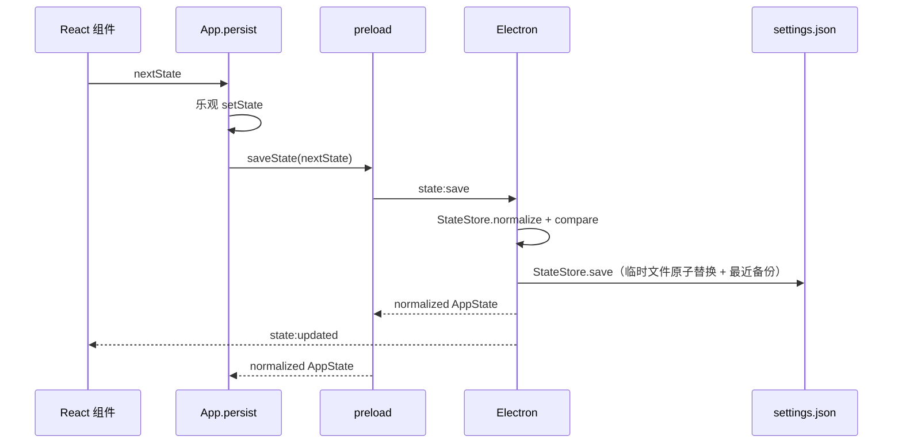

# 状态、存储与 IPC

[Wiki 首页](README.md) · [系统架构](01-architecture.md) · [持仓与做 T](04-position-and-t-trading.md)

## `AppState`

当前持久化根结构定义在 `src/shared/types.ts`：

```ts
interface AppState {
  watchlist: WatchStock[]
  watchlistGroups: WatchlistGroup[]
  stockTrackingProfiles: StockTrackingProfiles
  settings: AppSettings
  columnOrder: WatchlistColumnId[]
  columnOrderVersion?: number
  tTradingAccounts: TTradingAccounts
}
```

包含：

- 自选顺序、任务栏选择、重点关注。
- 自选分组及股票的多分组归属；包含不可改名或删除的系统“异动观察”和“追踪”分组。
- 选股追踪档案、来源历史、标签、选股逻辑、时间线、停止状态、复盘结论和按交易日保存的通用指标快照。
- 持仓和持仓快照。
- 自定义股价提醒规则与触发状态。
- 刷新、指数、筹码分布开关、做 T、浮动盈亏提醒默认值、系统、交易日历设置。
- 表格列顺序及迁移版本。
- 全部做 T 活动批次、历史元数据和唯一交易流水。

不包含：

- 最新行情。
- 行情、周期 K 线和盘口缓存。
- 筹码分布磁盘缓存和三个可选模块的设置、缓存及历史。
- 当前展开股票。
- 弹窗、加载和错误提示状态。

## 本地存储

桌面版路径：

```text
<Electron userData>\settings.json
```

当前已安装应用通常对应：

```text
%APPDATA%\jianzhang-stock-desktop\settings.json
```

状态文件由 `electron/main/state-store.ts` 的 `StateStore` 统一管理。除正式文件外，同目录还可能包含：

| 文件 | 作用 |
| --- | --- |
| `settings.last-good.json` | 最近一次完整保存的可用备份 |
| `settings.pre-unified-trades.json` | 统一交易流水迁移前的一次性原始备份 |
| `settings.invalid-<时间>.json` | 配置损坏时保留的原文件副本 |

### 加载

`StateStore.load()` 读取 JSON 后依次执行：

1. `normalizeWatchlist`
2. `normalizeWatchlistGroups`
3. `normalizeStockTrackingProfiles`
4. `synchronizeTrackingGroupMembership`
5. `normalizeAppSettings`
6. `migrateWatchlistColumnOrder`
7. `normalizeTTradingAccounts`

列版本落后或交易账户规范化结果变化时，会立即把迁移后的状态写回。若检测到旧 `baseTrades` / `batch.trades`，写回前先把原始完整配置备份为 `settings.pre-unified-trades.json`；已有备份不会被覆盖。

只有 `settings.json` 不存在时才复制 `DEFAULT_STATE` 并保存。文件读取、JSON 解析或迁移失败时：

1. 把原文件保留为 `settings.invalid-<时间>.json`。
2. 尝试加载并规范化 `settings.last-good.json`。
3. 恢复成功后重写正式文件，并在主界面显示一次启动警告。
4. 没有可用备份时抛出明确错误，主进程显示错误框后停止启动，不会用默认自选覆盖用户文件。

### 保存

主进程 `persistState` 调用 `StateStore.save()` 保存完整 `state`。保存先写同路径 `.tmp` 临时文件，再原子重命名替换目标文件；正式文件成功后同步更新 `settings.last-good.json`。常规保存入口是 IPC `state:save`：

1. 接收渲染层的完整 `AppState`。
2. 再次 normalize。
3. 比较新旧状态中会触发主进程副作用的字段。
4. 更新内存并写入文件。
5. 广播 `state:updated`。
6. 更新托盘菜单和任务栏窗口。
7. 通知追踪指标运行时检查是否有新开始追踪的股票需要立即采集。

可能触发的额外动作：

| 变化 | 副作用 |
| --- | --- |
| 刷新秒数 | 重排统一行情调度器的重点/普通到期时间 |
| 大盘指数选择 | 向统一调度器提交全量报价刷新 |
| 开机启动 | `app.setLoginItemSettings` |
| 自选集合或重点状态 | 交易时段内提交合并刷新；新增股票后台补取板块绑定 |
| 任务栏相关设置 | 重新计算窗口显示和位置 |

## 状态规范化和迁移

`src/shared/types.ts` 中的 normalize/migrate 是当前兼容核心：

| 函数 | 作用 |
| --- | --- |
| `normalizeWatchlist` | 持仓股票强制重点关注、补异动开关、过滤无效快照 |
| `normalizeWatchlistGroups` | 去除无 ID、无名称或重复 ID 的自选分组，并补齐系统“异动观察”和“追踪”分组 |
| `normalizeStockTrackingProfiles` | 兼容缺失追踪数据的旧配置并规范化来源、标签、时间线和通用每日指标快照；快照中的数字指标按名称扩展 |
| `synchronizeTrackingGroupMembership` | 根据追踪中/已停止状态自动加入或移出系统“追踪”分组 |
| `normalizeMarketIndexIds` | 过滤并按内置顺序返回指数 |
| `normalizeActiveTTradingBatch` | 兼容旧双五档、价格/浮动盈亏提醒开关和反 T 语义 |
| `normalizeTTradingAccounts` | 把旧活动/历史批次流水和 `baseTrades` 按 ID 合并到唯一 `tradeRecords`，再移除旧字段并规范化活动批次 |
| `normalizeWatchlistColumnOrder` | 去重、补缺失列、保证操作列在末尾 |
| `migrateWatchlistColumnOrder` | 按版本插入今日收益、板块、成交等新列，并过滤已经移除的列 |
| `normalizeAppSettings` | 兼容旧刷新字段、限制秒数/位置、补费用、浮动盈亏提醒默认值和日历 |
| `normalizeTradingCalendarSettings` | 校验日期、去重、排序并保证内置覆盖年份 |

新增持久化字段时，不能只改 interface；至少要补默认值和 normalize。

## 用户数据备份与恢复

用户数据备份文档定义在 `src/shared/user-data-backup.ts`：

```text
JianzhangUserDataBackupDocument
├─ format = "jianzhang-user-data-backup"
├─ formatVersion = 1
├─ applicationVersion
├─ exportedAt
├─ state
├─ files[]
└─ aiApiKeys
```

`state` 保存完整 `AppState`。`files` 只保存无法通过网络直接恢复的用户数据：市场观察设置与事件、AI 设置/对话/上下文快照/分析结果、AI 做 T 设置与建议历史，以及用户主动生成的财报 AI 总结。行情、K 线、股东、估值、基本面、分红融资、财报目录和全市场扫描等可重新获取的数据不进入备份。

`aiApiKeys` 保存 OpenAI 和 DeepSeek API Key。导出时主进程通过 `safeStorage` 解密，导入到另一台电脑时再使用目标电脑的 `safeStorage` 加密。Codex 账号登录目录始终排除。当前备份文件没有密码或二次加密，因此 API Key 在 JSON 中是明文，设置页和导出结果会明确提示用户妥善保管。

### 导出

1. React 把当前 `AppState` 传给 `config:export`。
2. 主进程显示保存对话框。
3. `UserDataBackupService` 收集允许备份的文件和 AI API Key。
4. 写入 `见涨-用户数据-<时间>.json`。

### 导入

1. 主进程显示打开对话框。
2. 校验备份格式、允许的相对路径、AI API Key 和 `AppState`，再运行共享 normalize/migrate。
3. 只把状态、文件数量和 API Key 数量返回给 React；Key 本身不会进入 renderer。
4. React 显示覆盖和自动重启确认提示。
5. 用户确认后先走普通 `state:save`，再替换受管用户文件并重新加密 API Key。
6. 应用自动重启，让各模块重新加载恢复后的设置和历史。

旧版 `jianzhang-config` 格式 1、2、3 仍可导入，但只恢复其中的核心配置，不触发模块数据替换和应用重启。`scripts/convert-stock-helper-config.mjs` 生成的转换结果也继续兼容。

### GitHub 私有仓库同步

GitHub 同步复用同一份用户数据备份，不维护第二套数据格式。用户在“设置 → 系统与数据”填写仓库所有者、私有仓库、分支、文件路径和 Fine-grained Personal Access Token，然后可以手动上传或从 GitHub 恢复。

- Token 只需要目标仓库的 Contents 读写权限，使用当前电脑的 `safeStorage` 加密保存到 `userData/github-sync/token.bin`，不会写入用户数据备份。
- 仓库、分支、路径和最近上传/恢复时间保存到 `userData/github-sync/settings.json`。
- 上传通过 GitHub Contents API 创建或覆盖固定路径，Git 提交历史保留旧版本。
- 从 GitHub 下载后走与本地导入完全相同的校验、确认、文件替换、API Key 重新加密和自动重启流程。
- 当前备份未加密且包含 AI API Key，上传确认框会再次要求用户确认目标是自己的私有仓库。

## 浏览器演示存储

没有 Electron preload 时：

```ts
stockApi = demoApi
```

演示状态保存在：

```text
localStorage["jianzhang-demo-state-v1"]
```

浏览器导入导出使用文件输入框和下载链接，不使用 Electron 对话框。

## 核心外的本地存储

以下数据不会进入 `AppState`。其中只有用户生成或无法等价联网恢复的部分进入用户数据备份：

| 路径（相对 `userData`） | 内容 | 进入备份 |
| --- | --- | --- |
| `market-cache/` | K 线、筹码、股东、估值和板块绑定 | 否，可联网重建 |
| `modules/market-insight/settings.json`、`events.json` | 模块设置和历史观察事件 | 是 |
| `modules/market-insight/cache/` 及新闻索引 | 指标、公告与要闻缓存 | 否，可联网重建 |
| `modules/ai/settings.json`、`conversations/`、`snapshots/`、`cache/` | Provider 设置、对话、引用上下文和 AI 解读 | 是 |
| `modules/ai/credentials.bin` | 当前电脑 `safeStorage` 加密的 API Key | 不直接复制；以明文 Key 写入备份后在目标电脑重新加密 |
| `modules/ai/codex-runtime/`、`codex-workspace/` | Codex 账号登录和运行目录 | 否 |
| `modules/ai-t-advice/` | 做 T 参考设置和历史 JSONL | 是 |
| `dividend-financing/`、`fundamentals/`、`daily-market-scan/` | 可重新获取的运行时快照和报告 | 否 |
| `company-reports/<股票代码>.json` | 可重新获取的财报目录 | 否 |
| `company-reports/summaries.json` | 用户主动生成的 AI 财报总结 | 是 |

## IPC 请求

类型契约统一定义在 `StockDesktopApi`。

| preload 方法 | IPC channel | 主进程处理 |
| --- | --- | --- |
| `getBootstrap` | `app:bootstrap` | 返回状态、内存报价和数据源 |
| `getTaskbarLayout` | `taskbar:layout:get` | 返回任务栏高度 |
| `searchStocks` | `stocks:search` | 股票联想 |
| `getDividendFinancingSnapshot` | `dividend-financing:get` | 返回进程内缓存的 schema v2 用户快照；本地不存在时返回 `null` |
| `getDividendFinancingState` | `dividend-financing:state:get` | 返回缺失、排队、更新中、有效、过期或失败状态 |
| `getDividendFinancingChangeReport` | `dividend-financing:changes:get` | 返回最近一次手动更新前后的新入榜、移出、排名、比例、分红与融资变化 |
| `runDividendFinancingUpdate` | `dividend-financing:update` | 调用随应用附带的 Python 脚本，保存更新前快照并生成变化报告 |
| `getFundamentalSnapshot` | `fundamentals:get` | 返回进程内缓存的 schema v1/v2/v3/v4/v5 用户快照；本地不存在时返回 `null` |
| `getFundamentalState` | `fundamentals:state:get` | 返回基本面快照状态、报告期、生成时间和过期原因 |
| `getFundamentalChangeReport` | `fundamentals:changes:get` | 返回最近两次快照按默认规则比较的新入选、移出、待核、数据完整性、覆盖和企业口径变化；首次快照返回 `null` |
| `runFundamentalUpdate` | `fundamentals:update` | 调用四阶段 Python 脚本，更新五年财务、行业资产负债分位、净负债、快照日 PE/PB行业分位、总市值和流通市值 |
| `getCompanyReports` | `company-reports:get` | 按股票读取有效缓存或查询巨潮最近五个报告年度的年报、半年报、一季报和三季报目录；可强制更新 |
| `generateCompanyReportSummary` | `company-reports:summary:generate` | 下载巨潮官方 PDF、提取重点章节、调用当前 AI 模型生成总结并保存到本地 |
| `openCompanyReport` | `company-reports:open` | 校验巨潮资讯 HTTPS 链接后用系统浏览器打开原始 PDF |
| `getShareholderSnapshot` | `shareholders:get` | 按股票读取 24 小时持久化缓存或查询东方财富 F10 股东信息；可强制更新，失败时允许返回旧缓存并提示 |
| `getValuationHistory` | `valuation-history:get` | 按股票返回近五年 PE TTM/PB正值序列，主进程按日缓存供市场观察和长期 AI 计算历史分位 |
| `refreshQuotes` | `quotes:refresh` | 向统一调度器提交手动全量刷新 |
| `refreshQuote` | `quotes:refresh-one` | 新增自选后向统一调度器提交单股定向刷新，并返回合并后的当前报价 |
| `getKline` | `kline:get` | 通过 `KlineHub` 获取分时/五日/周期 K，同参数合并并串行请求 |
| `getDailyMarketScanResult` | `daily-market-scan:get` | 返回最近一次落盘的收盘扫描结果；没有结果时返回 `null` |
| `getDailyMarketScanState` | `daily-market-scan:state:get` | 返回扫描阶段、进度和错误状态 |
| `runDailyMarketScan` | `daily-market-scan:run` | 启动全市场报价过滤、日 K 批处理和本地信号计算 |
| `saveChipDistributionCache` | `chip-distribution:cache:save` | 保存股票最后一次筹码分布计算结果 |
| `getOrderBook` | `order-book:get` | 从主进程 `OrderBookHub` 获取五档盘口、缓存状态和刷新错误 |
| `getFundsFlow` | `funds-flow:get` | 通过 `FundsFlowHub` 获取当日资金流 |
| `getSectorIndex` | `sector-index:get` | 所属板块详情 |
| `refreshTradingCalendar` | `trading-calendar:refresh` | 在线刷新当年休市日 |
| `saveState` | `state:save` | 规范化并持久化状态 |
| `exportConfig` | `config:export` | 保存 JSON |
| `importConfig` | `config:import` | 读取并解析 JSON |
| `applyConfigImport` | `config:import:apply` | 替换模块用户数据、重新加密 AI API Key，并重启应用 |
| `getGitHubSyncSettings` | `github-sync:settings:get` | 返回仓库配置、Token 配置状态和最近同步时间 |
| `saveGitHubSyncSettings` | `github-sync:settings:save` | 保存仓库配置并使用 `safeStorage` 更新 Token |
| `uploadUserDataToGitHub` | `github-sync:upload` | 生成当前用户数据备份并上传到私有仓库 |
| `downloadUserDataFromGitHub` | `github-sync:download` | 下载云端备份并进入统一导入确认流程 |
| `hideWindow` | `app:hide` | 隐藏主窗口 |
| `quitApp` | `app:quit` | 清理并退出 |

## IPC 事件

主进程通过 `sendToWindows` 同时发送给主窗口、任务栏窗口和托盘悬浮窗口。

| preload 订阅 | 事件 channel | 数据 |
| --- | --- | --- |
| `onQuotesUpdated` | `quotes:updated` | `StockQuote[]` |
| `onDailyMarketScanProgress` | `daily-market-scan:progress` | `DailyMarketScanState` |
| `onStateUpdated` | `state:updated` | `AppState` |
| `onTaskbarLayout` | `taskbar:layout` | `TaskbarLayout` |
| `onSelectStock` | `stock:selected` | `quoteId` |
| `onDataError` | `data:error` | 错误文本 |
| `onDividendFinancingUpdateProgress` | `dividend-financing:update-progress` | Python 脚本当前日志或完成/失败状态 |
| `onDividendFinancingStateUpdated` | `dividend-financing:state-updated` | 分红融资榜快照状态变化 |
| `onFundamentalUpdateProgress` | `fundamentals:update-progress` | 基本面四阶段脚本当前日志或完成/失败状态 |
| `onFundamentalStateUpdated` | `fundamentals:state-updated` | 基本面快照状态变化 |

`stock:selected` 用于从托盘菜单点选股票后，让主窗口定位/展开对应股票。

## 主窗口保存流程



## 敏感数据边界

核心 `AppState` 会：

- 明文写入 `settings.json`。
- 随配置完整导出。
- 广播给三个渲染窗口。

因此 AI API Key 和账号凭证没有放进 `AppState` / `AppSettings`。当前实现遵循：

1. 仅在 Electron 主进程读写秘密。
2. 使用独立、不可导出的模块存储。
3. Windows 下用 Electron `safeStorage` 加密 API Key 后再落盘。
4. 渲染层只拿“是否已配置、提供商、脱敏尾号/账号状态”等非敏感信息。
5. IPC 只提供设置、清除、登录/退出和测试连接动作，不提供读取明文接口。

详见 [AI 与市场观察模块](08-ai-extension-points.md)。

## 新增 IPC 的固定步骤

1. 在 `src/shared/types.ts` 添加输入、输出类型。
2. 扩展 `StockDesktopApi`。
3. 在 `electron/preload/index.ts` 添加 `invoke` 或订阅桥接。
4. 在 `electron/main/ipc-handlers.ts` 扩展依赖并注册 handler；广播来源若属于行情或窗口职责，则修改对应 Runtime/Manager。
5. 在 `src/lib/api.ts` 给 `demoApi` 补等价实现。
6. 在 React 中调用。
7. 如果结果持久化，再补默认值、normalize 和配置兼容。

`market-insight`、`ai`、`ai-t-advice` 的 IPC 不扩展 `StockDesktopApi`；应分别修改模块自己的共享类型、注册函数、preload bridge、renderer API 和浏览器降级入口。
