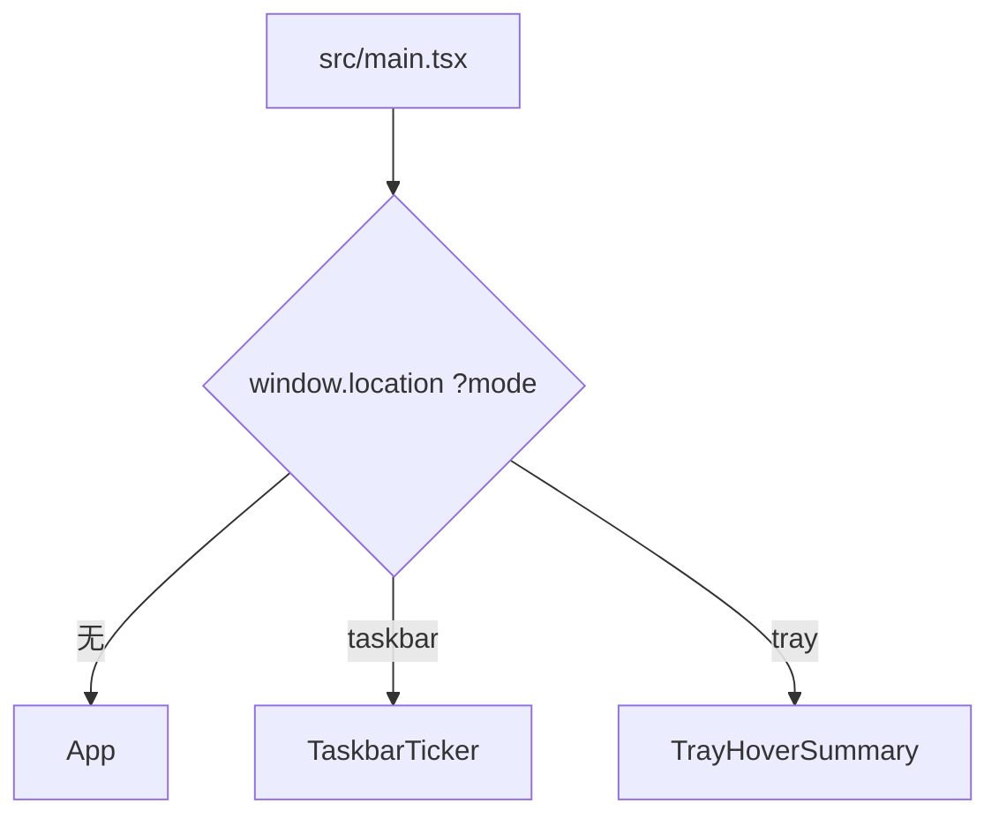

# 界面与组件

[Wiki 首页](README.md) · [功能地图](02-feature-map.md) · [行情数据链路](03-market-data.md)

## 渲染入口

`src/main.tsx` 复用同一个 renderer bundle，根据 `mode` 渲染不同根组件：



同时给 `<html>` 增加：

- `taskbar-mode`
- `tray-mode`

全局样式据此去掉普通页面背景和尺寸约束。

三个入口都由 `ConfirmDialogProvider` 包裹，业务组件通过 `useConfirmDialog` 使用统一的应用内确认弹窗，不再调用浏览器原生 `window.confirm`。

## 主窗口组件树

```text
App
├─ AppTitlebar
├─ SearchBar
├─ SettingsMenu
├─ FundamentalScreeningDialog
├─ AiAssistantDrawer（按构建开关加载）
└─ WatchlistTable
   ├─ WatchlistFilters
   │  ├─ TableStockSearch
   │  └─ TableFilterDropdown × 2
   ├─ FundamentalWatchlistOverview
   ├─ PortfolioQualityDialog
   ├─ WatchlistRow × N
   ├─ WatchlistGroupDialog
   ├─ ExpandedStockDetails
   │  ├─ CandlestickChart
   │  ├─ PeriodKlineChart
   │  ├─ ChipDistributionPanel
   │  ├─ OrderBookPanel
   │  ├─ FundsFlowPanel
   │  │  └─ FundsFlowChart
   │  └─ SectorIndexPanel
   │     └─ CandlestickChart
   ├─ PositionEditor
   ├─ StockAlertDialog
   ├─ TTradingDrawer
   │  └─ TPlanTable × 2
   ├─ TAlertBadges
   ├─ TFloatingProfitAlertBadge
   └─ FiveLevelAlertBadges
```

## 主窗口编排

### `App.tsx`

负责：

- 启动时 `getBootstrap`。
- 订阅报价、状态、选股和错误事件。
- 管理 `AppState`、`quotes`、当前展开股票和全局提示。
- 自选增删、重点/任务栏切换、持仓和做 T 保存。
- 自定义分组、表格顺序、列顺序和设置保存。
- 持有筹码分布和 BOLL 开关，并按图表内操作持久化到 `AppSettings`。
- 条件加载全局 AI 助手抽屉。
- 配置导入导出、手动刷新、交易日历刷新。
- 计算组合收益和大盘指数摘要。

`App` 不直接调用行情上游，也不实现做 T 公式。

### `AppTitlebar.tsx`

- 显示品牌和 A 股交易状态。
- 每 30 秒更新一次。
- 当前只按北京时间、工作日和 09:30–11:30 / 13:00–15:00 判断，不使用交易日历。

### `SearchBar.tsx`

- 输入代码或中文名称。
- 使用 `useDeferredValue` 延迟查询。
- 调用 `stockApi.searchStocks`。
- 过滤已存在股票并把选择结果交给 `App`。

### `SettingsMenu.tsx`

一个 `<details>` 弹层，内部有行情、做 T、系统与数据三个标签。所有变更立即调用 `onChange`，由 `App` 保存完整设置。弹窗采用分类标签而不是单列长表单。

### `FundamentalScreeningDialog.tsx`

独立的全市场基本面初筛弹窗。“当前筛选”默认只显示普通企业中同时通过五年 ROE、现金利润质量和同行业杠杆三项条件的公司，也可以关闭“仅显示全部通过”查看未入选证据。支持调整 ROE 口径和门槛、累计/当年现金转换率、行业负债百分位，按指标排序、分页、展开五年财务明细，并与自选股添加和定位联动。高级筛选以完整名称展示六类固定质量标签和六类固定风险提示，两组条件内部均为“同时满足”，并与当前硬筛选组合；标签计数基于全市场固定口径，不随临时规则变化。风险按红色严重风险和橙色关注项区分。金融企业只展示，不参与三项规则、质量标签和风险提示。

“更新变化”固定使用推荐条件比较最近两次快照，汇总新入选、移出、新增待核、已修复和数据变化，并显示每家公司前后筛选状态、规则状态和关键指标；可只看当前自选并直接定位。首次快照没有可比较报告，单纯数值变化不会进入表格。

## 自选主表

### `WatchlistTable.tsx`

该组件现在负责表格级状态和组件编排：

- 根据自选和报价生成行模型。
- 生成排序/筛选后的行模型并管理当前展开项。
- 置顶、临时列排序和列顺序调整。
- 自定义分组与板块两个组合筛选，以及分组管理弹窗。
- 当前分组与板块范围的四类价值组合、基本面覆盖、状态、待核构成和风险公司统计，并按价值组合、基本面状态和风险条件继续组合过滤主表。
- 按正面价值标签数量降序、升序或恢复手动排序；两份价值快照任一缺失时撤销相关筛选和排序，过期时保留计算并提示。
- 全部持仓质量入口与按市值加权的价值类型、风险暴露弹窗。
- 表内股票定位。
- 展开/收起行情详情动画。
- 打开持仓编辑和做 T Drawer。
- 打开股价提醒设置。

已提取的子职责：

| 文件 | 职责 |
| --- | --- |
| `watchlist-table/WatchlistRow.tsx` | 单只股票指标计算、单元格、提醒标识、操作按钮和展开详情；使用 `React.memo` |
| `watchlist-table/WatchlistFilters.tsx` | 表内搜索、分组/板块筛选和分组管理入口 |
| `watchlist-table/FundamentalWatchlistOverview.tsx` | 当前列表价值组合、基本面状态、待核构成、风险统计、组合过滤及标签数排序 |
| `PortfolioQualityDialog.tsx` | 全部持仓的价值与风险市值分布、行业集中度、组合筛选、快照状态、未计价说明和逐股定位 |
| `watchlist-table/columns.ts` | 列元信息、排序值和列渲染模型 |
| `watchlist-table/useDragReorder.ts` | 行拖拽状态和顺序更新 |

固定列关系：

```text
排序 | 设置 | 用户可调整数据列... | 删除
```

`operation` 虽然在共享列顺序中命名为“设置”，实际渲染在左侧固定区；共享数组末尾的 `operation` 主要用于兼容和计算。

### 表格列

当前数据列：

- 名称/代码
- 最新价
- 涨跌幅
- 板块涨跌幅
- 分红融资比
- 价值标签（基本、待核、缺数、金融、分红、风险、关注）
- 今日概览
- 成交
- 持仓天数
- 异动提示
- 持仓数量
- 成本价
- 持仓市值
- 今日收益
- 持仓收益

新增列时还要修改共享列版本和迁移，详见[功能地图](02-feature-map.md)。

### `PortfolioQualityDialog.tsx`

入口位于主表上方基本面概览左侧，显示全部持仓的“双优”和风险市值占比。弹窗不受当前分组、板块和基本面筛选影响，始终分析全部持仓；点击明细中的“定位”会关闭弹窗、清除主表筛选并聚焦对应股票。

价值类型按双重通过、仅基本面、仅分红回报、暂无标签四类互斥统计；风险状态按严重风险、关注项、暂未发现风险、未评估四类互斥统计。六个具体风险项同时展示各自持仓数量和市值占比，因允许重叠，单项之和可以超过总风险暴露。

行业集中度展示行业数量、第一大和前三大行业占比；每个行业同时展示占组合市值比例、行业内部四类价值结构和风险比例。点击价值卡、风险卡、具体风险或行业可组合过滤持仓明细，明细表提供统一“清除条件”。百分比以能取得最新价格的持仓总市值为分母，未计价持仓展示数量与成本但不进入分母。基本面缺失、判断字段不完整和金融企业显示为“未评估”，不归入“暂未发现风险”。

### `PositionEditor.tsx`

模态层，用于：

- 修改数量、成本和建仓日期。
- 开关该股票异动提示。
- 新建、编辑、删除持仓版本快照。
- 对比当前与快照的市值、收益率和收益差。
- 首次建立持仓时自动生成一笔底仓买入交易记录。
- 在持仓快照下展示最近 5 条统一交易记录，并通过独立分页弹窗查看全部记录。
- 在表格内行内编辑交易类型、时间、数量、价格、费用和备注，或删除记录；当前批次修改后重新校验持仓与五档，历史批次修改后刷新结算指标。

弹窗宽度当前为 1120px，减少交易表格横向滚动。数量输入 `step="100"`，成本支持 4 位小数。

### `TTradingDrawer.tsx`

右侧大型 Drawer，用于：

- 创建正 T / 反 T。
- 记录、编辑、删除 T 或底仓交易。
- 自动费用或手工费用。
- 当前批次概览和最近流水。
- 买入/卖出双五档。
- 双五档价格提醒、浮动盈亏提醒开启和恢复。
- 批次结算。
- 历史分页、收益校准和删除。

该组件负责交互编排，公式在 `t-trading.ts` 和 `t-alerts.ts`。

### `TPlanTable.tsx`

买入/卖出共用的紧凑五档表格。通过 `side` 决定：

- 涨跌幅符号。
- 主题。
- 收益/执行后成本列。
- 提醒操作。

### `TAlertBadges.tsx`

双五档价格提醒标识。`compact` 模式用于任务栏。

### `TFloatingProfitAlertBadge.tsx`

主表、任务栏和托盘悬停摘要复用的 T 仓金额提醒标识。浮盈显示红色“盈”，浮亏显示绿色“亏”，只显示当前已触发的一种方向。

### `StockAlertDialog.tsx` / `FiveLevelAlertBadges.tsx`

- `StockAlertDialog` 为单只股票管理股价、当日涨幅、持仓收益率的多条上下阈值规则。
- 自定义股价规则触发后，主表和任务栏使用上穿/下穿方向主题，系统通知由主进程发出。
- `FiveLevelAlertBadges` 展示活动 T 仓盘口中买方或卖方的异常大单档位，并与 T 价格提醒并列。

### `ConfirmDialog.tsx`

- `ConfirmDialogProvider` 在渲染入口维护唯一确认弹窗和 Promise 结果。
- `useConfirmDialog` 统一配置标题、正文、确认按钮文案和危险操作主题。
- 配置导入、分组/交易/做 T 历史/AI 数据删除、API Key 清除和 Codex 退出均复用该组件。

### `WatchlistGroupDialog.tsx` / `TableFilterDropdown.tsx`

- 分组弹窗负责新建、重命名、删除分组，以及批量调整股票归属；删除分组不会删除自选股票。
- 自定义分组使用列表式下拉，板块筛选使用可搜索下拉；两者都展示数量，并同时作用于当前表格。

## 行情详情

### `ExpandedStockDetails.tsx`

职责：

- 管理分时、分红融资、基本面、资金流、市场观察、AI 分析、AI 做 T 参考、五日、日/周/月 K 和板块标签；可选模块标签按构建开关出现。
- 基本面页展示默认三项规则的结论和阈值证据、简化 DCF 每股估值及相对实时股价的高低幅度、DCF/现价和现价/DCF双向比值、六类质量特征、六类风险关注、同一行业普通企业中的 ROE/现金质量/低负债名次、五年财务明细、快照生成时间与过期原因；DCF/现价低于70%时显示醒目文字提醒，计算假设直接列在结果下方。质量和风险标签都给出计算证据，风险使用完整名称并按红色严重风险、橙色关注项分级。主表“基本/待核/缺数/金融/风险/关注”标签可直接展开到此页，悬停说明具体状态或风险项。
- 市场观察页顶部的“估值与资本回报”区域展示实时 PE TTM/PB、近五年历史分位、快照日行业分位、总市值、流通市值，以及最新自由现金流、ROIC和净负债；行情、财报、历史区间及行业样本日期分别标注。银行、保险和券商的普通企业自由现金流、ROIC和净负债显示“不适用”。
- AI 分析页内部提供“短期行情”和“长期价值”两个独立入口。长期组合五年基本面、分红融资、估值分位和长期价格强弱，固定展示“企业质量、财务安全、当前价格、结论”，结论再拆为长期价值与当前时机。两类结果分别缓存，旧版 AI 结果继续作为短期行情结果读取。
- 为各价格周期维护数据、错误和加载状态。
- 模块级 K 线短时缓存，桌面版周期 K 同时复用主进程磁盘缓存。
- 分时/五日按刷新间隔更新。
- 日/周/月缓存 5 分钟并按需扩大请求条数。
- 日 K 筹码分布开启时按平均换手率估算所需历史根数，自动扩大到累计换手率 100%，并跟随可视范围重算。
- 把十字光标所在 K 线传给顶部概览。

图表和板块组件采用 `React.lazy`，避免主界面初始加载全部 Lightweight Charts 逻辑。

### `CandlestickChart.tsx`

名称沿用历史，但实际支持三种折线/成交量模式：

- `intraday`
- `fiveDay`
- `sectorIntraday`

分时模式创建价格和成交量两个 Lightweight Charts 实例；其他模式在一个实例中叠加成交量。

### `PeriodKlineChart.tsx`

日/周/月蜡烛图：

- 组件挂载时创建 chart/series。
- bars 变化时只更新 series 数据和可见范围。
- 使用 refs 避免每次 hover 或补历史都重建图表。
- 左边接近数据边界时触发 `onRequestMore`。
- 把日 K 当前可视逻辑区间回传给筹码分布；自动范围模式可按请求条数重设视口。
- 通过共享 `calculateBollingerBands` 在日/周/月主图叠加 BOLL(20,2) 三轨线，下方指标栏随十字光标显示对应数值并控制全局显示开关。

### `ChipDistributionPanel.tsx`

- 接收当前日 K 选中范围，在 renderer 内计算价格筹码桶、平均成本、获利比例和 70%/90% 成本区间。
- 每次得到有效结果后保存按股票区分的最后一次磁盘缓存。
- 自动 100% 换手范围被用户缩放/拖动替代后，提供恢复入口。

### `OrderBookPanel.tsx`

- 分时图右侧五档盘口。
- 自己管理刷新定时器和当前展示结果，请求合并、3 秒缓存和串行错峰由主进程 `OrderBookHub` 负责。
- 买卖价相对昨收着色。
- 有旧数据时刷新失败不清空。

### `FundsFlowPanel.tsx` / `FundsFlowChart.tsx`

- 面板负责 2 分钟刷新触发、renderer 最近结果、汇总和最近数据表；主进程 `FundsFlowHub` 负责跨调用方请求合并、缓存和串行队列。
- 图表只负责主力资金曲线。
- 金额正红、负绿、零中性。

### `SectorIndexPanel.tsx`

- 请求股票所属主行业板块。
- 展示板块概览。
- 过滤 09:30 之前的分时后复用 `CandlestickChart`。

## 任务栏和托盘组件

### `TaskbarTicker.tsx`

- 启动时并行获取 bootstrap 和任务栏布局。
- 订阅 `quotes:updated`、`state:updated`、`taskbar:layout`。
- 展示 `showInTaskbar` 股票和触发 T 提醒股票。
- 只负责内容，窗口定位由 Electron 主进程负责。

### `TrayHoverSummary.tsx`

- 订阅相同报价和状态。
- 展示今日收益合计，以及每只股票的今日收益、持仓市值和持仓收益。
- 有活动 T 批次时展示方向、剩余数量、均价和“浮动收益（收益率）”。
- 同样使用任务栏股票与提醒股票的并集。

## 可选模块界面

- `market-insight/renderer`：市场观察指标、指标说明、客观事件、公告/要闻/交易所通知和分时覆盖层。
- `ai/renderer/AiAnalysisPanel.tsx`：切换短期行情与长期价值，按股票分别恢复结果、展示独立进度，并保留旧结果直到同类型新结果完成。
- `ai/renderer/AiAssistantDrawer.tsx`：会话列表、搜索/重命名/删除/导出、流式对话、最近消息上下文和 `@自选股` 快速选择。
- `ai-t-advice/renderer/TAdvicePanel.tsx`：恢复每只股票最近做 T 参考、等待实时盘口、展示客观事件与结构化结果，并通过一次性预览确认应用 T1。

## 样式系统

`src/styles.css` 只保留设计变量、reset、应用框架和跨组件共享样式。组件样式按 `src/main.tsx` 中的固定顺序加载，保持拆分前的层叠关系：

- `SettingsMenu.css`
- `WatchlistTable.css`
- `WatchlistDialogs.css`
- `ConfirmDialog.css`
- `TTradingDrawer.css`
- `PositionDialogResponsive.css`
- `ExpandedStockDetails.css`
- `styles/app-feedback.css`
- `TaskbarTicker.css`
- `modules/ai/renderer/AiAssistantDrawer.css`

当前未引入 CSS Modules，也未批量重命名现有 class。

### 基础变量

`:root` 定义：

- 页面、卡片、文字、边框和阴影。
- 蓝色交互色。
- A 股红涨 `--red`。
- A 股绿跌 `--green`。

### 数值方向类

组件通常通过局部 `valueClass` / `directionClass` 返回：

```text
is-up    正数，红色
is-down  负数，绿色
is-flat  空值或零，中性色
```

卡片收益还有 `is-card-up/down/flat`。增加收益展示时应复用这些语义，不要用买入/卖出主题色覆盖数值正负。

### 图表颜色

- K 线、分时成交量：红涨绿跌。
- 集合竞价：紫色。
- 分时均价：独立图例色。
- BOLL 上轨为橙色、中轨为蓝色、下轨为紫色。
- 买入计划卡片为绿色主题，卖出计划卡片为红色主题，但内部收益仍按正负着色。

## 组件状态模式

### 主状态上提

会持久化的数据由 `App` 持有，通过 callbacks 传给子组件。子组件完成编辑后一次性回传。

### 模块级缓存

K 线详情使用最多 100 条的共享 LRU：

```ts
const klineCache = new LruCache<string, KlineCacheEntry>(100)
```

资金流等面板仍可使用模块级 `Map` 保留最近显示结果。renderer 缓存跨组件卸载保留，但不会跨页面刷新或应用重启；桌面版 K 线、资金流和盘口还会经过各自主进程 Hub。

### 旧数据优先

多数行情面板的错误态分两种：

- 无缓存：显示错误和重试。
- 有缓存：保留旧内容，在上方显示刷新失败警告。

### 图表实例

Lightweight Charts 实例保存在 ref 中，并在 effect cleanup 中：

- 取消事件。
- 断开 `ResizeObserver`。
- 调用 `chart.remove()`。

## 新增组件的建议落点

| 组件类型 | 目录/模式 |
| --- | --- |
| 纯展示小组件 | `src/components`，props 接收已计算数据 |
| 可复用业务计算 | `src/lib` 纯函数 |
| 主/渲染共享类型 | `src/shared/types.ts` |
| 行情请求面板 | 参考 `FundsFlowPanel` 的缓存、旧数据和定时刷新 |
| 新图表 | 参考现有 chart ref + ResizeObserver 生命周期 |
| 新窗口模式 | `src/main.tsx` 分流 + `electron/main/window-manager.ts` 创建窗口 |
