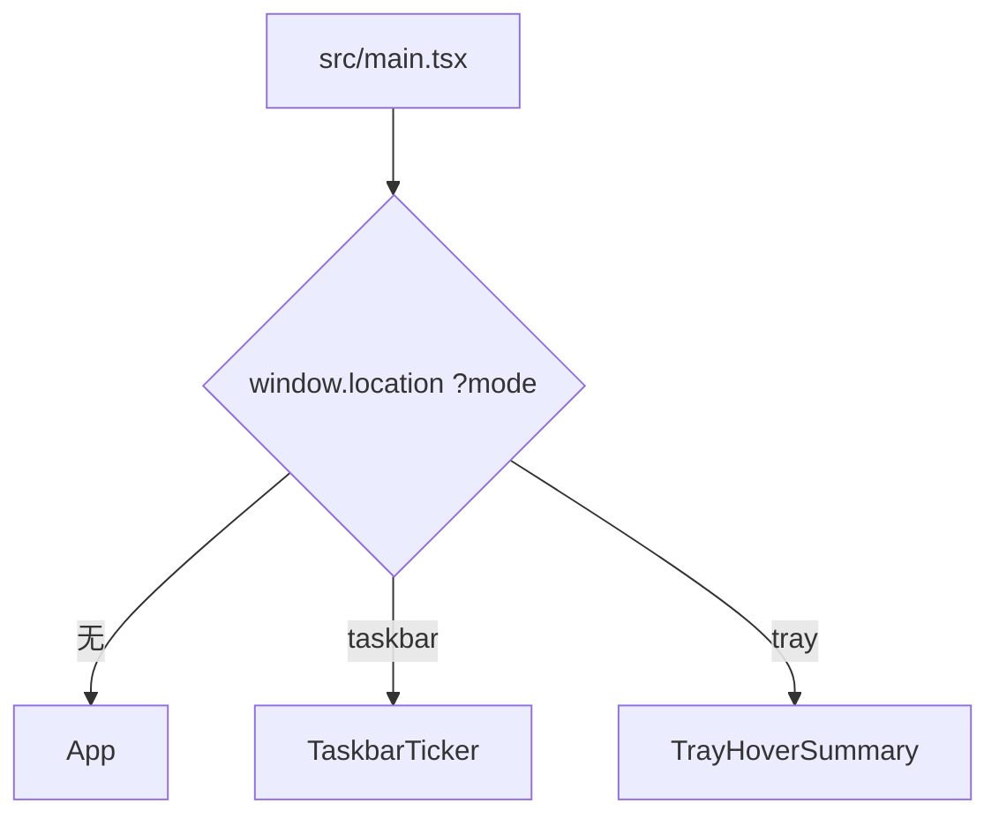

# 界面与组件

[Wiki 首页](README.md) · [功能地图](02-feature-map.md) · [行情数据链路](03-market-data.md)

## 渲染入口

`src/main.tsx` 复用同一个 renderer bundle，根据 `mode` 渲染不同根组件：



同时给 `<html>` 增加：

- `taskbar-mode`
- `tray-mode`

全局样式据此去掉普通页面背景和尺寸约束。

## 主窗口组件树

```text
App
├─ AppTitlebar
├─ SearchBar
├─ SettingsMenu
└─ WatchlistTable
   ├─ TableStockSearch（文件内组件）
   ├─ ExpandedStockDetails
   │  ├─ CandlestickChart
   │  ├─ PeriodKlineChart
   │  ├─ OrderBookPanel
   │  ├─ FundsFlowPanel
   │  │  └─ FundsFlowChart
   │  └─ SectorIndexPanel
   │     └─ CandlestickChart
   ├─ PositionEditor
   ├─ TTradingDrawer
   │  └─ TPlanTable × 2
   └─ TAlertBadges
```

## 主窗口编排

### `App.tsx`

负责：

- 启动时 `getBootstrap`。
- 订阅报价、状态、选股和错误事件。
- 管理 `AppState`、`quotes`、当前展开股票和全局提示。
- 自选增删、重点/任务栏切换、持仓和做 T 保存。
- 表格顺序、列顺序和设置保存。
- 配置导入导出、手动刷新、交易日历刷新。
- 计算组合收益和大盘指数摘要。

`App` 不直接调用行情上游，也不实现做 T 公式。

### `AppTitlebar.tsx`

- 显示品牌和 A 股交易状态。
- 每 30 秒更新一次。
- 当前只按北京时间、工作日和 09:30–11:30 / 13:00–15:00 判断，不使用交易日历。

### `SearchBar.tsx`

- 输入代码或中文名称。
- 使用 `useDeferredValue` 延迟查询。
- 调用 `stockApi.searchStocks`。
- 过滤已存在股票并把选择结果交给 `App`。

### `SettingsMenu.tsx`

一个 `<details>` 弹层，内部有行情、做 T、系统与数据三个标签。所有变更立即调用 `onChange`，由 `App` 保存完整设置。

## 自选主表

### `WatchlistTable.tsx`

这是主界面最大的组件，职责包括：

- 根据自选和报价生成行模型。
- 计算每行持仓指标、可用数量、持仓天数和 T 状态。
- 手动拖拽、置顶和临时列排序。
- 列顺序调整。
- 表内股票定位。
- 异动弹层。
- 展开/收起行情详情动画。
- 打开持仓编辑和做 T Drawer。
- 渲染 T 提醒。

固定列关系：

```text
排序 | 设置 | 用户可调整数据列... | 删除
```

`operation` 虽然在共享列顺序中命名为“设置”，实际渲染在左侧固定区；共享数组末尾的 `operation` 主要用于兼容和计算。

### 表格列

当前数据列：

- 名称/代码
- 最新价
- 涨跌幅
- 板块涨跌幅
- 今日概览
- 成交
- 持仓天数
- 异动提示
- T 提醒
- 持仓数量
- 成本价
- 持仓市值
- 今日收益
- 持仓收益

新增列时还要修改共享列版本和迁移，详见[功能地图](02-feature-map.md)。

### `PositionEditor.tsx`

模态层，用于：

- 修改数量、成本和建仓日期。
- 开关该股票异动提示。
- 新建、编辑、删除持仓版本快照。
- 对比当前与快照的市值、收益率和收益差。

数量输入 `step="100"`，成本支持 4 位小数。

### `TTradingDrawer.tsx`

右侧大型 Drawer，用于：

- 创建正 T / 反 T。
- 记录、编辑、删除 T 或底仓交易。
- 自动费用或手工费用。
- 当前批次概览和最近流水。
- 买入/卖出双五档。
- 提醒开启、处理和恢复。
- 批次结算。
- 历史分页、收益校准和删除。

该组件负责交互编排，公式在 `t-trading.ts` 和 `t-alerts.ts`。

### `TPlanTable.tsx`

买入/卖出共用的紧凑五档表格。通过 `side` 决定：

- 涨跌幅符号。
- 主题。
- 收益/执行后成本列。
- 提醒操作。

### `TAlertBadges.tsx`

主表和任务栏复用的小组件。`compact` 模式用于任务栏。

## 行情详情

### `ExpandedStockDetails.tsx`

职责：

- 管理 7 个标签页。
- 为各价格周期维护数据、错误和加载状态。
- 模块级 K 线缓存。
- 分时/五日按刷新间隔更新。
- 日/周/月缓存 5 分钟并按需扩大请求条数。
- 把十字光标所在 K 线传给顶部概览。

图表和板块组件采用 `React.lazy`，避免主界面初始加载全部 Lightweight Charts 逻辑。

### `CandlestickChart.tsx`

名称沿用历史，但实际支持三种折线/成交量模式：

- `intraday`
- `fiveDay`
- `sectorIntraday`

分时模式创建价格和成交量两个 Lightweight Charts 实例；其他模式在一个实例中叠加成交量。

### `PeriodKlineChart.tsx`

日/周/月蜡烛图：

- 组件挂载时创建 chart/series。
- bars 变化时只更新 series 数据和可见范围。
- 使用 refs 避免每次 hover 或补历史都重建图表。
- 左边接近数据边界时触发 `onRequestMore`。

### `OrderBookPanel.tsx`

- 分时图右侧五档盘口。
- 自己管理缓存和刷新定时器。
- 买卖价相对昨收着色。
- 有旧数据时刷新失败不清空。

### `FundsFlowPanel.tsx` / `FundsFlowChart.tsx`

- 面板负责请求、缓存、汇总和最近数据表。
- 图表只负责主力资金曲线。
- 金额正红、负绿、零中性。

### `SectorIndexPanel.tsx`

- 请求股票所属主行业板块。
- 展示板块概览。
- 过滤 09:30 之前的分时后复用 `CandlestickChart`。

## 任务栏和托盘组件

### `TaskbarTicker.tsx`

- 启动时并行获取 bootstrap 和任务栏布局。
- 订阅 `quotes:updated`、`state:updated`、`taskbar:layout`。
- 展示 `showInTaskbar` 股票和触发 T 提醒股票。
- 只负责内容，窗口定位由 Electron 主进程负责。

### `TrayHoverSummary.tsx`

- 订阅相同报价和状态。
- 展示今日收益。
- 有活动 T 批次时展示方向、剩余数量、均价和浮动收益。
- 同样使用任务栏股票与提醒股票的并集。

## 样式系统

所有样式目前集中在 `src/styles.css`。

### 基础变量

`:root` 定义：

- 页面、卡片、文字、边框和阴影。
- 蓝色交互色。
- A 股红涨 `--red`。
- A 股绿跌 `--green`。

### 数值方向类

组件通常通过局部 `valueClass` / `directionClass` 返回：

```text
is-up    正数，红色
is-down  负数，绿色
is-flat  空值或零，中性色
```

卡片收益还有 `is-card-up/down/flat`。增加收益展示时应复用这些语义，不要用买入/卖出主题色覆盖数值正负。

### 图表颜色

- K 线、分时成交量：红涨绿跌。
- 集合竞价：紫色。
- 分时均价：独立图例色。
- 买入计划卡片为绿色主题，卖出计划卡片为红色主题，但内部收益仍按正负着色。

## 组件状态模式

### 主状态上提

会持久化的数据由 `App` 持有，通过 callbacks 传给子组件。子组件完成编辑后一次性回传。

### 模块级缓存

行情详情面板使用：

```ts
const cache = new Map<string, CacheEntry>()
```

缓存跨组件卸载保留，但不会跨页面刷新或应用重启。

### 旧数据优先

多数行情面板的错误态分两种：

- 无缓存：显示错误和重试。
- 有缓存：保留旧内容，在上方显示刷新失败警告。

### 图表实例

Lightweight Charts 实例保存在 ref 中，并在 effect cleanup 中：

- 取消事件。
- 断开 `ResizeObserver`。
- 调用 `chart.remove()`。

## 新增组件的建议落点

| 组件类型 | 目录/模式 |
| --- | --- |
| 纯展示小组件 | `src/components`，props 接收已计算数据 |
| 可复用业务计算 | `src/lib` 纯函数 |
| 主/渲染共享类型 | `src/shared/types.ts` |
| 行情请求面板 | 参考 `FundsFlowPanel` 的缓存、旧数据和定时刷新 |
| 新图表 | 参考现有 chart ref + ResizeObserver 生命周期 |
| 新窗口模式 | `src/main.tsx` 分流 + `electron/main/index.ts` 创建窗口 |

