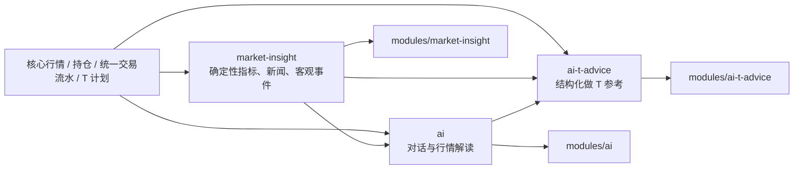
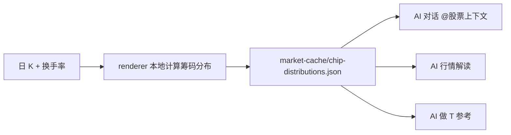

# AI 与市场观察模块

[Wiki 首页](README.md) · [系统架构](01-architecture.md) · [状态与 IPC](05-state-storage-and-ipc.md)

> 代码基线：4.21.0。当前仓库已经实现 `market-insight`、`ai` 和 `ai-t-advice` 三个可独立剔除的模块。本页描述当前代码，不再作为待实施计划；历史设计过程见 [`docs/plan`](../plan/)。

## 模块边界



依赖方向是单向的：核心功能不导入模块专有类型，三个模块也不把设置、历史或结果写入 `AppState`。删除或构建剔除模块后，自选、行情、持仓、做 T、提醒和配置导入导出仍能运行。

三个模块的共同结构为：

```text
src/modules/<module>/
├─ shared/      类型、常量和 IPC 名称
├─ main/        服务、存储和主进程注册
├─ preload/     独立 window API
└─ renderer/    UI 与渲染层入口
```

核心只保留条件注册和 UI 插槽。模块专有 IPC 不扩展 `StockDesktopApi`：

| 模块 | Renderer API | 主要安装点 |
| --- | --- | --- |
| `market-insight` | `window.marketInsightApi` | main、preload、`ExpandedStockDetails` |
| `ai` | `window.aiApi` | main、preload、`App`、`ExpandedStockDetails` |
| `ai-t-advice` | `window.aiTAdviceApi` | main、preload、`ExpandedStockDetails` |

## `market-insight`：非 AI 市场观察

该模块读取现有报价、K 线、盘口、资金流、板块和 T 计划，输出可复现的本地计算结果：

- 分时 VWAP、开盘区间、短周期动量和量能变化。
- 日线均线、MACD、RSI、KDJ、布林带、ATR 和波动率。
- 盘口不平衡、资金流、相对板块/指数强弱和 T 档位距离。
- 带生命周期、冷却和去重的客观观察事件。
- 巨潮资讯公司公告、证监会要闻以及沪深北交易所通知公告。

重点关注股票默认每 15 分钟自动查询新闻，其他自选在交易日 15:00 后查询一次；手动刷新不受自动调度限制。单个新闻来源失败时保留其他来源，并记录来源错误。

数据位于：

```text
userData/modules/market-insight/
```

内存快照、单股事件历史和磁盘缓存都有数量/时效上限，启动时清理过期缓存。`main/events/history-replay.fixture.ts` 用于固定历史事件回放。

## `ai`：对话与行情解读

### Provider 与凭证

当前 Provider：

| Provider | 认证 | 说明 |
| --- | --- | --- |
| OpenAI | API Key | 通过主进程 Provider 适配器调用 |
| DeepSeek | API Key | 转换为同一聊天与结构化任务接口 |
| OpenAI Codex | Codex 账号 | 使用随应用携带的官方 `codex app-server` 登录和运行 |

API Key 由 Electron `safeStorage` 加密保存在 AI 模块目录，renderer 只能读取配置状态和脱敏尾号。Codex 登录在系统浏览器完成，见涨不读取或复制凭证文件；对话运行在独立空工作目录、只读沙箱、禁止审批，并关闭网页搜索和 MCP，只消费应用传入的文字与市场快照。

### 对话上下文

对话记录按会话持久化。发送新消息时，主进程截取当前会话最近 `maxContextMessages` 个消息槽位，再把其中状态为 `completed` 的用户消息和 AI 回复提交给 Provider；默认 16，可在 4–40 之间设置。因此此前的已完成消息会作为后续上下文，但超出上限的更早消息不会继续提交，正在生成、已停止或失败的回复也不会进入模型上下文。

股票上下文有两种来源：

- 股票会话可选择附带该会话默认股票的最新市场快照。
- 输入 `@` 后可从当前自选快速选择一只或多只股票；发送时按 `quoteId` 去重并为每只股票即时取得只读快照。

每个上下文引用保存股票、快照 ID 和 `conversation` / `mention` 来源。构建快照时会组合市场观察结果、实时行情、持仓、活动 T 批次、计划档位，以及该股票最后一次筹码分布缓存。若明确 `@` 的股票暂时无法取得快照，本次发送会给出错误，不会把无数据股票伪装成有效上下文。

### 行情解读

股票详情的“AI 分析”页支持手动生成市场快照解读：

- 分阶段显示准备、加载快照、检查缓存、分析和校验进度。
- 结果包含摘要、指标事实、新闻引用和不确定性。
- 最近一次完整结果按股票写入 `cache/latest-interpretations.json`。
- 切换标签或重启应用会恢复旧结果；重新生成期间旧结果继续显示，直到新结果成功。

### 会话与存储

```text
userData/modules/ai/
├─ settings.json
├─ credentials.bin
├─ conversations/index.json
├─ conversations/conversation-<id>.jsonl
├─ snapshots/
└─ cache/latest-interpretations.json
```

AI 助手支持创建、搜索、重命名、删除、清空和导出会话，以及流式生成、停止和重试。对话记录和 AI 结果不会进入核心配置导出。

## `ai-t-advice`：受控做 T 参考

该模块复用基础 AI 当前选择的 Provider、模型和认证，不保存第二份凭证。用户主动生成时读取：

- `MarketInsightSnapshot` 和同源确定性客观事件。
- 当前报价、持仓、可用数量和活动 T 批次摘要。
- 实时五档盘口；生成过程会等待盘口请求完成。
- 最后一次筹码分布缓存。

模型返回结构化的观望、正 T 或反 T 参考。主进程再校验价格、方向、持仓上限和 100 股整数倍；它不会创建交易或自动下单。

“应用到 T 计划”必须经过两步：

1. 生成 10 分钟有效的一次性预览，展示将修改的方向、价格和数量。
2. 用户确认后只提交预览 ID，主进程重新核对活动批次，再修改对应买入或卖出 T1。

历史、忽略和应用状态写入：

```text
userData/modules/ai-t-advice/settings.json
userData/modules/ai-t-advice/advice-history.jsonl
```

界面按股票恢复最近一次结果，重新生成期间继续保留旧结果，并明确显示生成时间和行情快照时间。

## 筹码分布进入 AI 的链路



只使用“最后一次已计算”的缓存。用户从未为某只股票打开并成功计算筹码分布时，AI 上下文中的该字段为 `null`；AI 不会为了补齐数据在后台隐式打开图表。

## 构建开关

| 环境变量 | 设为 `0` 时 |
| --- | --- |
| `JIANZHANG_MARKET_INSIGHT_MODULE` | 不注册市场观察 IPC/preload，不加载 renderer 模块和定时任务 |
| `JIANZHANG_AI_MODULE` | 不注册 AI IPC/preload，不加载 AI 对话/分析 UI，也不复制 Codex runtime |
| `JIANZHANG_AI_T_ADVICE_MODULE` | 不注册做 T 参考 IPC/preload，不加载做 T 参考 UI |

三个变量未设为 `0` 时默认进入当前构建。进入构建不代表自动调用模型：AI 对话、AI 分析和做 T 参考都由用户操作触发，模块设置仍可在运行时关闭。

`ai-t-advice` 依赖基础 `ai` 的 Provider，因此 `JIANZHANG_AI_MODULE=0` 时做 T 参考也一定被剔除，即使没有单独关闭它。

源码级删除时，应同时删除模块目录、main/preload/renderer 的薄安装点、对应构建常量；删除 AI 基础模块还要移除 `@openai/codex` 开发依赖和 electron-builder 的 Codex `extraResources`。

## 产品边界

- 当前只提供信息展示、分析和计划参考，不连接券商、不自动下单。
- 本地代码负责精确指标、T+1 可用数量、价格/数量上限和结构化校验；模型输出不能绕过这些约束。
- 新闻保留原始标题、来源、发布时间和链接；AI 引用使用传入的来源 ID，避免生成不存在的来源。
- AI 结果明确展示生成时间、快照时间和不确定性，不以模型输出代替真实券商持仓或成交数据。
- 若对外分发或商业化，仍需专项评估行情/新闻展示授权、证券投资咨询、个人信息和生成式 AI 服务等合规要求。
