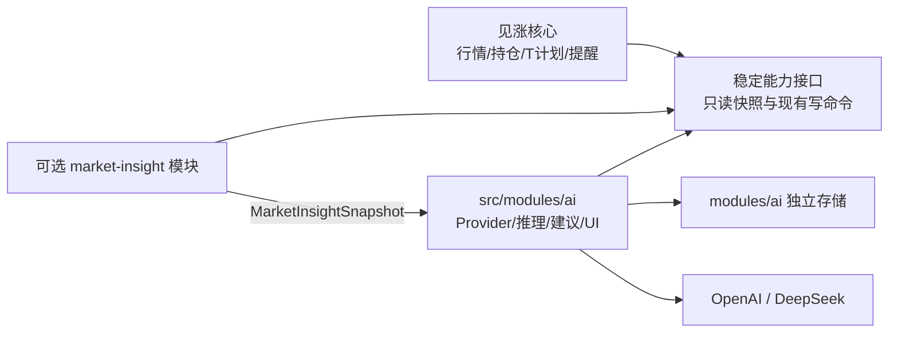
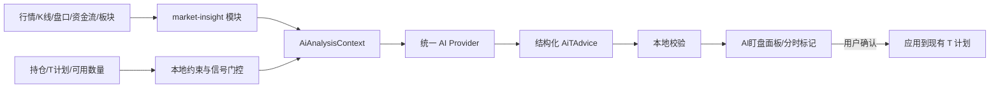

# AI 可移除模块设计（规划参考）

[Wiki 首页](README.md) · [系统架构](01-architecture.md) · [行情数据链路](03-market-data.md)

> 状态：早期规划参考。当前仓库已经实现 `market-insight`、第一期 `ai` 和独立的 `ai-t-advice`；做 T 参考默认编译、运行时默认关闭。
>
> 2026-07-21 更新：AI 基础模块已完成通用聊天、本地对话记录、Provider 设置和市场快照解读；做 T 参考已拆成可单独构建剔除或删除的 `ai-t-advice` 模块，并默认进入构建产物。详细目录、入口、存储、IPC 和实施阶段以 [AI 模块与可选做 T 参考实现计划](../ai-module-implementation-plan.md) 为准；本页与其冲突处均以新计划为准。

> 2026-07-29 更新：AI 分析按股票持久化最近一次完整结果；做 T 参考沿用本地历史恢复最近结果。两个界面重新生成时都保留旧结果，并突出显示生成时间与快照时间。
>
> 目标方向：基础 AI 提供指标解读、要闻参考和聊天，同时支持 OpenAI 与 DeepSeek；结构化做 T 参考由独立模块提供。
>
> 架构决策：AI 必须作为可插拔的独立模块实现。关闭、构建剔除或删除该模块后，行情、持仓、做 T、提醒和配置导入导出仍应完整运行。
>
> 非 AI 的指标、要闻和客观观察事件先作为独立 `market-insight` 模块实施，详见 [非 AI 市场洞察与智能盯盘实现计划](../non-ai-market-insight-implementation-plan.md)。AI 模块只消费其标准化快照，不反向控制该模块。

## 不可破坏的模块边界

核心代码不得依赖 AI 的类型、状态或输出。依赖方向只能是：



具体约束：

- AI 模块可以读取核心提供的行情、K 线、盘口、资金流、持仓和 T 计划快照。
- AI 模块可以在用户确认后调用现有 T 计划更新命令，但核心层不能接收 `AiTAdvice` 等 AI 专有类型。
- AI 不得写入 `AppState`、`AppSettings` 或核心 `settings.json`，避免配置导出、状态广播和迁移逻辑被 AI 污染。
- AI 不得插入 `refreshStocks`、`applyTAlertTriggersToAccounts` 等核心刷新与提醒函数内部。
- AI 的 Provider、提示词、推理、建议缓存、密钥、IPC 和建议 UI 全部放在同一模块目录。
- 本地指标、原始要闻和客观观察事件属于可独立移除的 `market-insight` 模块；AI 只能读取它的公开快照。
- 第一版不接入核心任务栏提醒；以后若需要，应通过通用通知能力接入，不能让任务栏组件反向依赖 AI。
- 移除 AI 模块后，核心功能不能出现空白标签、失效 IPC、启动报错或残留网络请求。

## 为什么现有架构适合扩展

当前已经具备：

- 主进程统一抓取实时行情、K 线、盘口、资金流和板块。
- 持仓、可用数量、正/反 T 批次和双五档计划。
- 主进程后台定时刷新与提醒状态机。
- 任务栏高优先级提示。
- 详情标签页和图表覆盖层的 UI 落点。

缺少的是：

- 本地技术指标引擎。
- 新闻数据源、去重、相关性和引用模型。
- AI provider 抽象。
- API Key / 登录凭证的秘密存储。
- AI 结构化输出和本地约束校验。
- 调用冷却、预算、缓存和历史评估。

## 推荐总体链路

AI 不应直接接收一张截图后自由给出交易结论，也不应承担精确指标计算。建议：



职责边界：

- 本地代码负责精确计算、交易规则、数量上限和风险约束。
- AI 负责综合解释、新闻关联、情景判断和人类可读理由。
- 第一版只给建议，不自动下单。
- AI 结果不能静默覆盖现有 T 计划，必须展示差异并由用户确认。

## 独立模块目录

```text
src/modules/ai/
├─ README.md                    # 模块能力、边界和删除清单
├─ shared/
│  ├─ types.ts                  # AiAnalysisContext / AiTAdvice
│  ├─ schema.ts                 # 结构化输出校验
│  └─ constants.ts              # IPC 名称与模块版本
├─ main/
│  ├─ register.ts               # 注册 ai:* IPC；模块主进程唯一入口
│  ├─ service.ts                # 分析任务编排
│  ├─ providers/
│  │  ├─ openai-api.ts
│  │  ├─ openai-codex.ts        # 本机官方 Codex Runtime 适配器
│  │  └─ deepseek.ts
│  ├─ prompts/                  # 带版本号的提示模板
│  ├─ storage.ts                # 模块设置、缓存和历史
│  └─ secrets.ts                # safeStorage 加密凭证
├─ preload/
│  ├─ register.ts               # window.aiApi；模块 preload 唯一入口
│  └─ types.ts
└─ renderer/
   ├─ register.tsx              # 模块 UI 唯一入口
   ├─ AiAnalysisPanel.tsx
   ├─ AiAdviceCard.tsx
   ├─ AiNewsList.tsx
   └─ AiChartOverlay.tsx
```

不把 AI 类型暂存在现有 `src/shared/types.ts`。本地指标和新闻也不放入通用 `src/lib`，而是放入可独立构建剔除的 `src/modules/market-insight/`。如果合规结论只允许客观行情工具，可以单独移除 AI；如果连规则型观察能力也不允许，则同时剔除两个模块。

核心仓库只保留三个明确安装点：

| 安装点 | 职责 | 移除时操作 |
| --- | --- | --- |
| `electron/main/index.ts` | 条件注册 AI 主进程入口 | 删除一处注册 |
| `electron/preload/index.ts` | 条件挂载 `window.aiApi` | 删除一处挂载 |
| `src/components/ExpandedStockDetails.tsx` | 条件挂载 AI 标签页 | 删除一处 UI 插槽 |

实现时应让安装点保持很薄，不在其中编写指标、Provider 或业务判断。

## 三层退出机制

### 1. 运行时关闭

模块设置中提供总开关，默认关闭：

```ts
interface AiModuleSettings {
  enabled: boolean
  provider: 'openai-api' | 'openai-codex' | 'deepseek'
}
```

`enabled = false` 时必须同时满足：

- 不启动定时分析任务。
- 不抓取 AI 专用新闻。
- 不调用任何模型 Provider。
- 不注册 AI 触发提醒。
- UI 只显示“模块未启用”或完全隐藏，由产品模式决定。

运行时开关适合个人临时停用，不作为正式合规下线的唯一措施。

### 2. 构建时剔除

增加构建变量，例如：

```text
JIANZHANG_AI_MODULE=0
```

为 `0` 时三个安装点都走禁用分支，打包产物不得包含 AI renderer chunk、Provider 地址、提示词和 `ai:*` IPC 实现。正式发布无 AI 版本时，需要检查 `out/` 中不存在：

- `api.openai.com`
- `api.deepseek.com`
- `chatgpt.com/backend-api/codex`
- AI 提示词和 AI 专用 IPC

Provider 优先使用 Node 内置 `fetch`，避免把 OpenAI、DeepSeek SDK 加入根 `dependencies`。如果以后确实需要专用依赖，应保证无 AI 构建不会把依赖复制进安装包，并把这一项加入产物检查。

构建开关用于快速发布不带 AI 能力的版本。是否已经满足监管要求仍需由合规人员确认，不能只依据界面是否隐藏。

### 3. 源码级删除

需要彻底移除时：

1. 删除 `src/modules/ai/`。
2. 删除三个安装点中的注册/挂载代码。
3. 删除 AI 构建变量和 AI 专用依赖。
4. 删除 `%APPDATA%\见涨\modules\ai\` 下的本地凭证、缓存和历史；这是用户数据删除动作，需要在卸载/迁移界面明确确认。
5. 重新打包并执行产物扫描。

目标是让源码级删除只影响模块目录、三个安装点和构建配置，不修改行情、持仓、做 T 或提醒业务。

## Provider 抽象

建议业务层只依赖统一接口：

```ts
interface AiProvider {
  analyze(context: AiAnalysisContext): Promise<AiTAdvice>
  testConnection(): Promise<AiConnectionResult>
}
```

实现：

| Provider | 请求方式 | 新闻策略 |
| --- | --- | --- |
| OpenAI API Key | OpenAI Responses API | 可选内置 web search，也可使用应用新闻工具 |
| DeepSeek API Key | DeepSeek Chat Completions / 兼容接口 | 调用应用自有新闻工具 |
| OpenAI 账号登录 | 随应用携带的官方 Codex App Server（已实现） | 调用应用自有新闻工具 |

OpenAI 的普通 API 使用 Bearer 凭证，且官方明确不应把 API Key 暴露在客户端代码中：[API Authentication](https://developers.openai.com/api/reference/overview#authentication)。“Sign in with ChatGPT”是 Codex 产品的认证方式，普通平台 API 调用仍使用平台 API Key，两者应作为不同接入路线处理：[Codex Authentication](https://learn.chatgpt.com/docs/auth)。

账号登录通道不复制 OAuth Client ID，不自行请求 ChatGPT 内部接口，也不读取或复制凭证文件。当前实现通过官方 App Server 的 `account/login/start` 打开浏览器授权，并使用 `account/read`、`account/logout` 与线程事件完成状态管理和对话；见涨只观察脱敏账号状态和运行结果。

DeepSeek 提供 Chat Completions、JSON Output 和工具调用能力，可通过适配器转换成相同业务结果：[DeepSeek Chat Completions](https://api-docs.deepseek.com/api/create-chat-completion/)。

模型 ID 不应散落在组件中；保存为 provider 非敏感设置，并允许用户选择或输入。

## 秘密存储

不能把 API Key 或登录令牌加入当前 `AppSettings`，原因：

- `settings.json` 是明文。
- 配置导出会包含完整 `AppState`。
- `state:updated` 会把状态广播给所有渲染窗口。

建议：

```text
渲染层设置表单
  → IPC ai:credential:set
  → Electron 主进程
  → safeStorage.encryptString
  → %APPDATA%\见涨\modules\ai\secrets.bin
```

渲染层只获得：

```ts
{
  provider: 'openai' | 'deepseek'
  configured: boolean
  authMode: 'api-key' | 'account'
  displayName?: string
}
```

不要提供读取明文 Key 的 IPC。

## 本地指标引擎

本节定义的是 AI 所需的输入口径，实际代码归属 `market-insight` 模块，实施步骤以 [非 AI 实现计划](../non-ai-market-insight-implementation-plan.md) 为准。

第一阶段建议计算：

### 分时

- 当日均价/VWAP 偏离。
- 1/3/5/15 分钟收益。
- 成交量突增和量价背离。
- 开盘区间、日内高低点位置。
- 盘口买卖委托不平衡。

### 日线背景

- MA5/10/20/60。
- EMA/MACD。
- RSI6/14。
- KDJ。
- 布林带。
- ATR 和近期波动率。
- 成交量/换手率分位。

### 相对强弱

- 相对所属行业板块。
- 相对用户选定的大盘指数。
- 资金流方向和斜率。
- 当前价格相对 T 仓均价和现有五档。

指标结果应是确定性的数值和状态。AI 上下文可带最近 30–60 根必要 K 线，但不必发送整张图表截图。

## 新闻层

由 `market-insight` 模块定义应用自己的 `NewsProvider`，两个 AI provider 使用相同的标准化新闻结果：

```ts
interface NewsItem {
  id: string
  title: string
  source: string
  publishedAt: string
  url: string
  scope: 'stock' | 'sector' | 'market'
  category: 'announcement' | 'policy' | 'finance' | 'news'
  relatedQuoteIds: string[]
}
```

优先级：

1. 公司公告、交易所和监管来源。
2. 稳定、可授权的财经新闻源。
3. 开放网页搜索作为补充。

必须保存并展示：

- 原始 URL。
- 来源。
- 发布时间。
- 抓取/分析截止时间。

AI 输出只引用传入的 `sourceIds`，UI 再映射为可点击来源，避免模型生成不存在的链接。

## 结构化建议

建议统一输出：

```ts
interface AiTAdvice {
  action: 'observe_sell' | 'observe_buy' | 'wait' | 'avoid'
  direction: 'forward' | 'reverse' | 'none'
  priceZone: { lower: number; upper: number } | null
  invalidationPrice: number | null
  quantity: number
  confidence: 'low' | 'medium' | 'high'
  validUntil: string
  reasons: string[]
  risks: string[]
  sourceIds: string[]
}
```

本地校验必须保证：

- `quantity` 为 100 的整数倍。
- 不超过持仓可用数量或用户设置的单次上限。
- 价格区间、失效价和有效期是有限合法值。
- 操作方向与正/反 T 语义一致。
- 新闻引用都存在。
- 过期结果不再显示为当前建议。

不要要求模型输出伪精确胜率；`confidence` 只作为分级说明。

## 调用门控

当前主进程可能 5 秒刷新一次，不能每次都调用 AI。建议本地指标每次刷新计算，只有事件满足时才调用：

- 穿越 VWAP、布林带或关键价位。
- 成交量突增。
- 盘口不平衡显著变化。
- 主力资金方向反转。
- 新重大公告/新闻。
- 现有 T 档位触发。
- 上一条 AI 建议过期。

配套：

- 每只股票 5–10 分钟冷却。
- 每日次数/金额预算。
- 用输入快照哈希复用未变化结果。
- 建议到期后先由本地规则判断是否失效，不必立即再次调用 AI。

## UI 落点

通过模块 renderer 入口向 `ExpandedStockDetails` 挂载“AI 盯盘”标签：

```text
结论与时效
├─ 当前建议
├─ 观察价格区间
├─ 失效条件
├─ 依据指标
├─ 相关新闻与来源
└─ 风险提示
```

可增加：

- “立即分析”
- “开启智能盯盘”
- “应用到 T 计划”

分时图只叠加：

- 观察卖出/买回区间。
- 失效线。
- 建议生成时间。

不要把大段 AI 文本覆盖在图表上。

## 与现有代码的具体接点

| 需求 | 当前落点 |
| --- | --- |
| 取得行情快照 | 模块入口从主进程 `latestQuotes` 接收只读快照 |
| 取得 K 线/盘口/资金流/板块 | 模块通过注入的现有 fetch 能力读取 |
| 取得持仓/T 批次 | 模块读取主进程 `state` 的只读投影 |
| 计算可用数量 | 模块调用现有 `getAvailablePositionQuantity` |
| 增加后台触发 | 模块拥有独立调度器，不修改 `refreshStocks` |
| 增加 IPC | 独立 `window.aiApi` 与 `ai:*` IPC，不扩充 `StockDesktopApi` |
| 增加详情页 | `ExpandedStockDetails` 只保留一个模块插槽 |
| 叠加分时标记 | AI renderer 包装 `CandlestickChart` 输入，不让图表依赖 AI 类型 |
| 应用到 T 计划 | 用户确认后调用现有 `updateTPlanLevel` |
| 通知 | 第一版留在 AI 面板；以后仅通过通用通知能力接入 |

## 实施顺序

1. 先按独立计划实现并验收非 AI `market-insight` 模块。
2. 实现空 AI 模块、三个薄安装点、总开关和无 AI 构建。
3. 验证 `JIANZHANG_AI_MODULE=0` 的产物中没有 AI 代码和网络地址。
4. Provider 设置、独立秘密存储、连接测试。
5. 把 `MarketInsightSnapshot` 转换为 `AiAnalysisContext`。
6. 单只股票手动“立即分析”。
7. 事件门控、冷却、缓存和预算。
8. 分时覆盖层和“应用到 T 计划”确认流程。
9. 记录匿名化分析快照，做历史回放和 provider 对比。

该功能属于独立的新模块。真正进入开发并准备打包时，应先确认是否将当前 3.x 升级到 4.0.0。

## 产品与合规边界

- 默认只提供观察建议，不自动交易。
- 明确显示数据截止时间、建议有效期、失效条件和来源。
- AI 不得绕过本地 T+1、数量和持仓限制。
- 不以“研究辅助”“仅供参考”或“非投资建议”等文案替代业务实质判断。
- 公开发布或商业化前，需要专项评估证券投资咨询、“荐股软件”、个人信息、数据来源和生成式 AI 服务等合规要求。
- 合规未形成明确放行结论时，发行包使用 `JIANZHANG_AI_MODULE=0`，而不是仅在设置中关闭按钮。

证监会公开规则将涉及具体证券的投资分析意见、价格走势预测、证券选择建议或买卖时机建议列为“荐股软件”功能；向投资者销售或提供并直接或间接获取经济利益的，属于证券投资咨询业务。这与是否由 AI 生成、是否自动下单并不是同一个判断维度：[证监会关于规范“荐股软件”的说明](https://www.csrc.gov.cn/csrc/c100028/c1002385/content.shtml)、[现行规则汇编中的“荐股软件”条款](https://www.csrc.gov.cn/csrc/c101950/c1048010/1048010/files/%E9%99%84%E4%BB%B61%EF%BC%9A%E3%80%8A%E5%85%B3%E4%BA%8E%E4%BF%AE%E6%94%B9%E9%83%A8%E5%88%86%E8%AF%81%E5%88%B8%E6%9C%9F%E8%B4%A7%E8%A7%84%E8%8C%83%E6%80%A7%E6%96%87%E4%BB%B6%E7%9A%84%E5%86%B3%E5%AE%9A%E3%80%8B.pdf)。

以上是为了约束软件架构和发布流程，不构成法律意见。正式上线前应让熟悉证券及生成式 AI 监管的专业人员对产品形态、用户范围、收费方式、展示文案、数据来源和留痕机制做专项评估。
