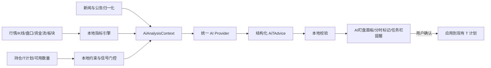

# AI 扩展入口（未实现）

[Wiki 首页](README.md) · [系统架构](01-architecture.md) · [行情数据链路](03-market-data.md)

> 状态：规划参考，当前仓库没有 AI、新闻抓取或技术指标模块。
>
> 目标方向：指标分析、要闻汇总、智能盯盘和结构化做 T 建议，同时支持 OpenAI 与 DeepSeek。

## 为什么现有架构适合扩展

当前已经具备：

- 主进程统一抓取实时行情、K 线、盘口、资金流和板块。
- 持仓、可用数量、正/反 T 批次和双五档计划。
- 主进程后台定时刷新与提醒状态机。
- 任务栏高优先级提示。
- 详情标签页和图表覆盖层的 UI 落点。

缺少的是：

- 本地技术指标引擎。
- 新闻数据源、去重、相关性和引用模型。
- AI provider 抽象。
- API Key / 登录凭证的秘密存储。
- AI 结构化输出和本地约束校验。
- 调用冷却、预算、缓存和历史评估。

## 推荐总体链路

AI 不应直接接收一张截图后自由给出交易结论，也不应承担精确指标计算。建议：



职责边界：

- 本地代码负责精确计算、交易规则、数量上限和风险约束。
- AI 负责综合解释、新闻关联、情景判断和人类可读理由。
- 第一版只给建议，不自动下单。
- AI 结果不能静默覆盖现有 T 计划，必须展示差异并由用户确认。

## 建议新增目录

```text
electron/main/ai/
├─ index.ts                 # AI 服务编排
├─ providers/
│  ├─ openai.ts
│  └─ deepseek.ts
├─ secrets.ts               # 主进程秘密存储
├─ news.ts                  # 新闻 provider 编排
├─ prompts.ts               # 版本化提示模板
└─ cache.ts                 # 快照哈希、结果、冷却和预算

src/lib/indicators/
├─ intraday.ts
├─ trend.ts
├─ momentum.ts
└─ index.ts

src/shared/ai-types.ts       # provider 设置、上下文、结构化结果

src/components/ai/
├─ AiAnalysisPanel.tsx
├─ AiAdviceCard.tsx
├─ AiNewsList.tsx
└─ AiChartOverlay.tsx
```

也可以先把类型放入现有 `src/shared/types.ts`；当 AI 类型数量增长后再独立文件，避免过早拆分。

## Provider 抽象

建议业务层只依赖统一接口：

```ts
interface AiProvider {
  analyze(context: AiAnalysisContext): Promise<AiTAdvice>
  testConnection(): Promise<AiConnectionResult>
}
```

实现：

| Provider | 请求方式 | 新闻策略 |
| --- | --- | --- |
| OpenAI API Key | OpenAI Responses API | 可选内置 web search，也可使用应用新闻工具 |
| DeepSeek API Key | DeepSeek Chat Completions / 兼容接口 | 调用应用自有新闻工具 |
| OpenAI 账号登录 | 单独的实验性通道 | 不与普通 API Key 混为同一种凭证 |

OpenAI 的普通 API 使用 Bearer 凭证，且官方明确不应把 API Key 暴露在客户端代码中：[API Authentication](https://developers.openai.com/api/reference/overview#authentication)。“Sign in with ChatGPT”是 Codex 产品的认证方式，普通平台 API 调用仍使用平台 API Key，两者应作为不同接入路线处理：[Codex Authentication](https://learn.chatgpt.com/docs/auth)。

DeepSeek 提供 Chat Completions、JSON Output 和工具调用能力，可通过适配器转换成相同业务结果：[DeepSeek Chat Completions](https://api-docs.deepseek.com/api/create-chat-completion/)。

模型 ID 不应散落在组件中；保存为 provider 非敏感设置，并允许用户选择或输入。

## 秘密存储

不能把 API Key 或登录令牌加入当前 `AppSettings`，原因：

- `settings.json` 是明文。
- 配置导出会包含完整 `AppState`。
- `state:updated` 会把状态广播给所有渲染窗口。

建议：

```text
渲染层设置表单
  → IPC ai:credential:set
  → Electron 主进程
  → safeStorage.encryptString
  → 独立 secrets 文件
```

渲染层只获得：

```ts
{
  provider: 'openai' | 'deepseek'
  configured: boolean
  authMode: 'api-key' | 'account'
  displayName?: string
}
```

不要提供读取明文 Key 的 IPC。

## 本地指标引擎

第一阶段建议计算：

### 分时

- 当日均价/VWAP 偏离。
- 1/3/5/15 分钟收益。
- 成交量突增和量价背离。
- 开盘区间、日内高低点位置。
- 盘口买卖委托不平衡。

### 日线背景

- MA5/10/20/60。
- EMA/MACD。
- RSI6/14。
- KDJ。
- 布林带。
- ATR 和近期波动率。
- 成交量/换手率分位。

### 相对强弱

- 相对所属行业板块。
- 相对用户选定的大盘指数。
- 资金流方向和斜率。
- 当前价格相对 T 仓均价和现有五档。

指标结果应是确定性的数值和状态。AI 上下文可带最近 30–60 根必要 K 线，但不必发送整张图表截图。

## 新闻层

建议先定义应用自己的 `NewsProvider`，再让两个 AI provider 使用相同新闻结果：

```ts
interface NewsItem {
  id: string
  title: string
  source: string
  publishedAt: string
  url: string
  scope: 'stock' | 'sector' | 'market'
  category: 'announcement' | 'policy' | 'finance' | 'news'
  relatedQuoteIds: string[]
}
```

优先级：

1. 公司公告、交易所和监管来源。
2. 稳定、可授权的财经新闻源。
3. 开放网页搜索作为补充。

必须保存并展示：

- 原始 URL。
- 来源。
- 发布时间。
- 抓取/分析截止时间。

AI 输出只引用传入的 `sourceIds`，UI 再映射为可点击来源，避免模型生成不存在的链接。

## 结构化建议

建议统一输出：

```ts
interface AiTAdvice {
  action: 'observe_sell' | 'observe_buy' | 'wait' | 'avoid'
  direction: 'forward' | 'reverse' | 'none'
  priceZone: { lower: number; upper: number } | null
  invalidationPrice: number | null
  quantity: number
  confidence: 'low' | 'medium' | 'high'
  validUntil: string
  reasons: string[]
  risks: string[]
  sourceIds: string[]
}
```

本地校验必须保证：

- `quantity` 为 100 的整数倍。
- 不超过持仓可用数量或用户设置的单次上限。
- 价格区间、失效价和有效期是有限合法值。
- 操作方向与正/反 T 语义一致。
- 新闻引用都存在。
- 过期结果不再显示为当前建议。

不要要求模型输出伪精确胜率；`confidence` 只作为分级说明。

## 调用门控

当前主进程可能 5 秒刷新一次，不能每次都调用 AI。建议本地指标每次刷新计算，只有事件满足时才调用：

- 穿越 VWAP、布林带或关键价位。
- 成交量突增。
- 盘口不平衡显著变化。
- 主力资金方向反转。
- 新重大公告/新闻。
- 现有 T 档位触发。
- 上一条 AI 建议过期。

配套：

- 每只股票 5–10 分钟冷却。
- 每日次数/金额预算。
- 用输入快照哈希复用未变化结果。
- 建议到期后先由本地规则判断是否失效，不必立即再次调用 AI。

## UI 落点

优先在 `ExpandedStockDetails` 增加“AI 盯盘”标签：

```text
结论与时效
├─ 当前建议
├─ 观察价格区间
├─ 失效条件
├─ 依据指标
├─ 相关新闻与来源
└─ 风险提示
```

可增加：

- “立即分析”
- “开启智能盯盘”
- “应用到 T 计划”

分时图只叠加：

- 观察卖出/买回区间。
- 失效线。
- 建议生成时间。

不要把大段 AI 文本覆盖在图表上。

## 与现有代码的具体接点

| 需求 | 当前落点 |
| --- | --- |
| 取得行情快照 | `electron/main/market.ts` 和主进程 `latestQuotes` |
| 取得 K 线/盘口/资金流/板块 | 现有 fetch 函数 |
| 取得持仓/T 批次 | 主进程 `state` |
| 计算可用数量 | `getAvailablePositionQuantity` |
| 增加后台触发 | 参考 `refreshStocks → applyTAlertTriggersToAccounts` |
| 增加 IPC | `StockDesktopApi` → preload → `registerIpc` |
| 增加详情页 | `ExpandedStockDetails` |
| 叠加分时标记 | `CandlestickChart` props/series markers |
| 应用到 T 计划 | `TTradingDrawer` / `updateTPlanLevel`，需增加用户确认 |
| 任务栏提示 | `TaskbarTicker`，仅在建议状态变化时显示 |

## 实施顺序

1. Provider 设置、秘密存储、连接测试。
2. 本地指标引擎和 `AiAnalysisContext`。
3. 单只股票手动“立即分析”。
4. 新闻 provider、去重和来源展示。
5. 事件门控、冷却、缓存和预算。
6. 分时覆盖层和“应用到 T 计划”确认流程。
7. 记录匿名化分析快照，做历史回放和 provider 对比。

该功能属于独立的新模块。真正进入开发并准备打包时，应先确认是否将当前 3.x 升级到 4.0.0。

## 产品与合规边界

- 默认只提供观察建议，不自动交易。
- 明确显示数据截止时间、建议有效期、失效条件和来源。
- AI 不得绕过本地 T+1、数量和持仓限制。
- 公开发布或商业化前，需要专项评估“买卖时机建议/荐股软件”和生成式 AI 服务相关合规要求；仅写“非投资建议”不能代替资质和产品流程评估。
